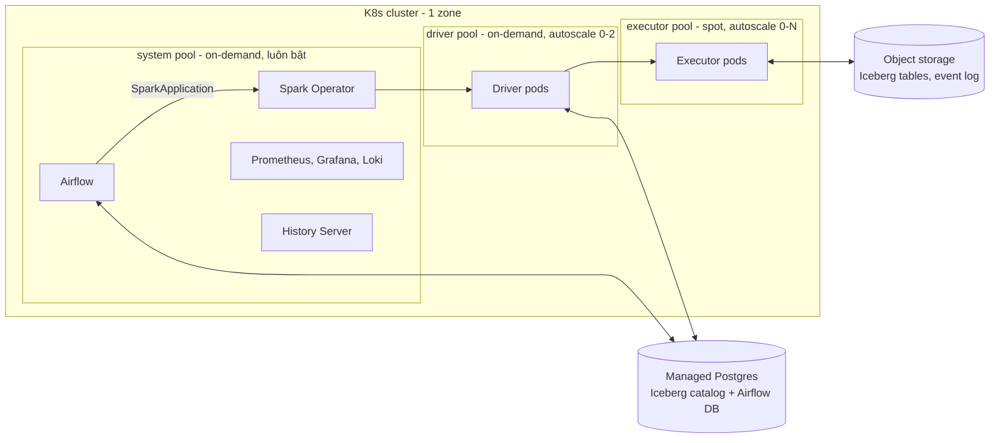

# Phase 1 — Startup: triển khai Spark trên Kubernetes

Tài liệu triển khai cụ thể cho Phase 1 trong [scale-spark.md](../deployment/scale-spark.md).
Checklist tổng quát và NFR đầy đủ nằm ở
[estimation-and-capacity.md](../deployment/estimation-and-capacity.md); tài liệu này chỉ
giữ những gì Phase 1 cần.

## 1. Context

**Tình huống giả định** (thay bằng số thật của bạn):

| Mục | Giá trị |
|---|---|
| Team | 1 team dữ liệu, 3 data engineer, không có platform engineer |
| Nguồn dữ liệu | Dump/CDC từ DB ứng dụng + event log, đổ vào object storage hằng ngày |
| Input | 200 GiB/ngày Parquet đã nén (~600 GiB khi giải nén), tăng 10%/tháng |
| Job | ~30 job/ngày: 1 ETL chính + ~29 job nhỏ (aggregate, export) rải trong ngày |
| SLA | ETL chính: input sẵn sàng 02:00, phải xong trước 03:00 |
| Loại xử lý | Chỉ batch |
| Người dùng output | BI/warehouse đọc bảng Iceberg |

**Mục tiêu Phase 1**

- Chạy ổn định với thời gian vận hành platform ≤ 1 ngày/tuần của một người.
- Tổng chi phí cloud ≤ $1.500/tháng ở tải hiện tại.
- Chịu được tăng trưởng 3x trong 12 tháng mà chỉ cần đổi cấu hình, không đổi
  kiến trúc.

**Không làm ở Phase 1**: streaming, nhiều team/namespace, scheduler mở rộng
(YuniKorn/Volcano), multi-region, chargeback, lineage.

**Kiến trúc**



---

## 2. Back-of-envelope

Giả định chung: throughput 25 MB/s/core, job nhiều stage tốn 2x một lần scan,
safety margin 1.3x. Tất cả là giả định cho đến khi benchmark (checklist mục
5.4).

### 2.1 Cores lúc đỉnh (ETL chính)

```text
Dữ liệu giải nén       = 600 GiB = 614.400 MB
Một lần scan           = 614.400 / 25        = 24.576 core-giây
Toàn job (x2 stage)    = 49.152 core-giây    ≈ 13,7 core-giờ
Thời gian cho phép     = 45 phút (chừa 15 phút cho autoscale, retry)
Cores                  = 49.152 / 2.700s     ≈ 18,2
Có margin              = 18,2 x 1,3          ≈ 24 cores
```

### 2.2 Tổng core-giờ mỗi ngày

```text
ETL chính              = 13,7 core-giờ
29 job nhỏ (giả định tổng = 2x ETL chính) = 27,4 core-giờ
Tổng x 1,3 margin      ≈ 53 core-giờ/ngày
```

### 2.3 Kích thước executor và node

```text
Node executor          = 8 vCPU / 32 GiB (allocatable ~7,8 vCPU / ~28 GiB)
Executor               = spark.executor.cores 4, coreRequest 3500m,
                         memory 10g + memoryOverhead 2g = 12 GiB
                         (PySpark: tăng overhead lên 3-4g)
Executor/node          = 2  → dùng 7 vCPU, 24 GiB
Lúc đỉnh               = 24 cores / 4 = 6 executor = 3 node
```

`coreRequest` 3500m thấp hơn 4 core để 2 executor vừa một node sau khi trừ
phần hệ thống; Spark vẫn chạy 4 task/executor.

### 2.4 Node-giờ mỗi tháng

```text
Executor pool   = 53 core-giờ / 8 vCPU ≈ 6,6 node-giờ/ngày
                  x 1,5 (thời gian scale lên/xuống, bin-packing lẻ) ≈ 10 node-giờ/ngày
                  ≈ 300 node-giờ/tháng (spot)
Driver pool     = driver 1 core / 4 GiB, tối đa ~4 driver cùng lúc
                  → 1 node 4 vCPU / 16 GiB, bật ~15 giờ/ngày ≈ 450 node-giờ/tháng
System pool     = Operator, Airflow, Prometheus, Grafana, Loki, History Server
                  ≈ 3-4 vCPU, 12-16 GiB request
                  → 2 node 4 vCPU / 16 GiB luôn bật = 1.460 node-giờ/tháng
```

### 2.5 Disk scratch, network, IP

```text
Shuffle        = 40% x 600 GiB = 240 GiB
Spill lúc đỉnh = 50% x 240 GiB = 120 GiB / 3 node = 40 GiB x 1,3 ≈ 52 GiB
               → 100 GiB disk mỗi executor node (root + emptyDir)

Network shuffle (write + read, trong ~20 phút):
               = 480 GiB / 1.200s ≈ 410 MB/s ≈ 3,3 Gbps toàn cụm ≈ 1,1 Gbps/node
               → node 8 vCPU thông thường đủ; đặt executor pool trong 1 zone

Pod lúc đỉnh   = 6 executor + 4 driver + ~40 system + ~10 Airflow task ≈ 60-100 pod
               → dải IP cho pod tối thiểu /22, không dùng /24
```

### 2.6 Storage

```text
Input giữ 90 ngày      = 200 GiB x 90         ≈ 18.000 GiB
Output (Iceberg nén, ~30% input nén) = 60 GiB/ngày
Output giữ 365 ngày    → tháng thứ 3: 5.400 GiB, tăng thêm ~1.800 GiB/tháng
Tổng ở tháng thứ 3     ≈ 23.400 GiB (~23 TB)
```

### 2.7 Tăng trưởng 12 tháng (x3)

| Tài nguyên | Hiện tại | Sau 12 tháng |
|---|---|---|
| Cores lúc đỉnh | 24 (3 node) | ~72 (9 node) |
| Executor node-giờ/tháng | 300 | ~900 |
| Storage | ~23 TB | ~60-70 TB (tuỳ lifecycle) |
| Max node executor pool | 6 | 12 |

Không đổi kiến trúc; chỉ tăng `maxExecutors`, max node của pool và quota.

---

## 3. Cost

Giá tham khảo list price on-demand region US (us-east-1 / us-central1 /
eastus), không có discount/commitment. Region Singapore đắt hơn ~10-25%.
**Kiểm tra lại bằng pricing calculator** trước khi chốt ngân sách; mục tiêu ở
đây là thấy khoản nào lớn, không phải con số chính xác.

### 3.1 Chi phí hằng tháng

| Hạng mục | EKS (AWS) | GKE (GCP) | AKS (Azure) |
|---|---|---|---|
| Control plane | $73 | $0 (credit free tier cho 1 cluster zonal/Autopilot) | $0 Free tier (không SLA) / $73 Standard |
| System pool 2 node 4 vCPU/16 GiB | m6i.xlarge ~$280 | e2-standard-4 ~$195 | D4s_v5 ~$280 |
| Driver pool ~450 node-giờ | ~$85 | ~$60 | ~$85 |
| Executor pool ~300 node-giờ spot (8 vCPU) | ~$50 | ~$40 | ~$40 |
| Disk node | ~$30 | ~$25 | ~$30 |
| Object storage ~23 TB | S3 Standard ~$540 | GCS Standard ~$470 | Blob Hot LRS ~$420 |
| Managed Postgres nhỏ | ~$30 | ~$30 | ~$15 |
| NAT + load balancer | ~$55 | ~$40 | ~$55 |
| Khác (registry, PV Prometheus) | ~$15 | ~$15 | ~$15 |
| **Tổng** | **~$1.160** | **~$875** | **~$940** (+$73 nếu Standard) |

Nhận xét:

- **Storage chiếm ~45-55% tổng chi phí.** Compute Spark (executor spot) chỉ
  ~$40-50. Đòn bẩy lớn nhất là retention và lifecycle, không phải tune Spark.
- **Phần luôn bật (system pool) đắt hơn executor.** Giữ system pool nhỏ nhất
  có thể; không chạy thêm service không cần thiết trên đó.
- Nếu throughput thật chỉ bằng 1/3 giả định, executor tăng lên ~$150 — vẫn
  không phải khoản lớn nhất.
- Lifecycle input sau 30 ngày sang lớp rẻ hơn (S3 Standard-IA, GCS Nearline,
  Blob Cool) giảm phần input khoảng 40-50%. Lưu ý phí đọc lại và thời gian
  lưu tối thiểu của lớp rẻ.

### 3.2 Chi phí ẩn cần chặn từ ngày đầu

| Chi phí ẩn | Ước tính nếu bỏ qua | Cách chặn |
|---|---|---|
| Đọc object storage qua NAT (AWS) | 600 GiB/ngày x $0,045/GB ≈ **+$800/tháng** | S3 Gateway VPC Endpoint (miễn phí); GCP: Private Google Access; Azure: service endpoint |
| Shuffle giữa các zone | 480 GiB/ngày x $0,02/GB ≈ **+$290/tháng** (AWS, GCP) | Executor pool trong 1 zone |
| Log Spark đổ vào logging của cloud | 5 GB/ngày: ~$75/tháng (CloudWatch, Cloud Logging); Azure Log Analytics ~$2-3/GB nên đắt hơn nhiều | Loki ghi ra object storage, log level WARN |
| EKS phiên bản K8s cũ (extended support) | Control plane $73 → **$438/tháng** | Upgrade K8s trước khi hết standard support |
| Node pool không scale về 0 | 3 node executor chạy 24/7 thay vì ~10 giờ/ngày: +$150-850 (spot → on-demand) | Min node = 0 cho driver/executor pool |
| Nhiều file nhỏ | Tăng phí request và làm job chậm | Compaction Iceberg định kỳ |

---

## 4. Tech stack

### 4.1 Stack chung (giống nhau trên mọi provider)

| Lớp | Chọn cho Phase 1 | Lý do | Phương án khác |
|---|---|---|---|
| Kubernetes | Managed K8s, 1 cluster, 1 zone | Ít việc vận hành nhất | Regional cluster khi cần HA control plane |
| Spark | 3.5.x hoặc 4.0.x, pin một version | 3.5 nếu thư viện chưa hỗ trợ 4.0 | — |
| Operator | Kubeflow Spark Operator (Helm) | Trưởng thành, nhiều tài liệu, Airflow có operator submit `SparkApplication` | Apache Spark Kubernetes Operator (chính thức nhưng còn 0.x) |
| Table format | Apache Iceberg | Engine-neutral, BI/warehouse đọc được | Delta Lake |
| Catalog | Iceberg JDBC catalog trên managed Postgres | Rẻ, không phụ thuộc provider, dùng chung DB với Airflow | Glue Data Catalog (AWS), Iceberg REST catalog |
| Orchestration | Airflow (Helm chart chính thức, KubernetesExecutor) trên system pool | Rẻ hơn managed Airflow (~$300+/tháng) | MWAA, Cloud Composer, Astronomer |
| Autoscaling | Autoscaler của provider, pool min 0 | Scale về 0 khi không có job | — |
| Observability | kube-prometheus-stack, Loki, Spark History Server | Mã nguồn mở, lưu trên object storage, rẻ | Logging/monitoring của cloud (đắt hơn với log Spark) |
| Deploy | Helm + CI (GitHub Actions/GitLab CI) | Đủ cho 1 team | Argo CD khi có nhiều môi trường/team |
| IaC | Terraform | Tạo lại cluster từ code | Pulumi |
| Secrets | External Secrets Operator + secret manager của cloud | Không lưu credential trong Git | Sealed Secrets |

### 4.2 So sánh provider

| Tiêu chí | EKS (AWS) | GKE (GCP) | AKS (Azure) |
|---|---|---|---|
| Phí control plane | $0,10/giờ (~$73/tháng); $0,60/giờ nếu version ở extended support | $0,10/giờ, nhưng credit ~$74/tháng miễn phí cho 1 cluster zonal hoặc Autopilot | Free tier $0 (không SLA); Standard $0,10/giờ có SLA |
| Autoscaling node | Karpenter (mạnh, chọn instance linh hoạt) hoặc EKS Auto Mode (Karpenter managed, thêm phí ~12% giá instance) | Cluster autoscaler + node auto-provisioning; Autopilot tính theo pod request | Cluster autoscaler; Node Auto Provisioning (dựa trên Karpenter) |
| Spot | Báo trước **2 phút** khi thu hồi | Báo trước **30 giây** | Báo trước **30 giây** |
| Identity cho pod | EKS Pod Identity / IRSA | Workload Identity Federation | Microsoft Entra Workload ID |
| Object storage / connector | S3, `s3a://` (hadoop-aws) hoặc Iceberg `S3FileIO` | GCS, `gs://` (GCS connector) | ADLS Gen2, `abfss://` (hadoop-azure) |
| Truy cập storage không qua NAT | S3 Gateway Endpoint (miễn phí) | Private Google Access (miễn phí) | Service endpoint (miễn phí) |
| Phí giữa zone | $0,01/GB mỗi chiều | $0,01/GB | Hiện chưa tính phí (kiểm tra lại) |
| Lớp Spark managed trên K8s | EMR on EKS (thêm phí theo vCPU/GB-giờ) | Dataproc on GKE (kiểm tra trạng thái hỗ trợ) | HDInsight on AKS đã ngừng (2025) |
| Catalog managed cho Iceberg | Glue Data Catalog, S3 Tables | BigLake metastore | Không có lựa chọn đơn giản — dùng JDBC/REST catalog |
| Logging của cloud | CloudWatch ~$0,50/GB | Cloud Logging ~$0,50/GiB, 50 GiB/tháng miễn phí | Log Analytics ~$2-3/GB |
| Điểm mạnh cho Phase 1 | Karpenter; spot báo trước 2 phút dễ decommission | Control plane miễn phí; autoscale nhanh; chi phí thấp nhất trong bảng 3.1 | Control plane Free tier; tích hợp tốt nếu công ty dùng Microsoft |
| Điểm cần chú ý | Phí control plane; NAT đắt nếu quên endpoint; pod dùng IP của VPC (VPC CNI) | Zonal cluster không có HA control plane (SLA thấp hơn regional); Autopilot hạn chế DaemonSet/hostPath và ephemeral storage | Free tier không có SLA; Log Analytics đắt; dùng Azure CNI Overlay để pod không tốn IP VNet |

### 4.3 Khuyến nghị

1. **Chọn provider nơi dữ liệu và hệ thống hiện có đang chạy.** Phí egress
   khi đọc dữ liệu từ cloud khác thường lớn hơn chênh lệch giá compute.
2. Nếu bắt đầu từ đầu và ưu tiên chi phí: **GKE Standard, cluster zonal**
   (control plane miễn phí, chi phí thấp nhất trong bảng 3.1). Dùng Standard
   thay vì Autopilot để tự quản lý spot node pool và disk scratch.
3. Nếu đã ở AWS: **EKS + Karpenter**, bắt buộc có S3 Gateway Endpoint.
4. Nếu đã ở Azure: **AKS** (Free tier cho dev, Standard cho production),
   Azure CNI Overlay, không dùng Log Analytics cho log Spark.
5. Với spot báo trước 30 giây (GKE, AKS): decommission có thể không kịp di
   chuyển hết shuffle; dựa vào retry stage và giữ job idempotent.

---

## 5. Checklist triển khai Phase 1

Mỗi mục có điều kiện "xong" (→). Thứ tự là thứ tự nên làm.

### 5.1 Chuẩn bị

- [ ] Điền lại bảng context (mục 1) bằng số thật → có input/ngày, số job,
      SLA, tăng trưởng
- [ ] Tính lại mục 2 với số thật → có số cores lúc đỉnh, node-giờ, storage
- [ ] Chọn provider theo mục 4.3 → ghi lại lý do
- [ ] Đặt budget alert ở 50%, 80%, 100% ngân sách tháng → nhận email thử

### 5.2 Cluster

- [ ] Terraform tạo VPC/network, subnet pod ≥ /22, cluster 1 zone → `terraform apply` tạo lại được từ đầu
- [ ] Endpoint storage không qua NAT (S3 Gateway Endpoint / Private Google Access / service endpoint) → traffic storage không qua NAT
- [ ] 3 node pool: `system` (on-demand, 2 node cố định), `driver` (on-demand, 0-2), `executor` (spot, 0-6, taint `spot=true:NoSchedule`) → pool rỗng khi không có job
- [ ] Executor pool dùng 2-3 instance type tương đương (8 vCPU/32 GiB) → giảm rủi ro hết spot
- [ ] Namespace `spark`, `airflow`, `monitoring`; `ResourceQuota` cho `spark` = max pool + 20%
- [ ] Workload identity cho `ServiceAccount` của Spark và Airflow → pod đọc/ghi bucket không cần access key
- [ ] Cài Spark Operator bằng Helm, pin version → chạy xong `SparkPi` mẫu

### 5.3 Data

- [ ] Tạo bucket: `lake` (Iceberg), `spark-events`, `logs`; lifecycle input 30 ngày → lớp rẻ, 90 ngày → xoá
- [ ] Managed Postgres nhỏ (backup tự động) cho Iceberg catalog và Airflow → restore thử 1 lần
- [ ] Tạo bảng Iceberg đầu tiên từ Spark, đọc lại được từ công cụ BI/warehouse
- [ ] Job compaction + expire snapshot hằng tuần → số file mỗi partition ổn định

### 5.4 Spark job

- [ ] Base image Spark pin version + dependency (Iceberg runtime, connector cloud, JDBC driver Postgres), đẩy lên registry của cloud, tag theo commit
- [ ] Viết `SparkApplication` theo mẫu mục 6 → driver ở pool `driver`, executor ở pool `executor`
- [ ] Bật dynamic allocation + shuffle tracking, `maxExecutors` theo mục 2.3
- [ ] Bật decommission cho executor trên spot
- [ ] Job idempotent: ghi Iceberg bằng `MERGE`/overwrite partition → chạy lại không nhân đôi dữ liệu
- [ ] Benchmark ETL chính với 1 ngày dữ liệu thật → đo throughput/core, cập nhật lại mục 2
- [ ] Thử lỗi: xoá 1 executor pod, drain 1 node executor → job vẫn xong trong SLA

### 5.5 Airflow

- [ ] Cài Airflow bằng Helm chart chính thức, KubernetesExecutor, DB trên managed Postgres
- [ ] DAG submit `SparkApplication` và chờ kết quả → task fail khi Spark job fail
- [ ] Retry 2 lần, có `sla`/timeout cho ETL chính
- [ ] DAG nằm trong Git, deploy qua CI

### 5.6 Observability & alert

- [ ] kube-prometheus-stack; Spark bật `PrometheusServlet` → thấy metric executor trên Grafana
- [ ] Spark History Server đọc `spark-events` → xem được job đã xong
- [ ] Loki ghi log ra bucket `logs`, retention 30 ngày
- [ ] Alert gửi Slack/email:
  - job hoặc DAG fail sau hết retry
  - ETL chính chưa xong lúc 02:50
  - pod `Pending` > 10 phút
  - executor OOMKilled
  - chi phí vượt 80% budget

### 5.7 Go-live

- [ ] Chạy song song với cách làm cũ 1-2 tuần, so sánh số dòng/tổng các cột chính
- [ ] Runbook 1 trang: job fail, OOM, Pending, spot hết, catalog down
- [ ] Lịch upgrade: K8s trước khi hết standard support, Spark/Operator mỗi 6 tháng
- [ ] Review chi phí hằng tháng theo bảng 3.1

---

## 6. Mẫu `SparkApplication`

Mẫu cho Kubeflow Spark Operator trên AWS. Với GCP/Azure, đổi `s3a://` thành
`gs://` hoặc `abfss://` và thay `io-impl` tương ứng.

```yaml
apiVersion: sparkoperator.k8s.io/v1beta2
kind: SparkApplication
metadata:
  name: daily-etl
  namespace: spark
  labels:
    team: data
    job: daily-etl
spec:
  type: Python
  mode: cluster
  image: <registry>/spark-jobs:<git-sha>
  mainApplicationFile: local:///opt/jobs/daily_etl.py
  sparkVersion: "3.5.3"
  restartPolicy:
    type: OnFailure
    onFailureRetries: 2
    onFailureRetryInterval: 60
  dynamicAllocation:
    enabled: true
    initialExecutors: 2
    minExecutors: 0
    maxExecutors: 6
  sparkConf:
    spark.sql.adaptive.enabled: "true"
    spark.dynamicAllocation.shuffleTracking.enabled: "true"
    spark.decommission.enabled: "true"
    spark.storage.decommission.enabled: "true"
    spark.storage.decommission.shuffleBlocks.enabled: "true"
    spark.eventLog.enabled: "true"
    spark.eventLog.dir: "s3a://spark-events/"
    spark.ui.prometheus.enabled: "true"
    spark.metrics.conf.*.sink.prometheusServlet.class: "org.apache.spark.metrics.sink.PrometheusServlet"
    spark.metrics.conf.*.sink.prometheusServlet.path: "/metrics/prometheus"
    spark.sql.catalog.lake: "org.apache.iceberg.spark.SparkCatalog"
    spark.sql.catalog.lake.catalog-impl: "org.apache.iceberg.jdbc.JdbcCatalog"
    spark.sql.catalog.lake.uri: "jdbc:postgresql://<pg-host>:5432/iceberg"
    spark.sql.catalog.lake.warehouse: "s3://lake/warehouse"
    spark.sql.catalog.lake.io-impl: "org.apache.iceberg.aws.s3.S3FileIO"
  driver:
    cores: 1
    memory: "3g"
    memoryOverhead: "1g"
    serviceAccount: spark-job
    nodeSelector:
      pool: driver
  executor:
    cores: 4
    coreRequest: "3500m"
    memory: "10g"
    memoryOverhead: "2g"
    nodeSelector:
      pool: executor
    tolerations:
      - key: spot
        operator: Equal
        value: "true"
        effect: NoSchedule
```

Mật khẩu Postgres của catalog lấy từ Kubernetes `Secret` (đồng bộ qua
External Secrets Operator) và truyền qua biến môi trường, không ghi trong
manifest.

---

## 7. Khi nào rời Phase 1

Xem tín hiệu graduate trong [scale-spark.md](../deployment/scale-spark.md). Với tình
huống này, dấu hiệu sớm nhất thường là: team thứ hai cần chạy job trên cùng
cluster, hoặc ETL chính thường xuyên gần chạm 03:00 dù đã tăng
`maxExecutors`.
