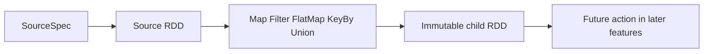
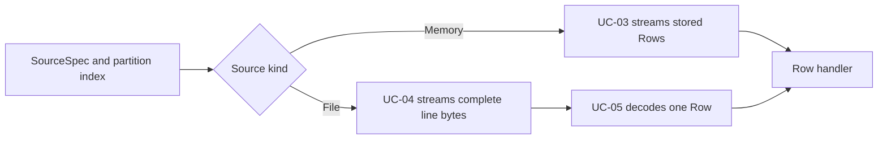

# Feature 01: RDD API và partitioned sources

## Outcome

Feature này xây nền tảng RDD của engine:

- tạo source RDD từ memory, JSONL, text hoặc CSV;
- tạo lineage immutable bằng các lazy transformations;
- đọc **một source partition** theo yêu cầu và stream từng `Row`;
- quan sát topology RDD an toàn qua snapshot metadata.

Feature 01 chưa có action thực thi toàn bộ lineage. Vì vậy `Map`, `Filter`,
`FlatMap`, `KeyBy` chỉ tạo RDD con; chúng chưa đọc source hoặc gọi user function.

## Ý tưởng chính

Một RDD là mô tả của dữ liệu phân vùng và dependency, không phải dữ liệu đã
materialize trong memory.



Mỗi transformation nhận Go function và giữ function đó ở runtime state private
của RDD con. Parent không đổi, nên một RDD có thể có nhiều branches.

| Transformation | Một input row tạo | Mục đích |
| --- | --- | --- |
| `Map` | đúng 1 row mới | đổi hoặc chọn fields |
| `Filter` | 0 hoặc 1 row | giữ row theo predicate |
| `FlatMap` | 0 đến N rows | tách một row thành nhiều rows |
| `KeyBy` | đúng 1 keyed row | chuẩn bị key cho aggregation/join sau này |
| `Union` | nối partitions của hai parents | ghép hai RDD, không shuffle |

`KeyBy` chưa group equal keys. `ReduceByKey` và shuffle thuộc Feature 02.

## Hai luồng độc lập

### 1. Xây lineage

```text
SourceSpec -> FromSource -> Map / Filter / FlatMap / KeyBy / Union -> child RDD
```

Luồng này chỉ validate metadata, cấp RDD ID và tạo dependency. Nó không mở file,
không đọc rows và không gọi closure.

### 2. Đọc một source partition



Luồng đọc source chỉ đọc input của partition được chọn. Nó chưa chạy các
transformations trong lineage; runtime/action ở feature sau sẽ nối reader với
computation của RDD.

## Mapping với Spark

| Spark Core | Project | Giới hạn có chủ đích |
| --- | --- | --- |
| `RDD[T]` | `RDD` dùng `Row` | không implement generic type system đầy đủ |
| `SparkContext` cấp RDD ID | `Context` cấp numeric RDD ID | ID chỉ có ý nghĩa trong một context |
| lazy `map` / `filter` / `flatMap` | RDD con giữ private Go closure | chưa serialize closure sang executor |
| source RDD partitions | memory partitions hoặc file byte ranges | local sources, không có HDFS locality |
| Hadoop input split + record reader | UC-04 + UC-05 | simplified line-oriented reader |
| `UnionRDD` | union nối output partitions theo parent order | không có execution engine trong feature này |
| `RDD.toDebugString` | structured `Describe()` snapshot | không có Spark UI/event log |

## Use cases

| Use case | Outcome                                                          | Liên kết                                                                         |
| -------- | ---------------------------------------------------------------- | -------------------------------------------------------------------------------- |
| UC-01    | Tạo `SourceSpec` immutable cho memory hoặc file source           | [01-source-descriptor](../use-case/feature-01/01-source-descriptor.md)           |
| UC-02    | Tạo lazy, immutable RDD lineage và branching                     | [02-lazy-rdd-pipeline](../use-case/feature-01/02-lazy-rdd-pipeline.md)           |
| UC-03    | Chia memory rows thành contiguous partitions                     | [03-memory-partitioning](../use-case/feature-01/03-memory-partitioning.md)       |
| UC-04    | Chia file bytes nhưng stream mỗi complete line đúng một lần      | [04-file-byte-ranges](../use-case/feature-01/04-file-byte-ranges.md)             |
| UC-05    | Decode complete line thành `Row` theo JSONL, text hoặc CSV       | [05-source-record-decoding](../use-case/feature-01/05-source-record-decoding.md) |
| UC-06    | Quan sát RDD ID, parent, partition metadata qua snapshot an toàn | [06-rdd-observability](../use-case/feature-01/06-rdd-observability.md)           |

## Feature boundary

Feature 01 bao gồm source metadata, source-partition reading và logical RDD
lineage. Nó không bao gồm:

- action như `Collect`, `Count` hoặc write;
- chạy `Map`/`Filter`/`FlatMap`/`KeyBy` trên rows;
- DAGScheduler, stages, tasks, workers, retry hoặc cache;
- shuffle, `ReduceByKey`, join và distributed partitioning;
- Hadoop `InputFormat`, HDFS/S3, compression hoặc multiline CSV.

## Hoàn thành khi

- source và RDD lineage đều immutable theo góc nhìn caller;
- transformations không trigger source I/O hoặc closure execution;
- memory/file partition reader stream mỗi record đúng một lần;
- file reader xử lý boundary giữa lines, LF, CRLF và final line không newline;
- UC-05 đưa JSONL, text và CSV simple về cùng `Row` handler contract;
- `Describe()` không expose mutable internal graph hay closure;
- tests xác nhận các invariant trên, gồm race detector.
