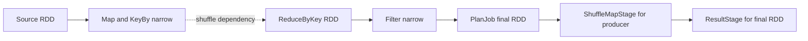
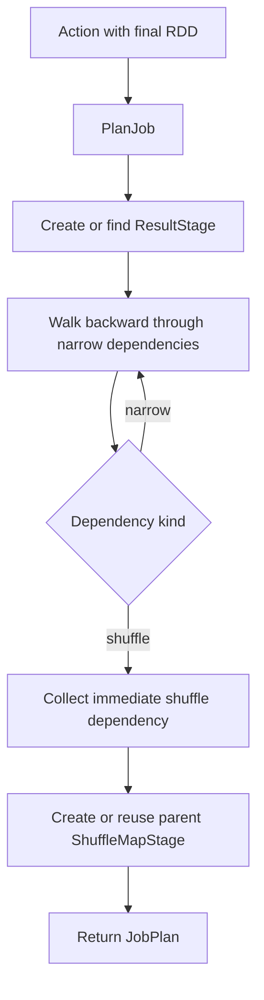
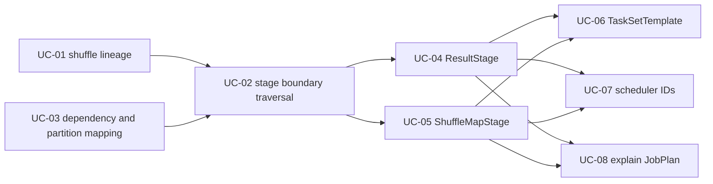

# Feature 02: RDD dependencies và DAGScheduler planning

## Outcome

Feature 02 biến RDD lineage của Feature 01 thành stage graph cho một action.
Nó bổ sung `ReduceByKey` như một shuffle boundary, sau đó dùng DAGScheduler
để tìm các stage cần chạy trước final RDD.

Output là `JobPlan` metadata gồm:

- một `ResultStage` cho final RDD của action;
- zero hoặc nhiều parent `ShuffleMapStage`;
- dependency edges giữa các stages;
- scheduler-assigned `JobID` và `StageID`.

Khi toàn bộ roadmap Feature 02 hoàn thành, plan cũng có thể chứa
`TaskSetTemplate`: danh sách partition cần chạy cho một stage. Template chưa là
task thực thi và chưa có task-attempt ID.

Feature này chỉ lập kế hoạch. Nó không đọc source, không gọi transformation hay
reducer closure, không route data qua shuffle và không launch task.

## Ý tưởng chính

Narrow dependency giữ computation trong cùng stage. Shuffle dependency cắt
lineage thành hai stages: producer ghi shuffle output trong tương lai, consumer
đọc output đó trong tương lai.

`ReduceByKey` chưa thực hiện phép cộng, đếm hay reduce. Nó chỉ ghi vào lineage
rằng dữ liệu keyed phải được repartition theo `HashPartitioner` trước khi
reduce có thể chạy.

## Luồng lập kế hoạch

Planner không tạo một global topological list của mọi RDD. Nó bắt đầu tại final
RDD, chỉ đi xuyên qua narrow dependencies của stage hiện tại, và dừng khi gặp
shuffle boundary. Sau đó nó đệ quy từ shuffle producer để tìm stages cha xa
hơn.

## Mapping với Spark

| Spark Core | Project | Giới hạn có chủ đích |
| --- | --- | --- |
| `reduceByKey` pair RDD | `ReduceByKey(reducer, partitions)` | chưa map-side combine hoặc reduce execution |
| `ShuffleDependency` | `DependencySpec{Kind: shuffle, Partitioner}` | chỉ hỗ trợ `HashPartitioner` |
| `HashPartitioner` | `floorMod(HashCode(key), partitions)` | adapter hash cho supported Go key types |
| `DAGScheduler.submitJob` | `DAGScheduler.PlanJob(finalRDD, action)` | trả plan-only snapshot |
| `ResultStage` | final stage metadata | chưa submit tasks |
| `ShuffleMapStage` | producer stage metadata | chưa có shuffle files/map output status |
| scheduler IDs | JobID và StageID counters | Task ID/attempt/retry thuộc feature sau |

RDD ID của Feature 01 vẫn là identity của RDD trong `Context`. Nó không phải
JobID, StageID hay plan hash. Mỗi action submission có thể nhận JobID mới dù
final RDD giống nhau.

## Hai dependency kinds

| Kind | Ý nghĩa với planner | Ví dụ |
| --- | --- | --- |
| `narrow` | tiếp tục walk parent trong stage hiện tại | `Map`, `Filter`, `FlatMap`, `KeyBy`, `Union` |
| `shuffle` | dừng current-stage walk và tạo/tìm producer stage | `ReduceByKey` |

`Union` vẫn là narrow dù có hai parents: mỗi output partition chỉ đọc một parent
partition. Planner không yêu cầu hai parent có cùng partition count.

## Use cases và roadmap

`TBU` nghĩa là use case đã được xác định trong roadmap nhưng chưa có tài liệu
chi tiết hoặc implementation. Chỉ UC-01 và UC-02 có tài liệu chi tiết hiện tại.

| Use case | Status | Năng lực đóng góp cho Feature 02 | Liên kết |
| --- | --- | --- | --- |
| UC-01 | Available | Tạo lazy `ReduceByKey` RDD: keyed parent, private reducer closure, `HashPartitioner` và `ShuffleDependency`. Đây là stage boundary để planner nhận ra. | [01-reduce-by-key-logical-node](../use-case/feature-02/01-reduce-by-key-logical-node.md) |
| UC-02 | Available | Từ final RDD, DAGScheduler walk qua narrow dependencies và collect immediate shuffle dependencies. | [02-logical-dag-walk](../use-case/feature-02/02-logical-dag-walk.md) |
| UC-03 | TBU | Biểu diễn `DependencySpec` và partition mapping cho narrow/shuffle edge, bao gồm range mapping của `Union`. | TBU |
| UC-04 | TBU | Tạo `ResultStage` từ final RDD của action và link các parent shuffle stages. | TBU |
| UC-05 | TBU | Tạo hoặc reuse `ShuffleMapStage` đệ quy từ mỗi shuffle producer. | TBU |
| UC-06 | TBU | Tạo `TaskSetTemplate` theo partition IDs của mỗi runnable stage; chưa launch task. | TBU |
| UC-07 | TBU | Mô tả lifecycle `JobID`, `StageID`, `StageAttemptID` và ranh giới với future `TaskID`. | TBU |
| UC-08 | TBU | Render `JobPlan`/stage graph để inspect mà không execute. | TBU |

Thứ tự dependency giữa các use case:

UC-02 xác định **ở đâu phải cắt stage**. UC-04 và UC-05 quyết định **stage
objects nào phải được tạo**. UC-06–UC-08 chỉ sử dụng plan metadata; chúng vẫn
không chạy source hoặc transformations.

## Feature boundary

Feature 02 bao gồm dependency metadata, `HashPartitioner`, stage-boundary
traversal và plan metadata. Nó không bao gồm:

- đọc source records hoặc chạy `Map`/`Filter`/`KeyBy`/reducer closures;
- map-side combine, shuffle files, fetch shuffle output hoặc reduce execution;
- task submission, worker/executor launch và cấp task-attempt ID khi runtime;
- retry, speculative execution, cache/checkpoint, locality;
- Spark SQL Catalyst logical/physical plans, AQE hoặc cluster manager.

## Hoàn thành khi

- `ReduceByKey` chỉ tạo lazy RDD node và `ShuffleDependency`; reducer chưa chạy.
- Equal supported keys luôn map tới cùng `HashPartitioner` partition.
- `PlanJob` bắt đầu từ final RDD của action, không có `RDD.Plan()` độc lập.
- Narrow chain ở trong cùng stage; shuffle dependency tạo parent producer stage.
- Shared ancestor chỉ được visit một lần trong một traversal.
- Job/Stage IDs là scheduler counters; không dùng content hash/plan hash.
- `JobPlan` là snapshot, caller không thể mutate scheduler state qua output.
- Các UC đánh dấu `TBU` được bổ sung tuần tự theo roadmap trước khi Feature 02
  được xem là hoàn chỉnh.
