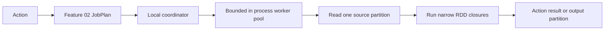
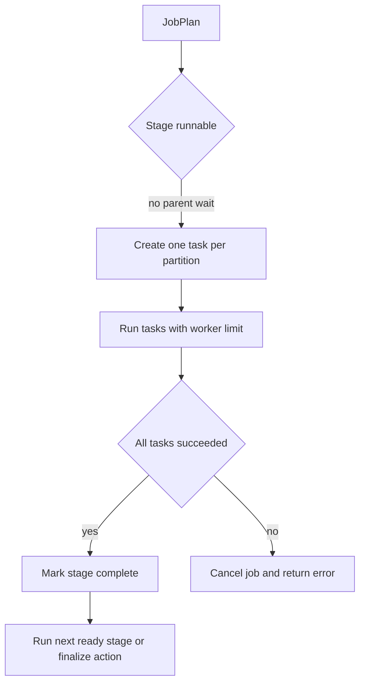
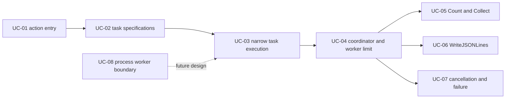

# Feature 03: Local worker runtime và actions

## Outcome

Feature 03 thực thi các stage không cần shuffle trên một máy local. Khi caller
gọi action, runtime lấy `JobPlan` từ Feature 02, tạo task cho các stage runnable,
đọc source partition, chạy narrow transformations và gom kết quả action.

Actions mục tiêu:

- `Count`: trả tổng số output rows;
- `Collect`: trả output rows theo partition order, chỉ phù hợp kết quả nhỏ;
- `WriteJSONLines`: ghi output partitions thành JSON Lines qua publish an toàn.

Output của một action là `JobResult`: action result, metadata job và trạng thái
thành công/thất bại. Runtime không trả toàn bộ intermediate data vào memory.

## Execution boundary

Feature 01 giữ Go closure private trong RDD (`MapFunc`, `FilterFunc`,
`FlatMapFunc`, `KeyFunc`). Go không có cơ chế chuẩn để serialize arbitrary
closure sang child process. Vì vậy runtime đầu tiên chạy **in-process local
workers**: các goroutines dùng trực tiếp private computation của RDD.



Process worker/executor isolation là `TBU`. Nó cần một contract để transport
hoặc serialize user computation; không thể chỉ re-exec binary như một generic
Go closure.

## Ý tưởng chính

Một stage có `p` output partitions tạo tối đa `p` local tasks. Mỗi task xử lý
một partition và stream rows:

```text
source partition
    -> Map / Filter / FlatMap / KeyBy closures
    -> Count accumulator, Collect buffer, or JSONL writer
```

Worker pool giới hạn số tasks đang chạy đồng thời. Một stage chỉ trở thành
runnable sau khi parent stages của nó đã thành công. Với Feature 03, runtime
chỉ execute stage không đòi shuffle input.



## Mapping với Spark

| Spark Core | Project | Giới hạn có chủ đích |
| --- | --- | --- |
| `DAGScheduler` produces stages | Feature 02 `JobPlan` | Feature 03 không đổi stage topology |
| `TaskSet` | local task set theo stage partitions | chỉ one local process |
| executor task | goroutine chạy một partition | chưa có JVM/process executor isolation |
| `RDD.iterator(partition)` | source reader + private narrow closures | chỉ source types Feature 01 |
| action result handler | Count/Collect/JSONL action sink | Collect giới hạn small-result use case |
| task failure | cancel active job và trả contextual error | retry/speculation thuộc Feature 05 |
| executor output | local temporary output + atomic publish | không có distributed storage |

## Dependency với Feature 01 và 02

| Dependency | Feature 03 sử dụng như thế nào |
| --- | --- |
| Feature 01 source readers | một task gọi reader cho đúng source partition và stream `Row` |
| Feature 01 RDD closures | task gọi `Map`/`Filter`/`FlatMap`/`KeyBy` khi stream row |
| Feature 02 `JobPlan` | coordinator biết stage nào có thể chạy và stage partitions nào cần task |
| Feature 02 `ShuffleDependency` | runtime nhận diện boundary; cả shuffle producer/consumer thuộc Feature 04 |

## Use cases và roadmap

`TBU` nghĩa là use case đã được planned nhưng chưa có tài liệu chi tiết hoặc
implementation. Feature 03 hiện chưa có use case document nào.

### UC-01 — TBU: Action entry

Gọi `PlanJob`, validate runtime options và tạo job context.

### UC-02 — TBU: Local task specifications

Chuyển runnable stage partitions thành local task specifications; một task cho
một partition.

### UC-03 — TBU: Narrow task execution

Thực thi streaming source reader → private closures → action sink.

### UC-04 — TBU: Coordinator và worker limit

Chạy tasks với worker limit; chỉ mở stage khi parent stages complete.

### UC-05 — TBU: Count và Collect

Gom task results theo deterministic partition order.

### UC-06 — TBU: WriteJSONLines

Ghi partition outputs vào temporary location rồi atomic publish target directory.

### UC-07 — TBU: Cancellation và failure

Propagate cancellation/task error, cancel remaining local tasks và cleanup
temporary output.

### UC-08 — TBU: Process-worker boundary

Define closure transport contract cho future process workers. Không implement
process execution trong Feature 03.



## Feature boundary

Feature 03 bao gồm local task execution cho source + narrow lineage và action
result handling. Nó không bao gồm:

- shuffle data write/fetch, `ReduceByKey` execution hoặc shuffle consumer stage;
- retries, speculative execution, task attempts sau failure hoặc cache;
- multi-process/multi-node executor runtime và closure serialization;
- distributed filesystem, resource manager, locality scheduling;
- Spark SQL/Catalyst, join và broadcast.

`ReduceByKey` vẫn có thể xuất hiện trong `JobPlan`, nhưng Feature 03 chưa thực
thi cả producer lẫn consumer stage của shuffle: producer cần ghi shuffle output,
còn consumer cần đọc và reduce output đó. Hai việc thuộc Feature 04.

## Hoàn thành khi

- action tạo job context và chỉ execute runnable non-shuffle stages;
- mỗi task đọc đúng một source/stage partition và stream output, không giữ cả
  partition trong memory;
- worker limit không bị vượt quá;
- task failure hoặc cancellation dừng job, dừng tasks đang chạy và không publish
  partial final output;
- `Count` độc lập với worker concurrency; `Collect` giữ deterministic partition
  order; `WriteJSONLines` publish all-or-nothing;
- process-worker design vẫn được đánh dấu `TBU`, không ngầm thêm named-operation
  indirection hoặc closure serialization không có contract.
