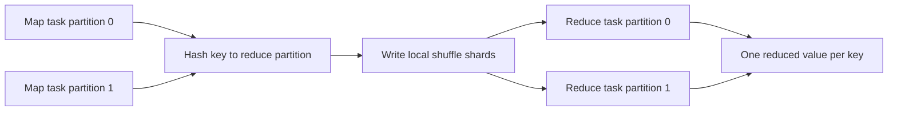
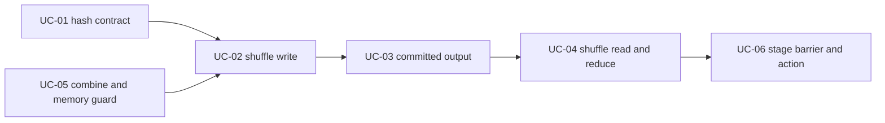

# Feature 04: Local shuffle và keyed aggregation

## Outcome

Feature 04 thực thi `ReduceByKey` đã được mô tả ở Feature 02. Nó route keyed
records từ nhiều map partitions vào đúng reduce partition, rồi gọi private
reducer function cho values có cùng key.

Ví dụ input:

```text
map partition 0: (Alice, 10), (Bob, 20)
map partition 1: (Alice, 5),  (Bob, 2)
```

Output sau shuffle và reduce:

```text
(Alice, 15)
(Bob, 22)
```

Feature này biến `ShuffleDependency` thành local persisted shuffle data. Nó
không chỉ tạo plan metadata như Feature 02.

## Ý tưởng chính

Shuffle có hai phía:



Map task ghi records theo destination partition. Reduce task chỉ đọc shards
có destination bằng partition của nó. `HashPartitioner` bảo đảm equal keys đi
cùng một destination, nên reducer nhìn thấy toàn bộ values của một key.

## Mapping với Spark

| Spark Core | Project | Giới hạn có chủ đích |
| --- | --- | --- |
| shuffle map task | local task ghi shard files theo hash partition | một máy, local disk |
| `MapStatus` / map output tracker | committed shard metadata | không có RPC hoặc remote fetch |
| shuffle reduce task | stream shards của một destination rồi reduce | không có external shuffle service |
| map-side combine | optional local combine trước shard write | memory bound, spill policy là TBU |
| `HashPartitioner` | stable `HashCode` adapter | chỉ supported Go key types |
| `reduceByKey` | private `ReduceFunc` | one reducer shape trên `Row` |

## Dependency với Feature 01–03

- Feature 01 tạo keyed rows và giữ reducer closure private.
- Feature 02 tạo `ShuffleDependency`, `HashPartitioner` và stage graph.
- Feature 03 cung cấp local task/coordinator lifecycle.
- Feature 04 thêm dữ liệu ở giữa `ShuffleMapStage` và `ResultStage`.

## Use cases và roadmap

`TBU` nghĩa là planned nhưng chưa có tài liệu chi tiết hoặc implementation.

### UC-01 — TBU: Stable hash partitioning

Define supported key types và `HashCode`; verify equal keys luôn đi cùng reduce
partition, kể cả qua nhiều tasks/runs.

### UC-02 — TBU: Shuffle-write task

Map task stream keyed rows, route theo destination và ghi shard data cho từng
reduce partition mà không giữ toàn bộ input partition trong memory.

### UC-03 — TBU: Committed shuffle output

Publish shard manifest atomically. Reduce side chỉ đọc output của map attempts
đã được coordinator xác nhận thành công.

### UC-04 — TBU: Shuffle-read và reduce task

Một reduce task stream tất cả shards cho destination của nó, group values cùng
key và gọi `ReduceFunc` để emit đúng một value cho mỗi key.

### UC-05 — TBU: Map-side combine và memory guard

Cho phép combine values cùng key trước khi ghi shard để giảm I/O; define memory
budget, flush/spill policy và diagnostic khi skew vượt budget.

### UC-06 — TBU: Stage barrier và action result

Chỉ mở reduce stage khi mọi required shuffle map outputs đã commit; nối reduced
rows với `Count`, `Collect` hoặc `WriteJSONLines`.



## Feature boundary

Feature 04 bao gồm one-machine shuffle cho `ReduceByKey`. Nó không bao gồm:

- retry/task attempt recovery hoặc speculative execution;
- remote shuffle service, distributed filesystem hoặc multi-node fetch;
- arbitrary custom partitioner, sort-based shuffle hoặc full external spill;
- SQL aggregate expressions, adaptive execution hoặc join.

## Hoàn thành khi

- equal supported keys luôn được reduce trong cùng destination partition;
- map output chỉ visible downstream sau atomic commit;
- reduce output không phụ thuộc source partition count;
- reducer được gọi ở execution, không phải lúc dựng lineage/planning;
- memory limit và malformed shard errors có diagnostic rõ ràng;
- tất cả use cases hiện vẫn được ghi rõ `TBU` cho tới khi có spec và implementation.
