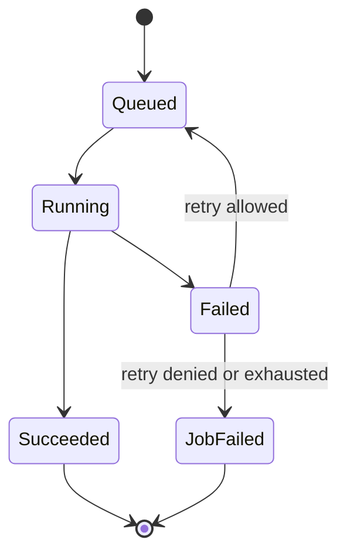
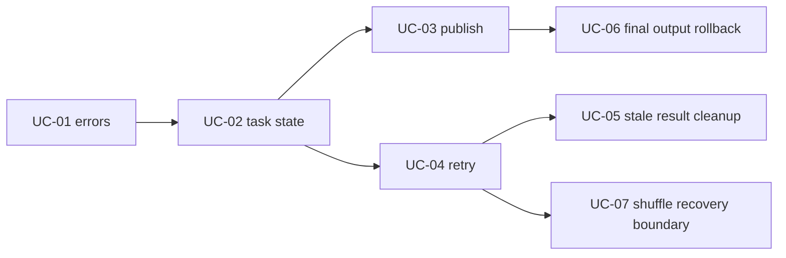

# Feature 05: Reliable task execution

## Outcome

Feature 05 làm cho task failure trở thành trạng thái có kiểm soát: coordinator
ghi nhận từng attempt, quyết định retry hay fail job, và chỉ publish output của
attempt thành công đã được validate.

Output khi job fail là `JobError` có job ID, task/stage liên quan và lịch sử
attempt errors. Output final của action chỉ visible khi mọi task cần thiết đã
hoàn thành theo policy.

## Ý tưởng chính

Một logical task có thể có nhiều attempts, nhưng chỉ coordinator được thay đổi
task state. Result đến muộn từ attempt cũ không được overwrite output của
attempt mới hơn.

`Succeeded` nghĩa là output đã validate và publish atomically, không chỉ là
worker/goroutine return `nil`.

## Mapping với Spark

| Spark Core | Project | Giới hạn có chủ đích |
| --- | --- | --- |
| task attempt | local attempt record cho một stage partition | local coordinator owner |
| task retry | bounded retry policy theo error class | không speculation ban đầu |
| task failure reason | structured `TaskError` / `JobError` | error classes education-sized |
| map output invalidation | invalidate local committed shuffle output | remote map-output tracker là TBU |
| output commit | validate temporary output rồi atomic publish | local filesystem only |
| job cancellation | context cancellation lan tới active tasks | no cluster-wide kill protocol |

## Dependency với Feature 03–04

- Feature 03 tạo/runs local tasks và action output temporary.
- Feature 04 tạo shuffle shard output cần attempt-safe publishing.
- Feature 05 làm coordinator, temporary paths và committed output an toàn khi
  task fail hoặc retry.

## Use cases và roadmap

`TBU` nghĩa là planned nhưng chưa có tài liệu chi tiết hoặc implementation.

### UC-01 — TBU: Error taxonomy và JobError

Define error classes như configuration, input data, user function, I/O,
cancellation và runtime failure; decide class nào retryable.

### UC-02 — TBU: Attempt state machine

Create immutable attempt records, legal state transitions và single-owner
coordinator loop để tránh race giữa tasks.

### UC-03 — TBU: Validate và publish attempt output

Validate files/manifest nằm trong attempt directory, rồi publish qua temporary
file + atomic rename. Failed/unpublished output không visible downstream.

### UC-04 — TBU: Bounded retry policy

Retry task theo `MaxAttempts` và error class; stop retry khi cancellation, data
error hoặc user-function error không retryable.

### UC-05 — TBU: Stale result và cleanup

Bỏ result của attempt superseded; cleanup đúng temporary/failed attempt mà
không xóa output committed của task khác.

### UC-06 — TBU: Cancellation và final output rollback

Cancel remaining tasks khi job terminal; `WriteJSONLines` không để target hay
temporary final directory bị partial sau failure.

### UC-07 — TBU: Shuffle recovery boundary

Xác định map output nào bị invalid sau retry/failure và stage nào cần chạy lại.
Full remote shuffle recovery không thuộc MVP.

## Feature boundary

Feature 05 bao gồm local retries và atomic output lifecycle. Nó không bao gồm:

- speculative execution, task locality reassignment hoặc cluster failover;
- exactly-once external side effects from arbitrary user functions;
- remote executor/process recovery protocol;
- checkpointing, lineage truncation hoặc durable cluster metadata.

## Hoàn thành khi

- attempts có transition hợp lệ và bounded retry count;
- late/superseded result không thể được publish;
- retry decision giải thích được qua error class;
- failed/canceled job không visible partial final/shuffle output;
- job error giữ attempt history đủ để debug;
- toàn bộ UC vẫn `TBU` cho tới khi có detailed spec và implementation.
