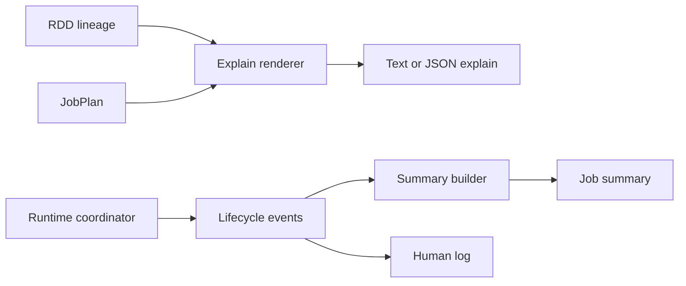
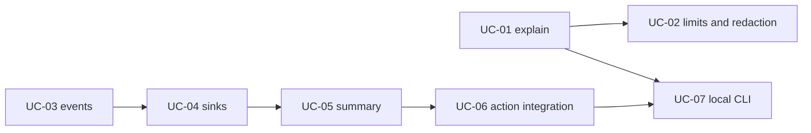

# Feature 06: Explain và job observability

## Outcome

Feature 06 giúp caller trả lời hai câu hỏi:

```text
Trước khi chạy: RDD lineage và stage plan trông như thế nào?
Sau khi chạy: job nào đã chạy, stage/task nào thành công hoặc thất bại?
```

Output gồm:

- side-effect-free `Explain` cho logical RDD lineage và `JobPlan`;
- event stream của job/stage/task lifecycle;
- job summary và human-readable log được tạo từ events;
- metadata paths/IDs/counters/errors, không chứa payload rows.

## Ý tưởng chính

Explain không là action. Nó chỉ inspect metadata, không mở source và không gọi
closure. Job summary không tự đọc runtime state rải rác; nó được fold từ event
stream để success và failure có cùng nguồn sự thật.



Closure body/captured values không được render. Explain chỉ mô tả RDD kind,
parent IDs, partition count, dependency kind, partitioner và stage relation.

## Mapping với Spark

| Spark Core | Project | Giới hạn có chủ đích |
| --- | --- | --- |
| RDD debug string | structured/text `Explain` | không có full Spark UI DAG visualization |
| Spark listener events | local job/stage/task events | one local coordinator |
| event log/history server | JSONL event file + summary | không có history server |
| SQL `EXPLAIN` | RDD lineage + stage graph renderer | không render Catalyst rule tree |
| task metrics | counts, bytes, duration, errors | metrics set nhỏ, no record payload |

## Dependency với Feature 01–05

- Feature 01 cung cấp `Describe()` snapshots của RDD nodes.
- Feature 02 cung cấp `JobPlan`, stages và dependency edges.
- Feature 03/04 cung cấp task execution metrics.
- Feature 05 cung cấp attempts, retry/failure information và terminal status.

## Use cases và roadmap

`TBU` nghĩa là planned nhưng chưa có tài liệu chi tiết hoặc implementation.

### UC-01 — TBU: Deterministic RDD and JobPlan Explain

Render logical RDD lineage, dependencies, partitioner và stage graph thành text
và JSON stable across runs. Không source I/O/closure execution.

### UC-02 — TBU: Explain limits và redaction

Cap output size, omit row payload/closure body, normalize non-deterministic
fields như timestamps/PIDs khỏi plan rendering.

### UC-03 — TBU: Lifecycle event contract

Define job/stage/task/attempt started, succeeded, failed and canceled events;
assign monotonic sequence numbers at coordinator.

### UC-04 — TBU: Event sinks

Provide in-memory sink for tests, JSONL file sink for persistence and fan-out
sink for multiple observers without making workers block.

### UC-05 — TBU: Job summary from events

Fold event stream into a versioned summary with status, timings, stage/task
counts, output metrics and terminal error information.

### UC-06 — TBU: Human log and action integration

Write concise log lines, attach explain/events/summary paths to `JobResult`,
and preserve observability on failed jobs.

### UC-07 — TBU: Local CLI surface

Expose minimal `explain`, `run` and `job show` commands over stored plan/event
artifacts. CLI is local only and does not become a cluster control plane.



## Feature boundary

Feature 06 provides inspection and local event artifacts. Nó không bao gồm:

- Spark UI, history server, distributed tracing hoặc external metrics platform;
- row-level payload logging, closure source capture hoặc PII policy engine;
- SQL/Catalyst explain, adaptive plan changes hoặc live cluster dashboard.

## Hoàn thành khi

- Explain side-effect free và deterministic;
- terminal job state luôn có event/summary, kể cả failure;
- events không chứa record payload;
- summary có thể rebuild từ persisted event stream;
- output caps không làm job execution fail;
- tất cả UC vẫn `TBU` cho tới khi có detailed spec và implementation.
