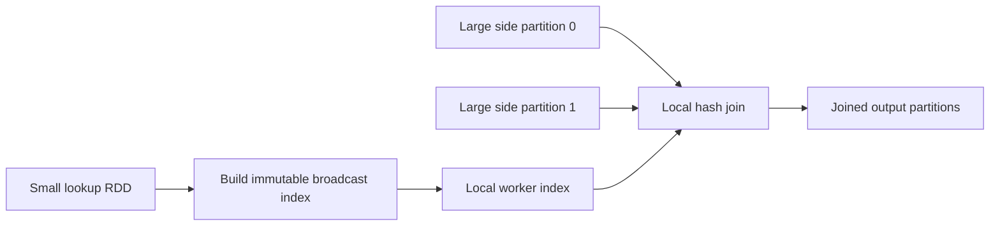
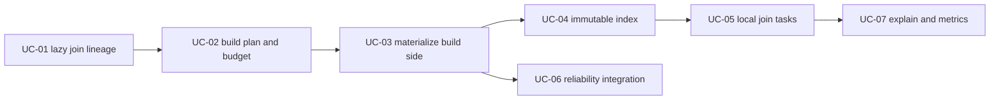

# Feature 07: Broadcast hash join

## Outcome

Feature 07 join một large RDD với một small lookup RDD mà không shuffle large
side. Lookup side được materialize thành immutable broadcast index; mỗi task
của large side dùng index đó để join local rows.

Ví dụ:

```text
orders large RDD:   {customer_id: "c1", amount: 100}
customers small RDD:{customer_id: "c1", tier: "gold"}

output:             {customer_id: "c1", amount: 100, tier: "gold"}
```

Output là join RDD lazy. Action runtime sau đó build lookup index, kiểm tra
size budget và stream join output theo partitions của large side.

## Ý tưởng chính

Large side giữ nguyên partitioning. Chỉ lookup side được materialize/broadcast.



Đây khác `ReduceByKey`: join không route tất cả large-side records qua hash
shuffle. Mỗi large-side partition vẫn được xử lý local; cost chính là memory
để giữ lookup index.

## API direction

Vì project dùng direct Go closures, join key và merge rule nên được caller định
nghĩa bằng functions, không phải operation-name string:

```go
lookup, err := engine.Broadcast(customers)

joined, err := orders.BroadcastHashJoin(
    lookup,
    func(row engine.Row) (any, error) { return row["customer_id"], nil },
    func(left, right engine.Row) (engine.Row, error) {
        return mergeOrderAndCustomer(left, right), nil
    },
)
```

Exact public types, supported key types và join variants là `TBU`; ví dụ trên
chỉ thể hiện intended closure-based direction.

## Mapping với Spark

| Spark Core | Project | Giới hạn có chủ đích |
| --- | --- | --- |
| broadcast exchange | build side materialized thành local immutable index | one machine, no remote broadcast protocol |
| broadcast hash join | each large-side partition probes local index | inner join first |
| size threshold | configured broadcast byte/record/memory budget | estimate may be unknown/refused |
| build-side relation | dedicated build stage before dependent join stage | no AQE change of strategy |
| executor broadcast copy | read-only local index shared/loaded by workers | process-copy semantics are TBU |

## Dependency với Feature 01–06

- Feature 01 provides lazy RDD branches và closure contracts.
- Feature 02 must represent a build-stage dependency without treating it as a
  hash shuffle of the large side.
- Feature 03 provides local tasks and narrow pipeline execution.
- Feature 05 supplies attempt-safe materialized build output.
- Feature 06 renders broadcast choice, limits and build/join lifecycle events.

## Use cases và roadmap

`TBU` nghĩa là planned nhưng chưa có tài liệu chi tiết hoặc implementation.

### UC-01 — TBU: Broadcast and join lineage nodes

Define lazy build-side wrapper and join RDD node. Validate same context,
non-nil key/merge closures and supported join type.

### UC-02 — TBU: Build-side planning and budget

Planner creates a build stage for lookup RDD, estimates serialized records/bytes
and rejects unknown/oversize input according to explicit policy before large
side tasks start.

### UC-03 — TBU: Deterministic broadcast materialization

Materialize build-side rows in deterministic order, publish immutable local
artifact and validate checksum/size before dependent stage can run.

### UC-04 — TBU: Immutable hash index

Load artifact into `key -> []Row` index. Define duplicate-key behavior, memory
budget and read-only ownership for concurrent local workers.

### UC-05 — TBU: Partition-local join task

Stream one large-side partition, extract key, probe index, invoke merge closure
and emit output. Start with inner join only.

### UC-06 — TBU: Failure, retry and cleanup integration

Integrate build artifact with Feature 05 attempts and cancellation; no dependent
join task may consume uncommitted/corrupt build output.

### UC-07 — TBU: Explain and metrics

Show build side, large side stays local, estimated broadcast copies/bytes,
matched/unmatched rows and budget decision.



## Feature boundary

Feature 07 starts with local inner broadcast hash join. Nó không bao gồm:

- shuffle hash join, sort-merge join, full outer/left/right/semi/anti joins;
- adaptive query execution or automatic join-strategy selection;
- remote executor broadcast transport, compression/encryption or cache eviction;
- SQL parser/planner semantics or distributed statistics collection.

## Hoàn thành khi

- large-side partitioning không thay đổi và no large-side shuffle occurs;
- lookup build output được validated trước dependent tasks;
- join closures và merge output không mutate input rows/index;
- oversize/unknown build side có policy và diagnostic rõ ràng;
- explain/metrics làm broadcast cost visible;
- toàn bộ UC vẫn `TBU` cho tới khi có detailed spec và implementation.
