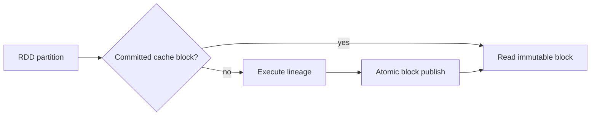

# Feature 08: Cache, persistence và BlockManager

## Outcome

Feature 08 cho phép caller materialize output partitions của một RDD và tái sử dụng chúng qua nhiều actions. Cache là optimization: cache miss hoặc lost block phải fall back về lineage recomputation, không làm thay đổi kết quả.

## Ý tưởng chính

Mỗi cached partition là một immutable block được định danh bởi RDD ID, partition ID và storage level. Task đọc block committed nếu có; nếu không có thì tính lại partition qua lineage, sau đó chỉ publish block khi output đã complete và valid.

## Mapping với Spark

| Spark Core | Project | Giới hạn có chủ đích |
| --- | --- | --- |
| `persist` / `cache` | RDD storage-level metadata | local-first storage |
| BlockManager | local block registry + store | no peer replication in MVP |
| cache eviction | capacity-aware eviction | no unified JVM memory manager |
| lost cached block | lineage recomputation | no remote block migration |

## Dependency với Feature 01–07

- Feature 01 provides immutable lineage and partition identity.
- Feature 03 provides partition-local execution.
- Feature 05 provides attempt-safe output publication.
- Feature 06 records cache hit, miss, eviction and recomputation metrics.

## Use cases và roadmap

`TBU` nghĩa là planned nhưng chưa có tài liệu chi tiết hoặc implementation.

### UC-01 — TBU: Persist intent and storage levels

Define MEMORY_ONLY, DISK_ONLY and MEMORY_AND_DISK; validate same-context ownership and immutable configuration.

### UC-02 — TBU: Block identity and metadata

Define stable block IDs, size/checksum metadata and ownership rules.

### UC-03 — TBU: Read-through cache execution

Check committed blocks before lineage execution; cache state must never expose partial output.

### UC-04 — TBU: Atomic cache publish

Write temporary block data, validate it, then atomically make it visible.

### UC-05 — TBU: Capacity and eviction

Apply explicit byte budgets and evict only committed blocks; eviction is always recoverable by lineage.

### UC-06 — TBU: Invalidation and lost-block recovery

Treat missing/corrupt blocks as cache misses and recompute the affected partition.

### UC-07 — TBU: Cache observability

Report hits, misses, bytes, evictions and avoided recomputation without logging row payloads.

## Feature boundary

Feature 08 does not include executor-to-executor replication, a distributed BlockManager, serialized JVM objects, checkpoint lineage truncation, or off-heap memory management.

## Hoàn thành khi

- a cached and uncached action return equivalent output;
- only validated complete blocks are visible;
- eviction or loss never corrupts output and triggers selective recomputation;
- cache metrics distinguish hit, miss and recompute;
- toàn bộ UC vẫn `TBU` cho tới khi có detailed spec và implementation.
