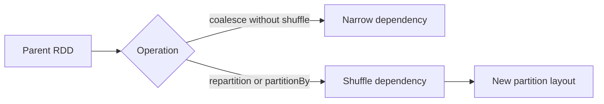

# Feature 09: Partition operations và partition-aware transformations

## Outcome

Feature 09 adds explicit control over data distribution: repartition, coalesce, partitionBy, range partitioning, and partition-preserving transformations. It makes partition count and partitioner metadata first-class planning inputs.

## Ý tưởng chính

Changing the number or ownership of partitions is not a cosmetic API decision. coalesce can preserve a narrow relationship when reducing partitions; repartition must introduce an explicit shuffle. A transformation may preserve a partitioner only when its key contract proves it safe.

## Mapping với Spark

| Spark Core | Project | Giới hạn có chủ đích |
| --- | --- | --- |
| `repartition` | full reshuffle | hash/range only |
| `coalesce` | narrow merge or optional shuffle | no locality optimization |
| `partitionBy` | keyed RDD repartitioning | limited key types |
| `RangePartitioner` | sampled boundary metadata | local deterministic sampling |

## Dependency với Feature 01–08

- Feature 02 models narrow and shuffle dependencies.
- Feature 04 executes shuffle boundaries.
- Feature 08 makes cache invalidation/reuse depend on partition identity.

## Use cases và roadmap

`TBU` nghĩa là planned nhưng chưa có tài liệu chi tiết hoặc implementation.

### UC-01 — TBU: Partition specification

Represent target count, partitioner kind, partition mapping and validation errors.

### UC-02 — TBU: Narrow coalesce

Merge contiguous parent partitions without shuffle and preserve record order within each parent partition.

### UC-03 — TBU: Shuffle coalesce and repartition

Route records through a new shuffle when an even redistribution is required.

### UC-04 — TBU: Hash partitioning API

Expose partitionBy and safely preserve partitioner metadata for compatible keyed transformations.

### UC-05 — TBU: Range partitioning

Sample comparable keys, define deterministic boundaries and route equal boundary keys consistently.

### UC-06 — TBU: Partitioner propagation rules

Define when map-like operations preserve, discard or require a partitioner.

### UC-07 — TBU: Explain and metrics

Show partition counts, operation-induced shuffle, skew indicators and mapping decisions.

## Feature boundary

No custom arbitrary partitioner plugins, rack locality, adaptive partition coalescing, skew splitting, or SQL distribution requirements.

## Hoàn thành khi

- plans distinguish narrow coalesce from shuffle repartition;
- partitioner propagation is conservative and deterministic;
- equal keys reach the same destination under supported partitioners;
- explain makes every partition-count change visible;
- toàn bộ UC vẫn `TBU` cho tới khi có detailed spec và implementation.
