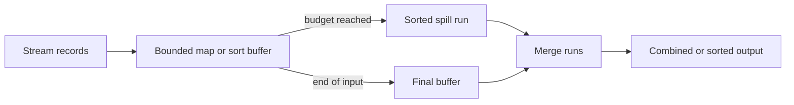

# Feature 10: External sort, spill và advanced keyed aggregation

## Outcome

Feature 10 extends ReduceByKey with bounded-memory aggregation and sorted output. It introduces combineByKey, aggregateByKey, foldByKey and sortByKey using spillable intermediate runs instead of assuming one partition fits in memory.

## Ý tưởng chính

Records are streamed into an in-memory map or sort buffer. A configured budget triggers a sorted spill run. Final execution merges runs and combines equal keys while preserving the combiner contract.

## Mapping với Spark

| Spark Core | Project | Giới hạn có chủ đích |
| --- | --- | --- |
| map-side combine | typed combiner state | reduced Row-based API |
| shuffle spill | local sorted temporary runs | no production sorter format |
| external sort | merge spill files | one-machine files only |
| `aggregateByKey` | zero-value and seq/comb closures | no arbitrary serialization |

## Dependency với Feature 01–09

- Feature 04 supplies shuffle read/write and basic keyed reduction.
- Feature 05 supplies cleanup and committed output lifecycle.
- Feature 09 supplies hash/range partitioning.

## Use cases và roadmap

`TBU` nghĩa là planned nhưng chưa có tài liệu chi tiết hoặc implementation.

### UC-01 — TBU: Combiner contract

Define create, merge-value and merge-combiner closures with deterministic error handling.

### UC-02 — TBU: Memory accounting

Track buffer bytes/records; reject impossible budgets with diagnostics.

### UC-03 — TBU: Spill-run writer

Sort buffered records, write checksummed temporary runs and release memory.

### UC-04 — TBU: Multi-way merge

Merge bounded fan-in runs and delete only verified-consumed temporary files.

### UC-05 — TBU: Advanced keyed APIs

Build combineByKey, aggregateByKey and foldByKey on the combiner contract.

### UC-06 — TBU: sortByKey

Use range partitioning plus local external sort for globally ordered partition ranges.

### UC-07 — TBU: Spill diagnostics

Expose spill bytes, run counts, merge passes, peak buffer usage and skew warnings.

## Feature boundary

No full Spark UnsafeExternalSorter, JVM object serialization, arbitrary ordering expressions, SQL aggregate expressions, or speculative spill sharing.

## Hoàn thành khi

- output remains correct under budgets smaller than one input partition;
- spill files never become visible as final output;
- combiner semantics are equivalent with and without spill;
- merge cleanup preserves committed outputs after failure;
- toàn bộ UC vẫn `TBU` cho tới khi có detailed spec và implementation.
