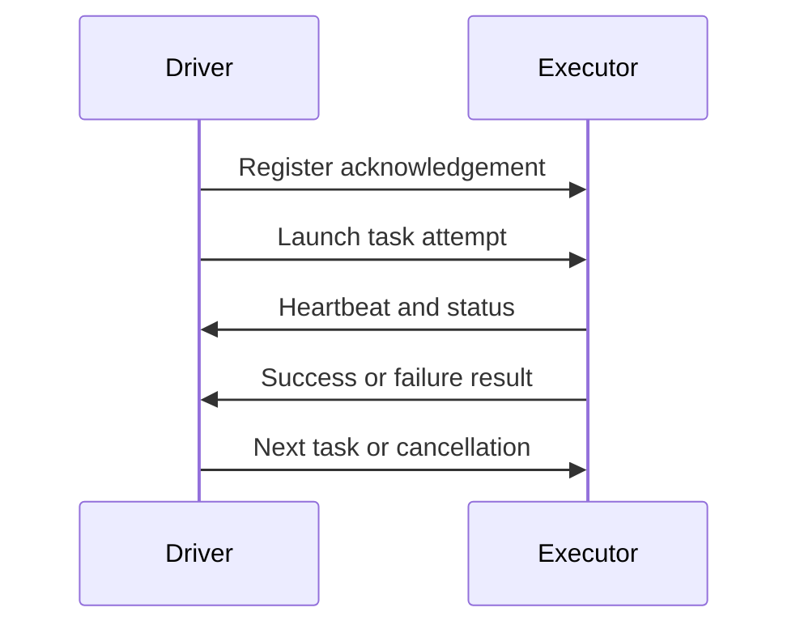

# Feature 11: Distributed driver–executor runtime

## Outcome

Feature 11 moves the local task runtime to a deliberately reduced multi-process model: a driver owns job state; executors register, receive tasks, heartbeat, return status and run one partition task at a time. It establishes a control-plane/data-plane boundary without claiming production cluster compatibility.

## Ý tưởng chính

The driver is the single authority for job, stage and attempt state. Executors are replaceable workers; they do not independently publish final output or decide retries.

## Mapping với Spark

| Spark Core | Project | Giới hạn có chủ đích |
| --- | --- | --- |
| driver | coordinator process | single driver, no HA |
| executor | worker process | fixed local/host pool |
| task launch | RPC task envelope | direct closures replaced by registered function IDs |
| heartbeat | executor liveness signal | no production RPC security |

## Dependency với Feature 01–10

- Feature 02 provides plans and stage identity.
- Feature 03 provides task semantics.
- Feature 05 owns attempts, retries and output commit.
- Feature 06 defines lifecycle events and metrics.

## Use cases và roadmap

`TBU` nghĩa là planned nhưng chưa có tài liệu chi tiết hoặc implementation.

### UC-01 — TBU: Driver state ownership
Define serialized job/stage/task-attempt state owned by one coordinator loop.

### UC-02 — TBU: Executor registration
Register executor ID, capabilities, slots and protocol version; reject incompatible workers.

### UC-03 — TBU: Task envelope and function registry
Send partition, stage, attempt, input descriptors and registered function references without serializing arbitrary closures.

### UC-04 — TBU: Heartbeat and liveness
Track heartbeat deadlines and mark lost executors without immediately declaring all work failed.

### UC-05 — TBU: Remote task lifecycle
Launch, cancel, acknowledge and report terminal task status with idempotent messages.

### UC-06 — TBU: Resource offers
Schedule runnable tasks against explicit executor slots; fairness is outside MVP.

### UC-07 — TBU: Process boundary tests
Run driver and executor in separate processes and validate protocol failure behavior.

## Feature boundary

No Kubernetes/YARN cluster manager, TLS/authentication, driver high availability, dynamic allocation, multi-tenant scheduling, or arbitrary language closure transport.

## Hoàn thành khi

- a task can run on a registered remote executor;
- the driver remains the only owner of scheduling and attempt decisions;
- duplicate messages do not create duplicate task publication;
- executor loss becomes an observable, recoverable event;
- toàn bộ UC vẫn `TBU` cho tới khi có detailed spec và implementation.
