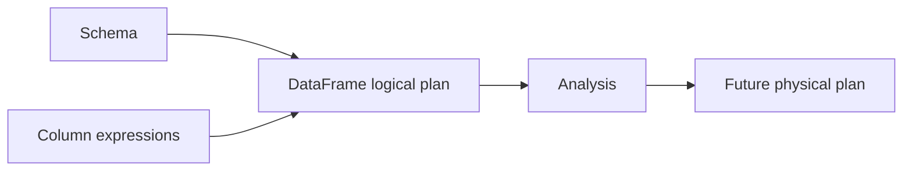

# Feature 13: Schema, expressions và DataFrame API

## Outcome

Feature 13 introduces a typed, schema-carrying DataFrame layer over RDD execution. DataFrame transformations are lazy logical operations built from named columns and expression trees rather than opaque row closures.

## Ý tưởng chính

A DataFrame owns a schema and a logical plan. An expression declares how to compute a column; it is analyzed before execution, enabling later optimization without evaluating user data during API construction.

## Mapping với Spark

| Spark SQL | Project | Giới hạn có chủ đích |
| --- | --- | --- |
| `StructType` | reduced schema and data types | primitive/nested subset first |
| `Column` | immutable expression tree | no UDF language runtime |
| DataFrame | schema + logical node | local API only |
| analyzer | basic resolution in next feature | no SQL parser |

## Dependency với Feature 01–12

- Features 01–12 provide partitioned execution, caching, shuffle and recovery substrate.
- Feature 06 provides explain artifacts that will render logical plans.

## Use cases và roadmap

`TBU` nghĩa là planned nhưng chưa có tài liệu chi tiết hoặc implementation.

### UC-01 — TBU: Data types and schema
Define nullable primitive types, field names, stable field IDs and schema equality.

### UC-02 — TBU: Row-to-schema validation
Validate source rows at explicit ingestion boundaries and produce field-aware errors.

### UC-03 — TBU: Expression AST
Represent attribute references, literals, aliases, arithmetic, comparisons, boolean logic and null predicates.

### UC-04 — TBU: Logical DataFrame nodes
Add project, filter, with-column, limit and union nodes without executing data.

### UC-05 — TBU: Public DataFrame API
Expose immutable Select, Filter, WithColumn, Drop and Limit calls.

### UC-06 — TBU: Name and ambiguity contracts
Define duplicate column, missing column and case-sensitivity behavior before analysis.

### UC-07 — TBU: Explain surface
Render schema and unresolved/resolved logical plan without values or source I/O.

## Feature boundary

No SQL parser, joins, aggregates, windows, UDFs, typed Dataset encoders, Catalyst optimizer, or physical execution operators.

## Hoàn thành khi

- DataFrame construction is lazy and immutable;
- all public column operations create inspectable expression trees;
- invalid schema/name states fail deterministically before execution;
- the API can express filter and projection without opaque closures;
- toàn bộ UC vẫn `TBU` cho tới khi có detailed spec và implementation.
