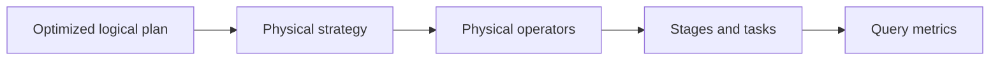

# Feature 15: Physical planning và DataFrame execution

## Outcome

Feature 15 maps optimized logical DataFrame plans to executable physical operators. It selects a simple physical strategy, inserts exchanges where distribution changes, executes column expressions over partition streams, and connects query metrics to existing job/stage/task events.

## Ý tưởng chính

Logical plans express what the result means; physical plans express where and how it is computed. A physical operator declares its child requirements, output partitioning and execution iterator contract.

## Mapping với Spark

| Spark SQL | Project | Giới hạn có chủ đích |
| --- | --- | --- |
| SparkPlan | physical operator tree | iterator-like Row stream |
| Exchange | explicit repartition boundary | reuses Core shuffle |
| ProjectExec / FilterExec | expression-evaluating operators | no generated bytecode |
| SQL metrics | operator counters | small local metric set |

## Dependency với Feature 01–14

- Feature 03/04/09/10 execute narrow work, shuffle and spill.
- Feature 11/12 run and recover distributed work.
- Feature 14 provides analyzed optimized plans.

## Use cases và roadmap

`TBU` nghĩa là planned nhưng chưa có tài liệu chi tiết hoặc implementation.

### UC-01 — TBU: Physical operator contract
Define child plan, output schema, output partitioning and streaming execute interface.

### UC-02 — TBU: Leaf and projection operators
Implement scan adapter, project, filter, limit and union physical nodes.

### UC-03 — TBU: Expression evaluator
Evaluate the supported expression AST with explicit null/error behavior.

### UC-04 — TBU: Distribution requirements
Represent clustered, ordered and single-partition requirements for future operators.

### UC-05 — TBU: Exchange insertion
Insert Core repartition/shuffle operators only when a physical requirement is unmet.

### UC-06 — TBU: Strategy selection
Choose a deterministic first-fit physical strategy and reject unsupported logical nodes.

### UC-07 — TBU: Query execution metrics
Attach row counts, time, spill and exchange metrics to physical nodes.

## Feature boundary

No whole-stage code generation, vectorized execution, SQL aggregates, joins, cost model, AQE, or production SparkPlan compatibility.

## Hoàn thành khi

- every supported logical node maps to an explicit physical operator;
- required exchanges are visible before execution;
- physical operators stream rows without materializing full partitions;
- metrics can be correlated to plan nodes and stages;
- toàn bộ UC vẫn `TBU` cho tới khi có detailed spec và implementation.
