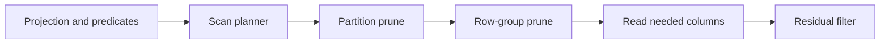

# Feature 16: Parquet, column pruning và predicate pushdown

## Outcome

Feature 16 adds a reduced columnar scan path for Parquet-like files. It uses schema, projection and filter information from the query engine to avoid reading unneeded files, row groups and columns while preserving correct residual filtering.

## Ý tưởng chính

Pushdown is an optimization contract, not a correctness shortcut. A source may skip data only when its statistics prove it cannot match; unsupported or uncertain predicates remain residual filters in the physical plan.

## Mapping với Spark

| Spark SQL | Project | Giới hạn có chủ đích |
| --- | --- | --- |
| Parquet scan | local columnar file reader | supported Parquet subset |
| partition pruning | directory partition filter | no Hive metastore |
| column pruning | requested field IDs | primitive columns first |
| predicate pushdown | min/max/null-count checks | no bloom/dictionary guarantees |

## Dependency với Feature 13–15

- Feature 13 provides schema and expressions.
- Feature 14 separates pushable predicates from residual predicates.
- Feature 15 turns a scan strategy into an executable physical operator.

## Use cases và roadmap

`TBU` nghĩa là planned nhưng chưa có tài liệu chi tiết hoặc implementation.

### UC-01 — TBU: Columnar source descriptor
Define file schema, row-group metadata and partition-directory descriptors.

### UC-02 — TBU: Schema projection
Map requested DataFrame fields to source columns and avoid reading unrequested fields.

### UC-03 — TBU: Partition pruning
Use directory partition values to skip impossible files before opening them.

### UC-04 — TBU: Row-group statistics pruning
Use conservative min/max/null-count logic and retain row groups on uncertainty.

### UC-05 — TBU: Predicate translation
Translate a safe subset of expression predicates into source filters; keep residual plan filters.

### UC-06 — TBU: Columnar decode and row adapter
Decode supported column pages into the Feature 15 row-stream contract.

### UC-07 — TBU: Scan metrics and explain
Expose files/row groups skipped, columns read, bytes read and residual predicates.

## Feature boundary

No ORC, Delta Lake, nested/repeated Parquet types, encryption, schema evolution, object-store commit protocol, catalog integration, or guaranteed predicate pushdown for all expressions.

## Hoàn thành khi

- removing a pushdown optimization does not change query results;
- unsupported predicates execute as residual filters;
- projection avoids decoding unrequested supported columns;
- explain proves why files or row groups were skipped;
- toàn bộ UC vẫn `TBU` cho tới khi có detailed spec và implementation.
