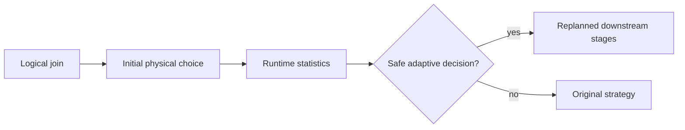

# Feature 17: Join strategies và Adaptive Query Execution

## Outcome

Feature 17 extends Feature 07 broadcast join with a small, explicit set of join strategies: broadcast hash join, shuffle hash join and sort-merge join. It then adds constrained Adaptive Query Execution that can revise selected exchanges or join strategies from trustworthy runtime statistics before dependent work starts.

## Ý tưởng chính

Every join strategy states its distribution and ordering requirements. AQE is not arbitrary mid-job mutation: it may replace only a not-yet-started downstream plan when collected statistics are complete, validated and recorded in explain/events.

## Mapping với Spark

| Spark SQL | Project | Giới hạn có chủ đích |
| --- | --- | --- |
| broadcast hash join | Feature 07 path | inner join first |
| shuffle hash join | hashed exchange + build/probe | limited key types |
| sort-merge join | ordered exchange + merge | reduced ordering semantics |
| AQE | bounded replanning rules | no full cost model |

## Dependency với Feature 07–16

- Feature 07 provides broadcast build-side semantics.
- Feature 09/10 provide partitioning and external sort.
- Feature 12 provides distributed shuffle recovery.
- Feature 14–16 provide logical predicates, physical planning and scan statistics.

## Use cases và roadmap

`TBU` nghĩa là planned nhưng chưa có tài liệu chi tiết hoặc implementation.

### UC-01 — TBU: Join logical and physical requirements
Define supported inner join keys, output schema, null behavior and distribution requirements.

### UC-02 — TBU: Broadcast hash strategy
Reuse Feature 07 after planner validates build-side budget and eligibility.

### UC-03 — TBU: Shuffle hash strategy
Hash-partition both sides, build a bounded in-memory/spillable hash table, then probe.

### UC-04 — TBU: Sort-merge strategy
Range/hash distribute as needed, external-sort both sides and merge matching keys.

### UC-05 — TBU: Strategy selection policy
Select a deterministic initial strategy from known size, ordering and budget metadata.

### UC-06 — TBU: Adaptive join and coalesce decisions
Use completed map statistics to replace only safe downstream strategies or coalesce partitions.

### UC-07 — TBU: Skew detection and split plan
Detect oversized shuffle partitions and define a bounded split/replicate plan for eligible joins.

### UC-08 — TBU: Adaptive explain and metrics
Render initial/final plans, decision reason, statistics, skew indicators and avoided shuffle bytes.

## Feature boundary

No outer/semi/anti joins, nested-loop joins, cost-based join reordering, automatic broadcast of unknown inputs, streaming joins, full Spark AQE rule parity, or dynamic cluster resizing.

## Hoàn thành khi

- every chosen join strategy satisfies its declared distribution/order requirements;
- adaptive decisions happen before affected downstream tasks begin;
- initial and final plans are inspectable with a reason for every change;
- skew handling is bounded and falls back safely when ineligible;
- toàn bộ UC vẫn `TBU` cho tới khi có detailed spec và implementation.
