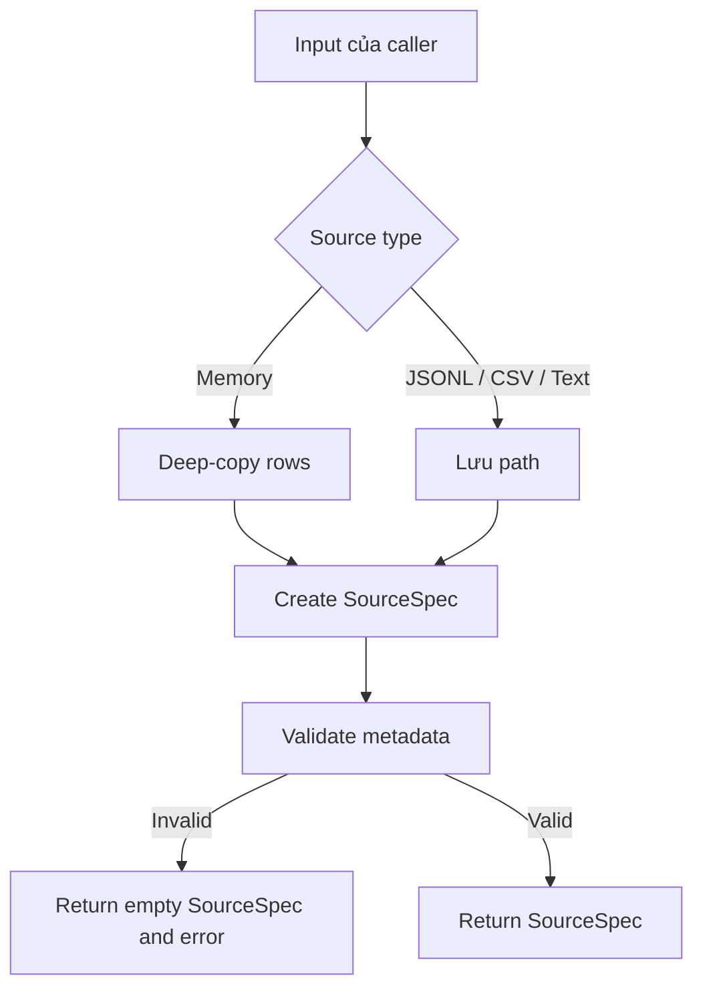

# Feature 01: RDD API và partitioned sources

## UC-01: Tạo source descriptor

### 1. Mục tiêu

UC-01 tạo một `SourceSpec` dùng để **mô tả nguồn dữ liệu**, nhưng chưa đọc dữ
liệu thật.

Source có thể đến từ:

- các `Row` có sẵn trong memory;
- file JSON Lines;
- file CSV
- file text.

Kết quả của use case là metadata đã được validate:

```go
SourceSpec{
    Kind:           SourceCSV,
    Path:           "testdata/sample.csv",
    Rows:           nil,
    PartitionCount: 2,
}
```

UC-01 chưa mở file, chưa decode record và chưa chia dữ liệu thật vào các
partition. Các hành vi đó thuộc source-reader use case.

### 2. Luồng xử lý



Hai nguyên tắc quan trọng:

1. Memory source không giữ reference tới rows do caller sở hữu.
2. File source constructor không kiểm tra filesystem.

### 3. Data model

#### 3.1. Row

`Row` là một record có cấu trúc tương tự JSON object:

```go
type Row map[string]any
```

Ví dụ:

```go
row := Row{
    "id":       1,
    "category": "book",
    "active":   true,
    "tags":     []any{"go", "spark"},
}
```

Kiểu `any` cho phép một field chứa scalar, nested map hoặc slice.

Implementation: `internal/model/record.go`.

#### 3.2. SourceKind

`SourceKind` xác định cách record được lưu:

```go
type SourceKind string

const (
    SourceMemory    SourceKind = "memory"
    SourceJSONLines SourceKind = "jsonl"
    SourceCSV       SourceKind = "csv"
    SourceText      SourceKind = "text"
)
```

Dùng một named type thay vì string thuần giúp API diễn đạt rõ mục đích và gom
các source kind được hỗ trợ vào một chỗ.

#### 3.3. SourceSpec

```go
type SourceSpec struct {
    Kind           SourceKind
    Path           string
    Rows           []Row
    PartitionCount int
}
```

Ý nghĩa của từng field:

| Field | Ý nghĩa |
| --- | --- |
| `Kind` | Memory, JSONL, CSV hoặc text. |
| `Path` | Đường dẫn của file source; rỗng với memory source. |
| `Rows` | Các record của memory source; `nil` với file source. |
| `PartitionCount` | Số partition logic được yêu cầu. |

Hai hình dạng hợp lệ:

```text
Memory source
├── Kind: memory
├── Path: ""
├── Rows: [...]
└── PartitionCount: 1..8

File source
├── Kind: jsonl / csv / text
├── Path: non-empty
├── Rows: nil
└── PartitionCount: 1..8
```

Implementation: `internal/model/source.go`.

### 4. Deep-copy memory rows

Map và slice trong Go chứa reference tới vùng dữ liệu bên dưới. Nếu constructor
lưu trực tiếp input, caller có thể vô tình thay đổi source sau khi nó được tạo:

```go
rows := []Row{{"id": 1}}
source, _ := NewMemorySource(rows, 2)

rows[0]["id"] = 999
```

UC-01 ngăn việc này bằng cách copy cả outer slice, từng `Row` và các collection
lồng bên trong.

#### 4.1. CloneRow

```go
func CloneRow(row Row) Row {
    if row == nil {
        return nil
    }

    cloned := make(Row, len(row))
    for key, value := range row {
        cloned[key] = CloneValue(value)
    }
    return cloned
}
```

`cloned := row` không đủ vì hai biến vẫn trỏ tới cùng một map.

#### 4.2. CloneValue

```go
func CloneValue(value any) any {
    switch value := value.(type) {
    case Row:
        return CloneRow(value)
    case map[string]any:
        cloned := make(map[string]any, len(value))
        for key, nested := range value {
            cloned[key] = CloneValue(nested)
        }
        return cloned
    case []any:
        cloned := make([]any, len(value))
        for index, nested := range value {
            cloned[index] = CloneValue(nested)
        }
        return cloned
    default:
        return value
    }
}
```

Hàm đệ quy với các mutable JSON-like values đang được hỗ trợ:

- `Row`;
- `map[string]any`;
- `[]any`.

Scalar như `string`, `int` và `bool` được trả lại trực tiếp vì chúng không thể
bị mutate thông qua một reference dùng chung.

#### 4.3. Clone outer slice

```go
func cloneRows(rows []Row) []Row {
    if rows == nil {
        return nil
    }

    cloned := make([]Row, len(rows))
    for index, row := range rows {
        cloned[index] = CloneRow(row)
    }
    return cloned
}
```

Việc tạo outer slice mới ngăn thao tác như `rows[0] = anotherRow` làm thay đổi
source.

### 5. Source constructors

#### 5.1. Memory source

```go
func NewMemorySource(rows []Row, partitions int) (SourceSpec, error) {
    source := SourceSpec{
        Kind:           SourceMemory,
        Rows:           cloneRows(rows),
        PartitionCount: partitions,
    }
    if err := source.Validate(); err != nil {
        return SourceSpec{}, err
    }
    return source, nil
}
```

Thứ tự xử lý:

1. Gán source kind.
2. Deep-copy input rows.
3. Lưu partition count.
4. Validate descriptor.
5. Trả về source hoặc error.

#### 5.2. File sources

Ba public constructors dùng chung một private helper:

```go
func NewJSONLinesSource(path string, partitions int) (SourceSpec, error)
func NewCSVSource(path string, partitions int) (SourceSpec, error)
func NewTextSource(path string, partitions int) (SourceSpec, error)
```

```go
func newFileSource(kind SourceKind, path string, partitions int) (SourceSpec, error) {
    source := SourceSpec{
        Kind:           kind,
        Path:           path,
        PartitionCount: partitions,
    }
    if err := source.Validate(); err != nil {
        return SourceSpec{}, err
    }
    return source, nil
}
```

Constructor không gọi `os.Open`, `os.Stat` hoặc `filepath.Glob`. Vì vậy đoạn
sau vẫn thành công dù path chưa tồn tại:

```go
source, err := NewCSVSource("does/not/exist.csv", 4)
```

Đây là lazy construction: lỗi filesystem chỉ nên xuất hiện khi source reader
được yêu cầu đọc một partition.

### 6. Validation rules

`SourceSpec.Validate` chỉ kiểm tra metadata và không thực hiện I/O.

#### 6.1. Partition count

```go
const MaxPartitions = 8
```

Một source hợp lệ phải có:

```text
1 <= PartitionCount <= MaxPartitions
```

Các giá trị `-1`, `0` và `9` đều trả error. Error bao gồm partition count đã
được yêu cầu để caller xác định cấu hình sai.

#### 6.2. Memory source

- `Path` phải rỗng.
- `Rows` có thể `nil`, rỗng hoặc chứa record.

#### 6.3. File source

- `Path` không được rỗng.
- `Rows` phải là `nil`.
- Path chưa cần tồn tại tại thời điểm construction.

#### 6.4. Unknown kind

Một `SourceKind` không nằm trong danh sách hỗ trợ trả error:

```go
SourceSpec{Kind: "unknown", PartitionCount: 1}
```

### 7. Source files dùng để kiểm tra

Project có ba fixture thực tế trong `testdata`:

```text
testdata/
├── sample.jsonl
├── sample.csv
└── sample.txt
```

#### sample.jsonl

```json
{"id":1,"category":"book","price":120}
{"id":2,"category":"course","price":250}
{"id":3,"category":"book","price":90}
```

#### sample.csv

```csv
id,category,price
1,book,120
2,course,250
3,book,90
```

#### sample.txt

```text
learning spark partitions
building a lazy rdd
streaming records from files
```

Ở UC-01, fixtures chỉ được dùng để xác nhận constructor có thể mô tả một path
có thật. Nội dung file chưa được đọc hoặc decode.

### 8. Tests

Tests nằm trong:

```text
internal/model/record_test.go
internal/model/source_test.go
```

#### 8.1. Deep-copy test

Test tạo memory source rồi mutate input ban đầu:

```go
rows[0]["id"] = 2
rows[0]["tags"].([]any)[0] = "changed"
rows[0] = Row{"id": 3}
```

Source vẫn phải giữ `id == 1` và tag `"learning"`. Test này bảo vệ cả outer
slice, row map và nested slice khỏi aliasing.

#### 8.2. No-I/O construction test

Test truyền một path cố ý không tồn tại cho JSONL, CSV và text constructors.
Constructor vẫn phải trả `SourceSpec` thành công.

Nếu constructor bị thay đổi để gọi filesystem, test này sẽ phát hiện regression.

#### 8.3. Validation tests

Tests xác nhận:

- partition count âm, bằng `0` hoặc lớn hơn `MaxPartitions` bị từ chối;
- file path rỗng bị từ chối;
- error partition có chứa giá trị cấu hình sai.

#### 8.4. Real fixture descriptor test

`TestExampleSourceFilesCanBeDescribed` kiểm tra với ba path có thật:

- fixture tồn tại;
- constructor trả đúng `SourceKind`;
- path được giữ nguyên;
- partition count được giữ nguyên;
- file source có `Rows == nil`.

Test này không khẳng định record bên trong đã được đọc.

### 9. Chạy kiểm tra

Từ thư mục `spark/reimplement/repository`:

```bash
go test ./internal/model -v
```

Chạy toàn bộ verification:

```bash
make check
```

`make check` thực hiện:

```text
format check
go vet ./...
go test -race ./...
```

### 10. Kết quả của UC-01

UC-01 hoàn thành khi:

- bốn source constructors tạo được descriptor hợp lệ;
- constructor không thực hiện file I/O;
- memory input được deep-copy;
- source-specific invariants được validate;
- example JSONL, CSV và text files có descriptor tests;
- toàn bộ tests chạy qua race detector.

Output của UC-01 là `SourceSpec`. Source reader sẽ sử dụng descriptor này ở
use case tiếp theo để chia partition, mở file và stream records.
