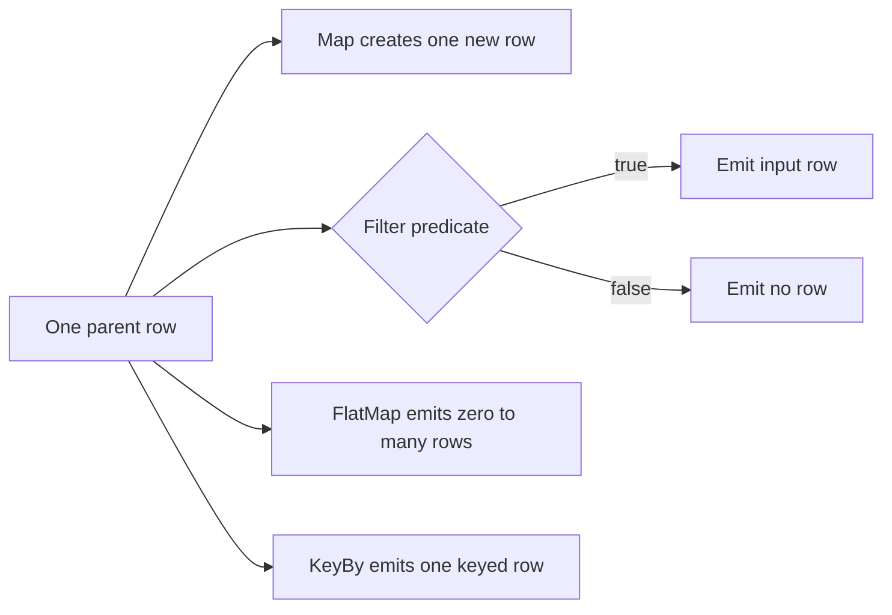
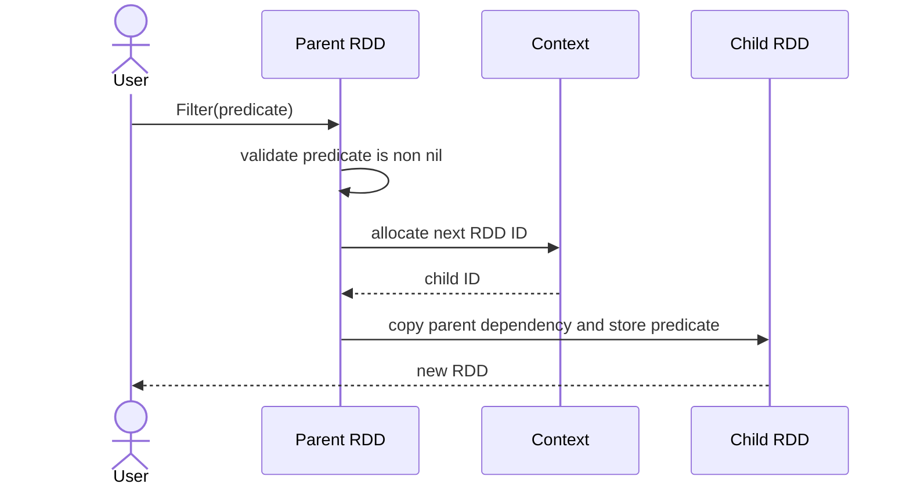
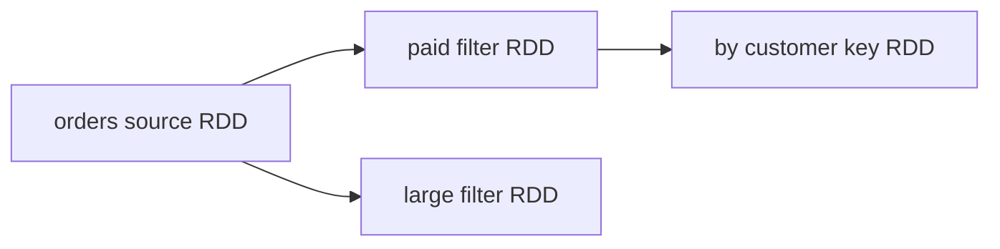

# UC-02: Xây lazy RDD lineage

## Mục tiêu

Từ một RDD có sẵn, tạo một RDD con cho mỗi transformation mà không đọc source,
không chạy row function và không thay đổi parent. RDD con giữ dependency tới
parent và giữ function cần chạy cho runtime của feature sau.

Đây là cách Spark RDD làm việc: `map`, `filter` và `flatMap` trả một RDD mới
ngay lập tức; user function chỉ chạy khi có action như `collect` hoặc `count`.

## Outcome

- Mỗi transformation tạo RDD immutable với numeric ID mới trong cùng `Context`.
- Parent có thể tạo nhiều branch độc lập.
- `Map`, `Filter`, `FlatMap`, `KeyBy` đều là narrow transformation.
- Closure được giữ private để runtime thực thi; API không nhận operation name
  hay `Params`.
- Tạo lineage không mở file, không đọc memory row và không gọi closure.

## Public API

```go
package engine

type Row map[string]any

type MapFunc func(Row) (Row, error)
type FilterFunc func(Row) (bool, error)
type FlatMapFunc func(Row) ([]Row, error)
type KeyFunc func(Row) (any, error)

type KeyedRow struct {
    Key   any
    Value Row
}

func NewContext() *Context
func FromSource(ctx *Context, source SourceSpec) (*RDD, error)
func (rdd *RDD) Map(fn MapFunc) (*RDD, error)
func (rdd *RDD) Filter(fn FilterFunc) (*RDD, error)
func (rdd *RDD) FlatMap(fn FlatMapFunc) (*RDD, error)
func (rdd *RDD) KeyBy(fn KeyFunc) (*RDD, error)
func (rdd *RDD) Union(other *RDD) (*RDD, error)
func (rdd *RDD) Describe() RDDDescription
```

`Context` là owner của counter RDD ID, tương ứng vai trò `SparkContext` cấp ID
cho RDD trong Spark. ID chỉ có ý nghĩa trong một context và không phải hash của
lineage hoặc hash của closure.

## Function được định nghĩa ở đâu?

Logic của operation được viết trực tiếp ở call site, hoặc trong một function Go
được truyền vào transformation. Ví dụ:

```go
func keepPaid(row engine.Row) (bool, error) {
    status, ok := row["status"].(string)
    if !ok {
        return false, fmt.Errorf("status must be a string")
    }
    return status == "paid", nil
}

paid, err := orders.Filter(keepPaid)
```

Hoặc dùng anonymous function khi logic nhỏ:

```go
byCustomer, err := paid.KeyBy(func(row engine.Row) (any, error) {
    key, ok := row["customer_id"]
    if !ok {
        return nil, fmt.Errorf("missing customer_id")
    }
    return key, nil
})
```

`Filter` chỉ kiểm tra `fn != nil` khi lineage được tạo. Lỗi data-dependent,
như `status` có kiểu sai, chỉ xuất hiện khi runtime gọi `keepPaid` trên một row.
Đó là hệ quả cần thiết của lazy evaluation.

Closure có thể capture configuration read-only:

```go
minimumAmount := int64(100_000)
largeOrders, err := orders.Filter(func(row engine.Row) (bool, error) {
    amount, ok := row["amount"].(int64)
    if !ok {
        return false, fmt.Errorf("amount must be int64")
    }
    return amount >= minimumAmount, nil
})
```

Trong Spark thật, closure sẽ được serialize để chạy ở executor. Vì vậy không
nên dựa vào mutable state bên ngoài function: task có thể retry hoặc chạy ở
process khác. Project chưa distributed, nhưng giữ cùng discipline để API không
đánh lừa người học.

## Phân biệt Map, Filter, FlatMap và KeyBy

| Hàm | Contract | Cardinality cho một input row | Output | Ví dụ |
| --- | --- | --- | --- | --- |
| `Map` | `Row -> Row` | chính xác 1 | row mới | chuẩn hoá hoặc chọn fields. |
| `Filter` | `Row -> bool` | 0 hoặc 1 | chính row input nếu giữ | bỏ order đã cancelled. |
| `FlatMap` | `Row -> []Row` | 0 đến N | các row function trả về | tách mỗi tag thành một row. |
| `KeyBy` | `Row -> key` | chính xác 1 | `KeyedRow{key, row}` | chuẩn bị cho `ReduceByKey`. |

### Map

`Map` luôn tạo một output row cho một input row. Dùng khi giá trị hoặc shape của
row thay đổi, nhưng số row không đổi.

```go
normalized, err := orders.Map(func(row engine.Row) (engine.Row, error) {
    country, ok := row["country"].(string)
    if !ok {
        return nil, fmt.Errorf("country must be a string")
    }
    return engine.Row{
        "order_id": row["order_id"],
        "country":  strings.ToUpper(country),
    }, nil
})
```

Runtime phải coi returned row là output owned by transformation. Function không
nên mutate `row` input, vì row này có thể được dùng bởi branch khác của lineage.

### Filter

`Filter` đánh giá predicate. `true` giữ row, `false` không emit row nào.
Filter không biến row thành row khác; nếu vừa biến đổi vừa lọc, dùng `FlatMap`
hoặc ghép `Filter` rồi `Map` để intent rõ ràng.

```go
paid, err := orders.Filter(func(row engine.Row) (bool, error) {
    return row["status"] == "paid", nil
})
```

### FlatMap

`FlatMap` cho phép một input row sinh zero, one hoặc many output rows. Đây là
khác biệt chính với `Map`. Một order có danh sách tags có thể được tách ra:

```go
tags, err := orders.FlatMap(func(row engine.Row) ([]engine.Row, error) {
    raw, ok := row["tags"].([]string)
    if !ok {
        return nil, fmt.Errorf("tags must be []string")
    }

    out := make([]engine.Row, 0, len(raw))
    for _, tag := range raw {
        out = append(out, engine.Row{
            "order_id": row["order_id"],
            "tag":      tag,
        })
    }
    return out, nil
})
```

`[]` là output hợp lệ: row đó đơn giản không tạo record nào. Function nên trả
một slice thuộc ownership của nó; runtime chỉ stream từng item, không cần giữ
cả partition trong memory.

### KeyBy

`KeyBy` tính key cho row và tạo pair khái niệm `(key, value)`. Trong project,
pair được biểu diễn bằng `KeyedRow`; value vẫn là row gốc theo semantics.

```go
byCustomer, err := paid.KeyBy(func(row engine.Row) (any, error) {
    return row["customer_id"], nil
})
```

`KeyBy` **không** group records và **không** shuffle. Nếu customer `A` có row
ở partition 0 và partition 2, hai `KeyedRow` vẫn ở hai partition đó. Feature 02
dùng `ReduceByKey` cùng `HashPartitioner` để đưa equal keys tới cùng reduce
partition.



## Cấu trúc lineage

Public node không giữ executable function. RDD giữ function ở field private:

```go
type Node struct {
    ID          int64
    Kind        NodeKind
    ParentIDs   []int64
    Source      *SourceSpec
    Partitions  int
    Partitioner *Partitioner
}

type RDD struct {
    node    Node
    parents []*RDD
    context *Context
    compute computation // private interface holding MapFunc, FilterFunc, ...
}
```

`NodeKind` mô tả shape của lineage (`source`, `map`, `filter`, `flat_map`,
`key_by`, `union`); `compute` giữ function đúng kiểu. Planner cần dependencies
và partitioner, không cần inspect body closure. Runtime sau này switch theo
`NodeKind` và gọi private function tương ứng.

## Thuật toán tạo child RDD

```text
createNarrowChild(parent, kind, fn):
    reject nil parent or nil fn
    childID = parent.context.nextRDDID()

    node = Node{
        ID: childID,
        Kind: kind,
        ParentIDs: copy([parent.ID]),
        Partitions: parent.Partitions,
    }

    return RDD{
        node: node,
        parents: [parent],
        context: parent.context,
        compute: private computation(fn),
    }
```

`Map`, `Filter`, `FlatMap` và `KeyBy` đều dùng pattern này. Chúng giữ partition
count của parent và tạo one-to-one narrow dependency. `FlatMap` có thể làm số
rows tăng/giảm, nhưng không làm số partitions thay đổi.



Không có source I/O hay row execution trong sequence này.

## Branching và laziness

```go
paid, _ := orders.Filter(keepPaid)
large, _ := orders.Filter(keepLarge)
byCustomer, _ := paid.KeyBy(customerID)
```

`orders` không thay đổi sau ba lời gọi. `paid` và `large` có cùng parent nhưng
không biết nhau; `byCustomer` chỉ phụ thuộc `paid`.



## Union theo Spark UnionRDD

`Union(left, right)` tạo RDD con với hai parent và không nhận row function.
Hai RDD phải thuộc cùng `Context`, nhưng không cần có cùng partition count.
Output partitions là nối partitions theo thứ tự parent:

```text
left:  L0 L1
right: R0 R1 R2
union: L0 L1 R0 R1 R2
```

Mỗi union partition narrow-depend tới đúng một parent partition; không zip,
không align index và không shuffle.

## Describe và ownership

`Describe()` trả snapshot copy có thể chứa ID, kind, parent IDs, source,
partition count và partitioner. Nó không trả closure body hoặc captured values.
Điều này vừa tránh alias mutable vừa phản ánh rằng Go functions không có stable
representation để hash hay serialize an toàn.

## Error contract

| Tình huống | Thời điểm lỗi |
| --- | --- |
| `Context` hoặc parent RDD không hợp lệ | tạo RDD |
| function là `nil` | tạo RDD |
| `Union` khác context | tạo RDD |
| schema/value không hợp lệ trong function | khi future runtime xử lý row |
| source path không tồn tại | khi source reader được gọi |

## Tests chính

- `Map`, `Filter`, `FlatMap`, `KeyBy` tạo child mới, parent không đổi.
- Child có parent ID đúng, partition count giữ nguyên và ID mới tăng dần.
- Closure không được gọi trong lúc tạo lineage.
- `nil` function trả error rõ ràng.
- Hai transformation từ cùng parent tạo được hai branches.
- `KeyBy` không đổi partition count và chưa tạo shuffle dependency.
- Union nối partitions hai parents và reject khác context.
- Caller sửa `Describe()` không làm đổi RDD internal state.

## Ngoài phạm vi

- chạy closure, action, task retry và executor serialization;
- `ReduceByKey`, shuffle, grouping và aggregation;
- typed generic `RDD[T]` của Spark. Project dùng `Row` để tập trung vào
  mechanism lineage.
