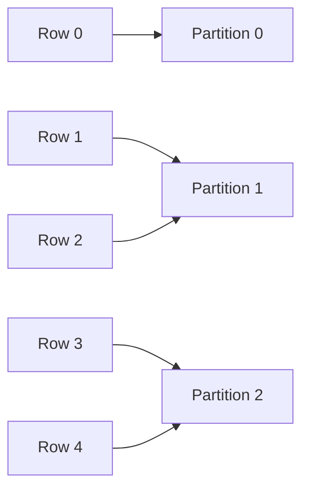
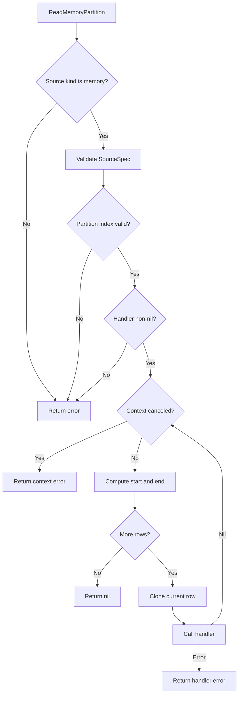
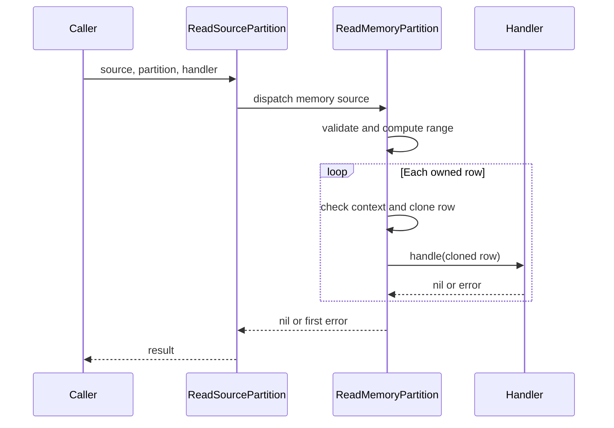

# Feature 01: RDD API và partitioned sources

## UC-03: Chia memory source thành partition

### 1. Mục tiêu

UC-03 gán mỗi row của memory source cho đúng một logical partition và cung cấp
API để duyệt các row thuộc partition đó.

Use case tập trung vào một thuật toán thuần, dễ kiểm chứng:

```text
start = rowCount * partition / partitionCount
end   = rowCount * (partition + 1) / partitionCount
owned rows = rows[start:end]
```

Kết quả cần bảo đảm:

- không row nào bị mất;
- không row nào xuất hiện ở hai partition;
- thứ tự row ban đầu được giữ nguyên;
- empty partition là hợp lệ;
- handler không thể mutate rows đang được giữ trong source.

### 2. Public API

```go
func ReadSourcePartition(
    ctx context.Context,
    source SourceSpec,
    partition int,
    handle func(Row) error,
) error
```

Ở UC-03, API chỉ hỗ trợ `SourceMemory`. JSONL, CSV và text sources trả lỗi
`not implemented`; chúng sẽ được hỗ trợ khi file partitioning và streaming
readers được xây dựng.

Ví dụ:

```go
source, _ := engine.NewMemorySource([]engine.Row{
    {"id": 0},
    {"id": 1},
    {"id": 2},
    {"id": 3},
}, 2)

err := engine.ReadSourcePartition(
    context.Background(),
    source,
    1,
    func(row engine.Row) error {
        fmt.Println(row["id"])
        return nil
    },
)
```

Output của partition `1`:

```text
2
3
```

### 3. Vì sao dùng handler?

API có thể trả `[]Row`, nhưng cách đó buộc reader tạo thêm một slice chứa toàn
bộ partition. Handler xử lý từng row một:

```text
source row → clone → handler → source row tiếp theo
```

Cách này chuẩn bị cùng một interface cho file streaming ở use case tiếp theo,
nơi một partition có thể lớn hơn memory khả dụng.

Handler cũng cho phép caller dừng sớm bằng cách trả error.

### 4. Thuật toán contiguous partitioning

Với:

```text
n = số rows
p = số partitions
i = partition index, 0 <= i < p
```

Ranh giới partition được tính bằng integer division:

```text
start(i) = n * i / p
end(i)   = n * (i + 1) / p
```

Partition `i` sở hữu half-open range `[start, end)`.

#### Ví dụ: 5 rows, 3 partitions

```text
rows = [0, 1, 2, 3, 4]

partition 0:
  start = 5 * 0 / 3 = 0
  end   = 5 * 1 / 3 = 1
  rows  = [0]

partition 1:
  start = 5 * 1 / 3 = 1
  end   = 5 * 2 / 3 = 3
  rows  = [1, 2]

partition 2:
  start = 5 * 2 / 3 = 3
  end   = 5 * 3 / 3 = 5
  rows  = [3, 4]
```



Partition sizes có thể lệch nhau tối đa một row. Với integer division, các
partition phía sau có thể nhận nhiều row hơn partition phía trước.

### 5. Vì sao không mất hoặc lặp row?

Hai partition liên tiếp có chung một boundary:

```text
end(i) = n * (i + 1) / p
start(i + 1) = n * (i + 1) / p
```

Do đó:

```text
end(i) = start(i + 1)
```

Vì mỗi range là half-open `[start, end)`:

- row tại boundary không thuộc partition trước;
- row tại boundary thuộc partition sau;
- không tồn tại gap giữa hai ranges.

Boundary đầu tiên luôn là `0` và boundary cuối luôn là `n`:

```text
start(0) = 0
end(p - 1) = n
```

Ghép lần lượt partition `0..p-1` sẽ tái tạo đúng input.

### 6. Empty partitions

Khi số rows nhỏ hơn số partitions, một số ranges có `start == end`.

Ví dụ 2 rows, 4 partitions:

```text
partition 0: [0, 0) → empty
partition 1: [0, 1) → row 0
partition 2: [1, 1) → empty
partition 3: [1, 2) → row 1
```

Empty partition là trạng thái hợp lệ. Function trả `nil` và không gọi handler.

Memory source có 0 rows tạo empty range cho mọi partition.

### 7. Internal implementation

Thuật toán nằm tại `internal/source/memory.go`:

```go
func ReadMemoryPartition(
    ctx context.Context,
    source model.SourceSpec,
    partition int,
    handle func(model.Row) error,
) error
```

Luồng xử lý:



Core loop:

```go
start := len(source.Rows) * partition / source.PartitionCount
end := len(source.Rows) * (partition + 1) / source.PartitionCount

for index := start; index < end; index++ {
    if err := ctx.Err(); err != nil {
        return err
    }
    if err := handle(model.CloneRow(source.Rows[index])); err != nil {
        return err
    }
}
```

### 8. Clone trước khi handle

Memory source đã copy input khi được tạo ở UC-01. UC-03 vẫn phải clone lại mỗi
row trước khi truyền cho handler:

```go
handle(model.CloneRow(source.Rows[index]))
```

Nếu truyền trực tiếp `source.Rows[index]`, handler có thể mutate source:

```go
func(row engine.Row) error {
    row["status"] = "changed"
    return nil
}
```

Clone tạo boundary ownership rõ ràng:

```text
Source owns stored row
Handler owns emitted clone
```

### 9. Error và cancellation semantics

#### Invalid source kind

`ReadMemoryPartition` từ chối JSONL, CSV và text descriptors. Public
`ReadSourcePartition` chịu trách nhiệm dispatch theo kind.

#### Invalid partition

Index hợp lệ nằm trong:

```text
0 <= partition < source.PartitionCount
```

Index âm hoặc bằng/lớn hơn partition count trả error chứa index được yêu cầu.

#### Nil handler

Nil handler trả error thay vì gây panic.

#### Handler error

Khi handler trả error:

- iteration dừng ngay;
- các row sau không được emit;
- chính error đó được trả về để `errors.Is` tiếp tục hoạt động.

#### Context cancellation

Context được kiểm tra trước khi iteration bắt đầu và trước mỗi row. Khi context
bị cancel, function dừng và trả `context.Canceled` hoặc context error tương ứng.



### 10. Public dispatch

`engine/source.go` giữ public API độc lập khỏi internal implementation:

```go
switch source.Kind {
case SourceMemory:
    return internalsource.ReadMemoryPartition(ctx, source, partition, handle)
case SourceJSONLines, SourceCSV, SourceText:
    return fmt.Errorf("read %s source partition: not implemented", source.Kind)
default:
    return fmt.Errorf("read source partition: unknown source kind %q", source.Kind)
}
```

Khi file readers được thêm, public signature không cần thay đổi; chỉ cần mở
rộng dispatch cases.

### 11. Tests

Internal tests nằm tại `internal/source/memory_test.go`.

#### Reconstruction invariant

Test chạy với:

- row count từ 0 đến 10;
- partition count từ 1 đến `MaxPartitions`.

Nó đọc lần lượt tất cả partitions và xác nhận kết quả đúng bằng input. Một
assertion này đồng thời phát hiện lost row, duplicate row và sai thứ tự.

#### Exact balanced ranges

Case 5 rows, 3 partitions xác nhận ranges cụ thể:

```text
[0]
[1, 2]
[3, 4]
```

#### Boundary và control-flow tests

Các tests còn lại xác nhận:

- partition `-1` và `partitionCount` bị từ chối;
- handler error dừng iteration sau lần gọi đầu tiên;
- handler mutation không thay đổi source row;
- canceled context không gọi handler;
- nil handler và non-memory source trả error.

Public tests tại `engine/source_test.go` xác nhận:

- memory source được dispatch vào đúng algorithm;
- file source trả lỗi `not implemented` rõ ràng trong UC-03.

### 12. Chạy kiểm tra

Từ `spark/reimplement/repository`:

```bash
go test ./internal/source ./engine
```

Chạy toàn bộ verification:

```bash
make check
```

### 13. Kết quả của UC-03

UC-03 hoàn thành khi:

- mỗi memory row thuộc đúng một partition;
- ghép partition theo thứ tự tái tạo chính xác input;
- empty source và empty partitions hoạt động bình thường;
- invalid index và nil handler trả error thay vì panic;
- handler nhận row clone và không thể mutate source;
- handler error và context cancellation dừng iteration ngay;
- public API dispatch memory source mà chưa giả lập hỗ trợ file source.

Output của UC-03 là một handler-based partition interface. UC-04 sẽ giữ
interface này và bổ sung thuật toán byte-range partitioning cho file sources.
