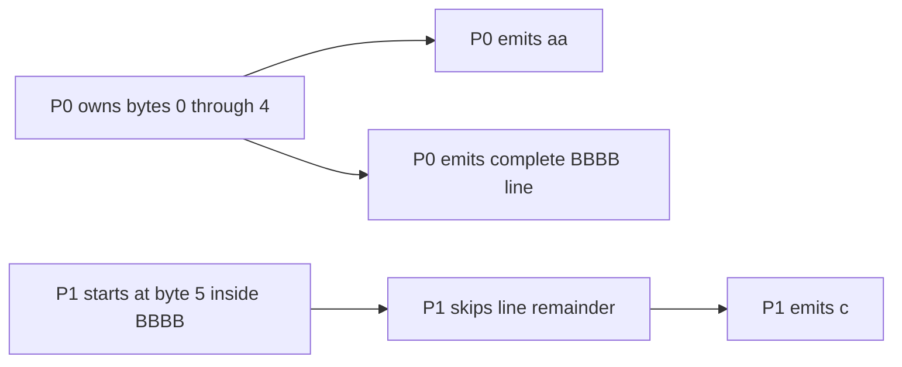
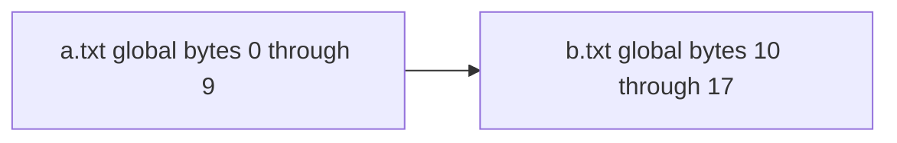
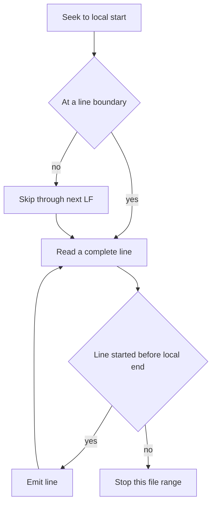

# Feature 01: RDD API và partitioned sources

## UC-04: Đọc file theo byte range nhưng không cắt line

### 1. Ý chính

UC-04 chia **bytes của file** cho nhiều partitions để chúng có thể đọc song
song. Tuy nhiên output phải là các **line hoàn chỉnh**, không phải các mẩu byte.

### 2. Ví dụ hoàn chỉnh: boundary nằm giữa line

Input một file:

```text
content:      aa\nBBBB\nc\n
byte offset:  0123456789

P0 range:   [0---------5)
P1 range:             [5---------10)
```

`BBBB` bắt đầu ở byte `3`, nên thuộc P0. Kết quả đúng phải là:

| Partition | Bắt đầu ở đâu | Reader làm gì | Output |
| --- | --- | --- | --- |
| P0 | đầu file | emit `aa`; `BBBB` bắt đầu tại 3, trước boundary 5, nên đọc hết line | `aa`, `BBBB` |
| P1 | giữa `BBBB` | bỏ `BB\n` còn lại; `c` bắt đầu tại 8 nên emit | `c` |

P0 đọc bytes `5..7` dù range danh nghĩa chỉ kết thúc ở `5`. Nó đọc thêm chỉ
để hoàn tất record mà P0 sở hữu; P1 không emit record này.



Kết quả ghép lại vẫn là:

```text
aa
BBBB
c
```

Mỗi line xuất hiện đúng một lần.

#### Nếu áp dụng sai logic UC-03 cho bytes thì sao?

UC-03 có thể lấy trực tiếp `rows[start:end]` vì mỗi index đã là một row đầy
đủ. Nếu áp dụng cùng ý tưởng đó cho file và **dừng cứng tại byte end**, kết quả
sẽ là các mẩu bytes thay vì lines:

```text
P0 đọc [0,5):  aa\nBB
P1 đọc [5,10): BB\nc\n
```

Nếu caller coi mỗi mẩu là một record, output sai sẽ là:

```text
aa
BB
BB
c
```

Line `BBBB` bị cắt thành hai record. Đây là điều UC-04 phải tránh. File chưa
có row index; reader phải tìm newline để biết ranh giới line, rồi dùng rule
“line thuộc partition chứa byte đầu tiên của line”.

### 3. UC-04 khác UC-03 như thế nào?

Hai use case đều dùng công thức chia balanced range, nhưng chúng chia **hai
thứ khác nhau**.

| Nội dung | UC-03: memory partitioning | UC-04: file byte ranges |
| --- | --- | --- |
| Input | `[]Row` đã biết ranh giới row | file chỉ là chuỗi bytes |
| Đơn vị chia | row index | byte offset |
| Range `[start,end)` chứa gì | các row hoàn chỉnh | có thể cắt giữa line |
| Khi đến `end` | dừng ngay | có thể đọc qua `end` để hết line đang sở hữu |
| Khi bắt đầu ở `start` | luôn là đầu row | có thể ở giữa line, phải skip phần dư |
| Ownership | row index thuộc range nào | byte đầu tiên của line thuộc range nào |
| Memory | source đã ở RAM | stream từng line, không load toàn file |
| Mục tiêu | chia collection trong memory | mô phỏng simplified file split/record reader |

UC-03 đơn giản hơn vì `rows[3:6]` luôn là ba rows đầy đủ. UC-04 không biết đâu
là row cho đến khi đọc delimiter `LF` hoặc `CRLF`, nên cần thêm line ownership
rule.

### 4. Outcome

- Một file hoặc nhiều file được chia thành logical byte ranges.
- Mỗi physical line được callback đúng một lần.
- Reader trả line không có `LF` hoặc `CRLF` terminator.
- Reader stream từng line, giới hạn kích thước một line và không materialize cả
  file/partition.
- UC-05 sẽ decode line thành `Row` cho text, JSONL hoặc CSV simple.

### 5. Internal API

```go
type LineHandler func(path string, offset int64, line []byte) error

func ReadFilePartitionLines(
    ctx context.Context,
    pattern string,
    partitions int,
    partition int,
    maxLineBytes int,
    handle LineHandler,
) error
```

| Tham số | Ý nghĩa |
| --- | --- |
| `pattern` | Một file path hoặc `filepath.Glob` pattern. |
| `partitions` | Tổng số logical partitions. |
| `partition` | Partition cần đọc, từ `0` tới `partitions - 1`. |
| `maxLineBytes` | Giới hạn payload của một line. |
| `handle` | Nhận từng line mà partition này sở hữu. |

`offset` là byte offset của **đầu line trong file thật**, không phải global
offset. `line` không chứa newline terminator và chỉ valid trong lúc callback
chạy; caller cần copy nếu muốn giữ lại.

### 6. Bước 1: tạo global byte space

Reader resolve `pattern`, chỉ nhận regular files, rồi sort path. Các file đã
sort được xem như đặt liên tiếp trong một không gian byte ảo. Không concatenate
file thật và không chèn byte separator giữa files.

Ví dụ:

```text
a.txt: size 10 bytes  -> global [0,10)
b.txt: size  8 bytes  -> global [10,18)
total: 18 bytes
```



Global offsets chỉ để quyết định partition ownership. Khi đọc, reader vẫn mở
từng file và dùng local offset trong file đó.

Sort path là bắt buộc: cùng input phải tạo cùng global byte space qua nhiều
lần chạy.

### 7. Bước 2: chia total bytes cho partitions

Giống UC-03, với:

```text
n = total bytes của tất cả files
p = total partitions
i = partition index
```

ta tính:

```text
start = floor(n * i / p)
end   = floor(n * (i + 1) / p)
range = [start, end)
```

Ví dụ `18` bytes và `3` partitions:

```text
P0 = [0, 6)
P1 = [6, 12)
P2 = [12, 18)
```

Các byte ranges không gap, không overlap và có kích thước gần cân bằng. Nhưng
**số lines** trong mỗi partition có thể không cân bằng: một long line có thể
vắt qua boundary và owner phải đọc toàn bộ line đó.

### 8. Bước 3: map global range vào file

Reader chỉ mở file nếu global range của partition giao với global range của
file. Với một file:

```text
file range      = [fileStart, fileEnd)
partition range = [start, end)
```

Hai range giao nhau khi:

```text
start < fileEnd and end > fileStart
```

Sau đó đổi sang local offsets:

```text
localStart = max(0, start - fileStart)
localEnd   = min(fileSize, end - fileStart)
```

Một partition có thể đọc phần cuối file `a.txt` rồi phần đầu `b.txt`. Một file
cũng có thể có nhiều partitions đọc các đoạn khác nhau của nó.

### 9. Bước 4: quyết định line nào thuộc partition

Quy tắc duy nhất cần nhớ:

> Line thuộc partition chứa byte đầu tiên của line đó.

Tương đương:

```text
partition owns line when localStart <= lineStart < localEnd
```

Do range là half-open, một line có một owner duy nhất.

#### Khi partition bắt đầu giữa line

Nếu byte trước `localStart` không phải `\n`, `localStart` đang giữa line. Line
đó đã bắt đầu ở partition/file range trước, nên reader bỏ phần còn lại tới
`\n` hoặc EOF. Không emit gì cho line bị bỏ.

#### Khi partition kết thúc giữa line

Nếu line bắt đầu trước `localEnd`, partition hiện tại sở hữu line. Reader đọc
trọn line, kể cả terminator nằm sau `localEnd`, rồi mới xét line tiếp theo.



### 10. LF, CRLF và final line

Reader tìm `LF` (`\n`) để tìm hết physical line.

- `hello\n` trở thành `hello`.
- `hello\r\n` trở thành `hello`: bỏ `\n`, rồi bỏ `\r` đứng ngay trước nó.
- `hello` rồi EOF vẫn là một final line hợp lệ.
- `\n` hoặc `\r\n` là empty line.

`\r` đứng một mình là dữ liệu, không phải delimiter.

Khi partition start ở byte `\r` của `\r\n`, byte trước không phải `\n`, nên
reader skip qua `\r\n`. Như vậy line CRLF vẫn chỉ có một owner.

### 11. Pseudocode

```text
readFilePartitionLines(partition):
    files = resolve, validate and sort matching files
    start, end = byteRange(totalBytes(files), partition)

    for each file intersecting [start, end):
        localStart, localEnd = intersection in file offsets
        seek(localStart)

        if localStart is inside a line:
            discard through LF or EOF

        while nextLineStart < localEnd:
            line = read one complete line
            emit(path, nextLineStart, line)
```

`read one complete line` cần kiểm tra `maxLineBytes`. Nếu vượt limit, dừng với
error có path, line offset và limit; không tiếp tục tăng memory theo file size.

### 12. Error và cancellation

Reader trả error cho:

- invalid partition count/index hoặc `maxLineBytes`;
- nil handler;
- glob malformed hoặc không match file nào;
- directory/non-regular file;
- lỗi `Stat`, `Open`, `Seek`, `ReadAt` hoặc `Read`, có path/offset;
- line vượt `maxLineBytes`.

Reader kiểm tra `ctx.Err()` trước khi resolve và trước mỗi owned line. Handler
trả error thì dừng ngay và trả nguyên error đó để `errors.Is` vẫn dùng được.

### 13. Invariants và tests chính

- Ghép output của partitions theo index tái tạo toàn bộ lines theo file/path
  order.
- Không line nào bị duplicate, kể cả boundary giữa line hoặc giữa `CRLF`.
- Final line không có newline vẫn được emit một lần.
- Empty file và empty byte range thành công, không gọi handler.
- Reader không dùng `ReadAll`/`os.ReadFile` và không giữ cả partition trong RAM.
- Long line vượt limit trả contextual error.
- Cancellation và handler error dừng traversal ngay.

### 14. Quan hệ với Spark

UC-04 là simplified local version của file split và record reader: Spark/Hadoop
chia input thành input splits theo file/block metadata, sau đó record reader
đảm bảo records không bị cắt sai ở split boundary. Project dùng byte range cân
bằng để thuật toán nhỏ và dễ quan sát hơn; không mô phỏng HDFS locality,
compression codecs hay Hadoop `InputFormat`.

UC-05 đứng sau UC-04: UC-04 chỉ tạo complete physical line; UC-05 mới decode
line đó thành `Row` theo JSONL, text hoặc CSV simple.
