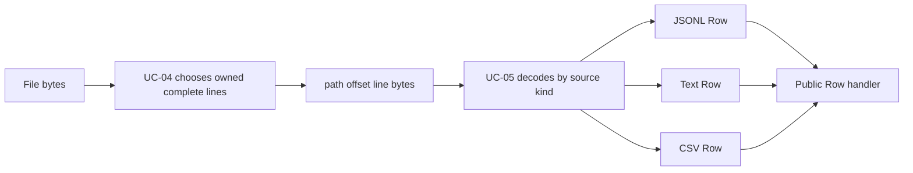
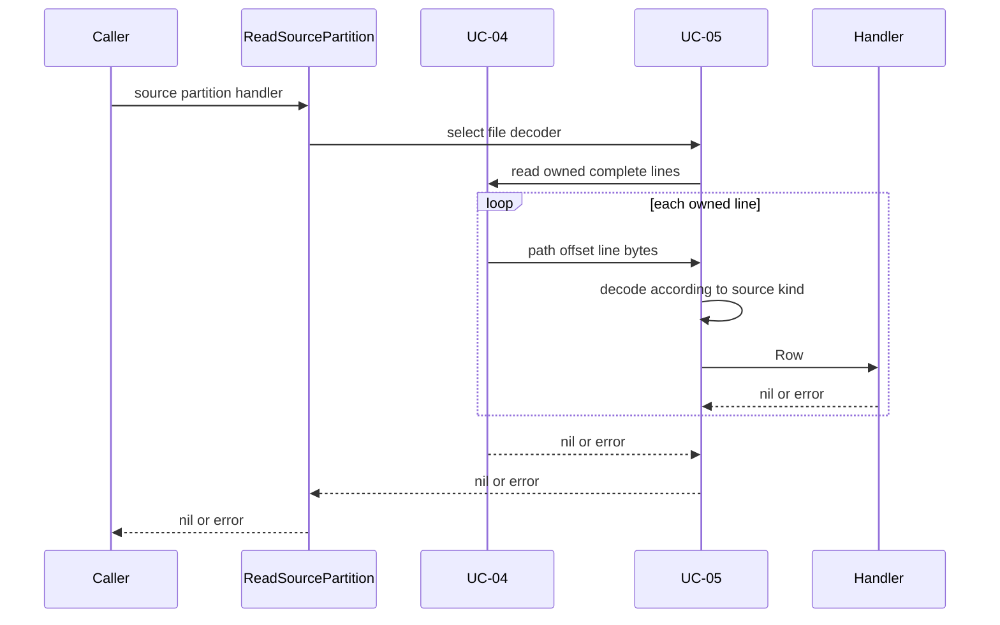
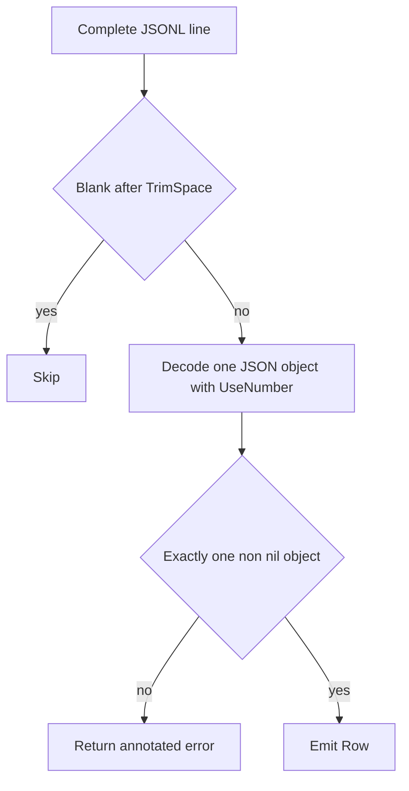
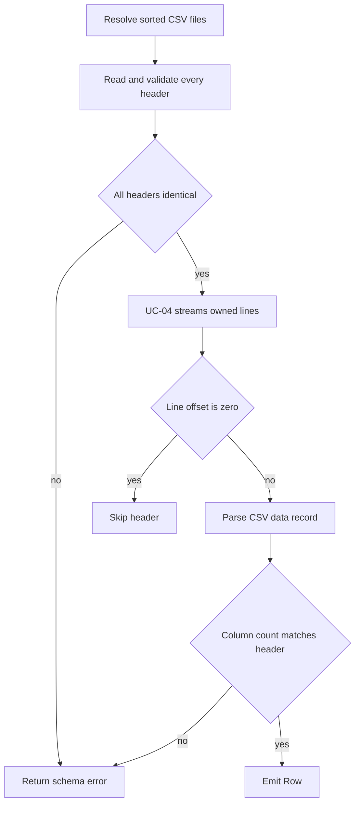

# Feature 01: RDD API và partitioned sources

## UC-05: Đổi file lines thành Rows

### 1. Output trước tiên

**Output của UC-05 là từng `Row` được stream vào public handler.** Nó không
trả metadata và không trả `[]Row` chứa toàn bộ partition.

Ví dụ một JSONL file:

```text
events.jsonl

{"id":1,"event":"login"}
{"id":2,"event":"purchase"}
```

Khi caller đọc partition sở hữu hai lines này:

```go
engine.ReadSourcePartition(ctx, source, partition, func(row engine.Row) error {
    fmt.Println(row)
    return nil
})
```

handler nhận lần lượt:

```go
Row{"id": json.Number("1"), "event": "login"}
Row{"id": json.Number("2"), "event": "purchase"}
```

Với cùng một physical line, output phụ thuộc `SourceKind`:

| Source kind | Physical line từ file | `Row` UC-05 emit |
| --- | --- | --- |
| JSONL | `{"id":1,"event":"login"}` | `Row{"id": json.Number("1"), "event": "login"}` |
| Text | `server started` | `Row{"line": "server started"}` |
| CSV | `1,Alice` với header `id,name` | `Row{"id": "1", "name": "Alice"}` |

Nói ngắn gọn:

```text
file line bytes -> UC-05 decode -> Row -> caller handler
```

### 2. UC-05 khác UC-04 như thế nào?

Hai use case nối tiếp nhau, nhưng answer hai câu hỏi khác nhau.

| | UC-04: file byte ranges | UC-05: source record decoding |
| --- | --- | --- |
| Câu hỏi | Partition này sở hữu line nào? | Line này có nghĩa gì theo format file? |
| Input | file bytes | một complete physical line `[]byte` |
| Output | callback `path, offset, line` | callback `Row` |
| Quan tâm | byte range, seek, line boundary, LF/CRLF | JSON parse, CSV header, field mapping |
| Không làm | không biết JSON/CSV/text | không tính byte range, không seek file theo range |



Ví dụ UC-04 có thể gửi cho UC-05:

```text
path   = events.jsonl
offset = 28
line   = []byte(`{"id":2,"event":"purchase"}`)
```

UC-05 không cần biết line này đến từ partition 0 hay 1. Nó chỉ decode thành:

```go
Row{"id": json.Number("2"), "event": "purchase"}
```

### 3. Mục tiêu

- Mở rộng `ReadSourcePartition` để file source stream `Row` như memory source.
- JSONL, text và CSV simple dùng chung byte-range reader UC-04.
- Parse error có source kind, path và byte offset.
- Không load toàn bộ file hoặc partition vào RAM.
- Không làm thay đổi exact-once line ownership của UC-04.

### 4. Public API

```go
func ReadSourcePartition(
    ctx context.Context,
    source SourceSpec,
    partition int,
    handle func(Row) error,
) error
```

Caller chỉ thấy `Row`, bất kể source là memory hay file:

```go
source, _ := engine.NewJSONLinesSource("events/*.jsonl", 4)

err := engine.ReadSourcePartition(ctx, source, 2, func(row engine.Row) error {
    fmt.Println(row["id"])
    return nil
})
```

Dispatch nội bộ:

```text
SourceMemory                  -> UC-03 đọc Row có sẵn trong RAM
SourceJSONLines / Text / CSV  -> UC-04 đọc complete line -> UC-05 decode Row
```

### 5. Thuật toán tổng quát

```text
ReadFileSourcePartition(source, partition, handler):
    validate source, partition, handler and context
    choose decoder from source.Kind

    UC-04.ReadFilePartitionLines(partition, onLine):
        row, shouldEmit = decoder.decode(path, offset, line)
        if shouldEmit:
            handler(row)
```

`ReadFileSourcePartition` không tự tính byte range và không tự xử lý boundary
giữa lines. Các phần đó thuộc UC-04.



### 6. JSON Lines decoder

JSONL contract: một non-blank physical line phải là đúng một JSON object.

```text
{"id":1,"category":"book"}
```

trở thành:

```go
Row{"id": json.Number("1"), "category": "book"}
```

Thuật toán cho một line:

1. `TrimSpace`; nếu line blank thì skip, không emit `Row`.
2. Tạo `json.Decoder` và gọi `UseNumber`.
3. Decode vào `map[string]any`.
4. Reject `null`, scalar, array hoặc object thiếu/invalid.
5. Decode lần hai và yêu cầu `io.EOF`, để reject hai JSON values trên một line.
6. Chuyển map thành `Row` và gọi handler.



`UseNumber` giữ JSON integer lớn chính xác. Ví dụ `9007199254740993` được giữ
là `json.Number("9007199254740993")`, thay vì tự thành `float64` và có nguy cơ
làm tròn.

Các input sau là lỗi:

```text
42
[1,2]
null
{"id":1} {"id":2}
```

### 7. Text decoder

Text đơn giản nhất: mọi physical line, kể cả empty line, là một record.

```text
first

third
```

UC-05 emit:

```go
Row{"line": "first"}
Row{"line": ""}
Row{"line": "third"}
```

UC-04 đã bỏ `LF`/`CRLF`, nên field `line` chỉ là payload. Text decoder không
trim whitespace, không validate UTF-8 và không parse cấu trúc dữ liệu khác.

### 8. CSV decoder

CSV cần header để biết tên fields. Mỗi file phải có header ở line local offset
`0`:

```csv
id,name
1,Alice
2,"Bob, Jr."
```

Output data rows:

```go
Row{"id": "1", "name": "Alice"}
Row{"id": "2", "name": "Bob, Jr."}
```

Trước khi emit data row, decoder:

1. resolve và sort mọi matching files;
2. đọc header của từng file;
3. parse, validate non-empty/unique field names;
4. yêu cầu mọi headers giống nhau, kể cả thứ tự;
5. mới gọi UC-04 để đọc partition được yêu cầu;
6. bỏ line có offset `0` vì đó là header;
7. parse từng data line và yêu cầu column count bằng header count.



CSV values giữ type `string`. Type inference/casting không thuộc UC-05.

Quoted comma và escaped quote trong một physical line được hỗ trợ bởi
`encoding/csv`. Quoted field chứa newline thật chưa hỗ trợ, vì UC-04 chia theo
physical line trước; UC-05 trả lỗi contextual thay vì ghép line ngầm.

### 9. Error, cancellation và memory

Parse error có format:

```text
decode <kind> source "<path>" at byte <offset>: <cause>
```

Ví dụ:

```text
decode jsonl source "events.jsonl" at byte 28: invalid character ...
decode csv source "users.csv" at byte 8: got 1 columns, want 2
```

`offset` là local file offset từ UC-04, nên caller có thể seek đến record lỗi.

Handler error được trả nguyên vẹn và dừng reader ngay. `ctx.Err()` được kiểm
tra trước file I/O và UC-04 kiểm tra tiếp trước mỗi owned line.

Mỗi thời điểm UC-05 giữ tối đa:

- buffer của một physical line từ UC-04;
- một `Row` đang decode;
- CSV headers cho matching files.

Nó không giữ `[]Row` cho toàn partition. `MaxLineBytes` của UC-04 giới hạn raw
line; decoded JSON object có thể lớn hơn raw bytes nhưng chỉ object hiện tại ở
trong memory.

### 10. Tests chính

- JSONL emit một object đúng cho mỗi non-blank line; blank line bị skip.
- JSON number lớn giữ `json.Number`.
- Text emit cả empty line như `Row{"line": ""}`.
- CSV bỏ header, map columns đúng, validate header/column count across files.
- File line được decode đúng một lần qua nhiều partitions, kế thừa ownership
  của UC-04.
- Parse error có kind, path, offset; cancellation/handler error dừng ngay.
- Không materialize toàn bộ partition trong memory.

### 11. Ngoài phạm vi

- CSV multiline fields, custom delimiter, schema inference/casting;
- JSON array như nhiều records, compression, charset conversion;
- remote object storage, distributed filesystem và cache headers giữa calls.

### 12. Tóm tắt

```text
UC-04: bytes -> complete physical line
UC-05: complete physical line -> Row
```

UC-04 quyết định **đọc line nào**. UC-05 quyết định **line đó thành Row gì**.
