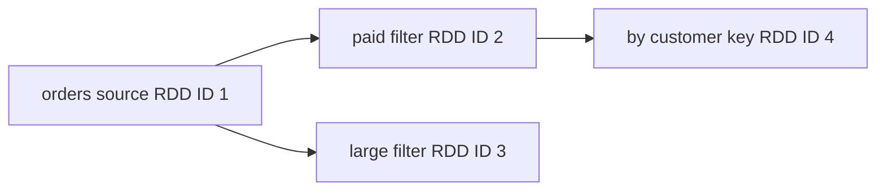
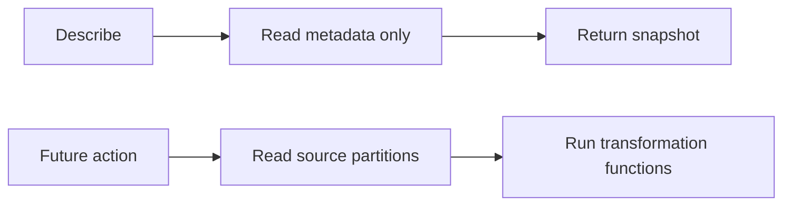
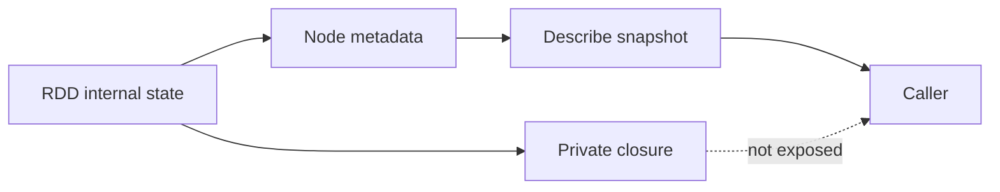

# Feature 01: RDD API và partitioned sources

## UC-06: Quan sát RDD lineage an toàn

### 1. Output trước tiên

**Output của UC-06 là một snapshot metadata của một RDD.** Nó dùng để trả lời:

```text
RDD này là loại gì?
Nó phụ thuộc RDD cha nào?
Nó có bao nhiêu partitions?
Nó có partitioner không?
```

API:

```go
func (rdd *RDD) ID() int64
func (rdd *RDD) Describe() RDDDescription
```

Ví dụ:

```go
orders, _ := engine.FromSource(ctx, source)
paid, _ := orders.Filter(keepPaid)
byCustomer, _ := paid.KeyBy(customerID)

description := byCustomer.Describe()
fmt.Printf("%+v\n", description)
```

Output có thể là:

```text
ID:          3
Kind:        key_by
ParentIDs:   [2]
Partitions:  4
Partitioner: nil
```

Nghĩa là RDD ID `3` là `key_by`, có parent là RDD ID `2`, và giữ bốn
partitions. `Describe()` không đọc source, không trả rows và không chạy
`customerID`.

### 2. Tại sao cần observability?

RDD là lazy. Sau các câu lệnh sau, chưa có file nào được đọc:

```go
paid, _ := orders.Filter(keepPaid)
byCustomer, _ := paid.KeyBy(customerID)
```

Người dùng vẫn cần kiểm tra lineage đã được tạo đúng chưa. Ví dụ source RDD
`orders` có hai branches:

```go
paid, _ := orders.Filter(keepPaid)
large, _ := orders.Filter(keepLarge)
byCustomer, _ := paid.KeyBy(customerID)
```



`byCustomer.Describe()` chỉ mô tả node `key_by` hiện tại và parent trực tiếp
`paid`. Muốn quan sát toàn bộ graph, caller có thể gọi `Describe()` cho các
RDD mình đang giữ; Feature 02 sẽ dùng chính parent/dependency metadata để
planner duyệt lineage ngược.

### 3. Public snapshot shape

```go
type RDDDescription struct {
    ID          int64
    Kind        NodeKind
    ParentIDs   []int64
    Source      *SourceSpec
    Partitions  int
    Partitioner *Partitioner
}
```

| Field | Ý nghĩa | Ví dụ |
| --- | --- | --- |
| `ID` | identity của RDD trong một `Context` | `4` |
| `Kind` | hình dạng node lineage | `source`, `map`, `filter`, `key_by`, `union` |
| `ParentIDs` | IDs của parent trực tiếp | `[2]`, hoặc `[2, 3]` với union |
| `Source` | source descriptor, chỉ có ở source RDD | path, source kind, partition count |
| `Partitions` | số output partitions của RDD | `4` |
| `Partitioner` | cách keyed data được partition nếu có | `HashPartitioner{Partitions: 4}` |

`Source` thường là `nil` ở transformation RDD. `Partitioner` thường `nil` cho
`Map`, `Filter`, `FlatMap`, `KeyBy`; Feature 02 gắn `HashPartitioner` cho output
của `ReduceByKey`.

### 4. ID nghĩa là gì?

`Context` cấp ID tăng dần khi một RDD được tạo:

```text
NewContext
    source RDD       -> ID 1
    source.Filter    -> ID 2
    source.Filter    -> ID 3
    paid.KeyBy       -> ID 4
```

ID không phải hash của dữ liệu, source hay function. Hai lời gọi giống hệt nhau
vẫn tạo hai RDD khác nhau:

```go
first, _ := orders.Filter(keepPaid)  // ID 2
second, _ := orders.Filter(keepPaid) // ID 3
```

Chúng có cùng intent nhưng là hai nodes khác trong lineage. Điều này gần với
Spark: `RDD.id` là identity được `SparkContext` cấp, không phải content hash.

### 5. Describe khác chạy RDD như thế nào?

| Operation | Đọc file/rows? | Gọi Map/Filter/KeyBy function? | Tạo RDD mới? |
| --- | --- | --- | --- |
| `Describe()` | Không | Không | Không |
| `ID()` | Không | Không | Không |
| `Filter(fn)` | Không | Không | Có, tạo lineage node |
| Future action như `Count` | Có | Có | Không, chạy lineage đã có |



Vì vậy có thể gọi `Describe()` trong test hoặc debug mà không vô tình trigger
job hay source I/O.

### 6. Closure ở đâu?

`Map`, `Filter`, `FlatMap`, `KeyBy` nhận Go function. RDD child giữ function
đó ở internal runtime state:

```go
type RDD struct {
    node    Node
    parents []*RDD
    context *Context
    compute computation // private; holds the transformation closure
}
```

Ví dụ `paid` giữ `keepPaid` private. `Describe()` chỉ nói node đó có
`Kind: filter`; nó không trả predicate body hoặc captured values.



Lý do:

- caller chỉ cần topology để debug/planning;
- Go function không có stable representation để copy, compare hay hash;
- expose closure sẽ cho caller chạy business logic ngoài lifecycle của RDD;
- captured mutable state không nên trở thành một phần public snapshot.

### 7. Thuật toán tạo snapshot

```text
Describe(rdd):
    validate receiver according to API convention

    return RDDDescription{
        ID: rdd.node.ID,
        Kind: rdd.node.Kind,
        ParentIDs: copy(rdd.node.ParentIDs),
        Source: deepCopy(rdd.node.Source),
        Partitions: rdd.node.Partitions,
        Partitioner: copy(rdd.node.Partitioner),
    }
```

`ID()` đơn giản trả `rdd.node.ID`. Không tạo node mới và không tăng counter.

### 8. Vì sao phải copy?

Nếu `Describe()` trả slice/map/pointer nội bộ, caller có thể làm hỏng lineage:

```go
d := byCustomer.Describe()
d.ParentIDs[0] = 999
```

Sau câu lệnh này, internal RDD **phải vẫn có parent ID cũ**. Vì thế:

```text
Internal Node        -> owns ParentIDs, Source, Partitioner
Describe snapshot    -> owns copies của các giá trị mutable
Caller               -> có thể sửa snapshot, không ảnh hưởng Node
```

Với memory source, deep copy phải đi sâu tới `Source.Rows`, `Row` map và các
mutable nested values mà source contract hỗ trợ. Với file source, path string
là immutable value nhưng `SourceSpec` vẫn được copy để contract nhất quán.

### 9. Union và ReduceByKey trong description

Union có hai parents và output partitions là tổng partition của parents:

```text
left ID 2  partitions 2
right ID 3 partitions 3
union ID 4 partitions 5

union.Describe().ParentIDs = [2, 3]
```

`ReduceByKey` thuộc Feature 02. Description của output có thể là:

```text
ID: 8
Kind: reduce_by_key
ParentIDs: [7]
Partitions: 4
Partitioner: HashPartitioner{Partitions: 4}
```

Description cho biết output partitioner, nhưng không expose reducer closure và
không trigger shuffle.

### 10. Invariants và tests chính

- `Describe()` và `ID()` không mở source, không đọc row và không gọi closure.
- Snapshot có đúng `ID`, `Kind`, parent IDs, partition count và partitioner.
- Caller mutate `ParentIDs`, `Source` hoặc `Partitioner` trong snapshot không
  thay đổi RDD nội bộ.
- Parent và child có IDs khác; hai branches từ một parent có parent ID giống
  nhau nhưng child ID khác nhau.
- Source RDD có `Source`; transformation RDD không cần lặp lại source metadata.
- Union mô tả hai parents; `ReduceByKey` mô tả output `HashPartitioner`.

### 11. Ngoài phạm vi

- Spark UI, event log, call-site tracking và format đầy đủ của `toDebugString`;
- serialize, inspect hoặc execute closure;
- đọc rows, chạy action, task/stage/job observability. Các lifecycle ID đó thuộc
  Feature 02 trở đi.
