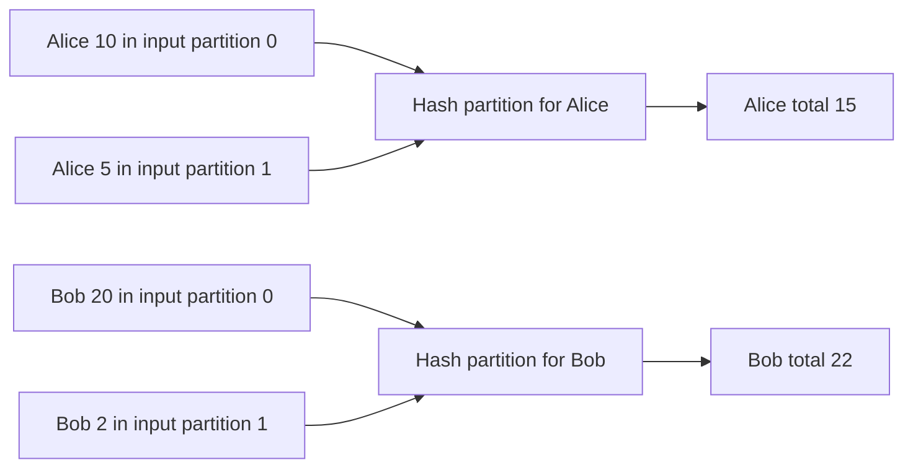
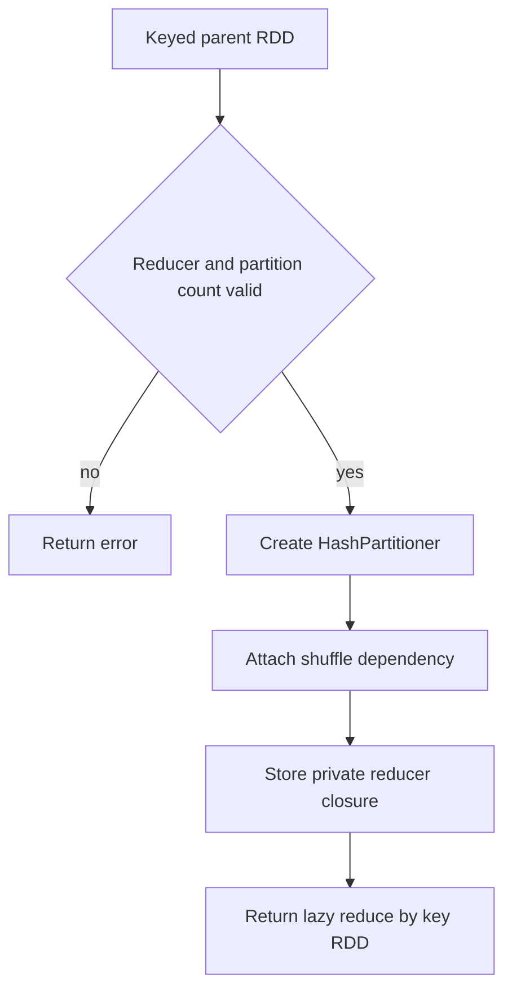

# Feature 02: RDD dependencies và DAGScheduler planning

## UC-01: Tạo `ReduceByKey` RDD và shuffle boundary

### 1. Output trước tiên

Gọi `ReduceByKey` **chưa tính tổng ngay**. Output của use case này là một RDD
mới mô tả việc reduce sẽ xảy ra ở runtime sau:

```text
Kind:          reduce_by_key
Parent:        keyed parent RDD
Partitions:    2
Partitioner:   HashPartitioner(2)
Dependency:    shuffle
Computation:   private reducer function
```

Ví dụ caller viết:

```go
totals, err := byCustomer.ReduceByKey(sumAmount, 2)
```

`totals` là lazy RDD, không phải kết quả `[]Row`. Ở thời điểm này engine:

- không đọc source;
- không move record giữa partitions;
- không gọi `sumAmount`;
- không trả tổng theo customer.

Feature sau mới thực thi shuffle và gọi reducer.

### 2. Bài toán `ReduceByKey` giải quyết

Giả sử `KeyBy` đã tạo keyed records theo customer:

```text
Partition 0: (Alice, {amount: 10}), (Bob, {amount: 20})
Partition 1: (Alice, {amount: 5}),  (Bob, {amount: 2})
```

Nếu muốn tính total amount theo customer, các values của `Alice` phải gặp nhau
trong cùng một partition. Hiện chúng nằm ở partition 0 và 1, nên `KeyBy` một
mình chưa đủ.

Kết quả **sau khi future runtime thực thi** sẽ là:

```text
(Alice, {amount: 15})
(Bob,   {amount: 22})
```

`ReduceByKey` ghi vào lineage hai ý định cần thiết để đạt kết quả đó:

1. route equal keys tới cùng output partition bằng `HashPartitioner`;
2. combine values của mỗi key bằng reducer function.



Diagram này mô tả execution tương lai để giải thích semantics. UC-01 chỉ tạo
metadata cho flow đó, chưa route hay reduce record thật.

### 3. `KeyBy` khác `ReduceByKey`

| Hàm | Làm gì ngay trong lineage | Có shuffle? | Có group/reduce values? |
| --- | --- | --- | --- |
| `KeyBy(customerID)` | tạo `(customerID, row)` cho từng row | Không | Không |
| `ReduceByKey(sumAmount, 2)` | tạo keyed child RDD với shuffle dependency | Chưa chạy, nhưng được ghi vào plan | Chưa chạy, reducer được lưu private |

`KeyBy` là narrow transformation của Feature 01: output partition `i` đọc từ
parent partition `i`. `ReduceByKey` là shuffle boundary, vì output partition
có thể cần records từ nhiều input partitions.

### 4. API và reducer function

```go
type ReduceFunc func(left Row, right Row) (Row, error)

func (rdd *RDD) ReduceByKey(
    reduce ReduceFunc,
    partitions int,
) (*RDD, error)
```

`left` và `right` là hai **values cùng key**, không phải hai `KeyedRow` khác
key. Với `KeyedRow{Key: "Alice", Value: Row{"amount": 10}}`, reducer nhận
hai values:

```go
func sumAmount(left, right engine.Row) (engine.Row, error) {
    l, ok := left["amount"].(int64)
    if !ok {
        return nil, fmt.Errorf("left amount must be int64")
    }
    r, ok := right["amount"].(int64)
    if !ok {
        return nil, fmt.Errorf("right amount must be int64")
    }
    return engine.Row{"amount": l + r}, nil
}
```

Reducer là nơi caller định nghĩa aggregation logic. Không có parameter string
như `"sum"` hay `"count"`:

```text
sum   -> cộng field amount
max   -> chọn Row có amount lớn hơn
count -> trả Row có count tăng dần
avg   -> giữ cả sum và count trong aggregation state
```

### 5. Vì sao reducer cần associative?

Runtime sau này được phép reduce theo nhiều cách vì data chạy parallel. Ví dụ
ba values của Alice là `10`, `5`, `7` có thể được combine như sau:

```text
(10 + 5) + 7 = 22
10 + (5 + 7) = 22
```

Đó là tính associative:

```text
reduce(reduce(a, b), c) == reduce(a, reduce(b, c))
```

Reducer cũng nên commutative khi output không có ordering guarantee:

```text
reduce(a, b) == reduce(b, a)
```

`sum`, `min`, `max`, `count` là lựa chọn tốt. Trừ hoặc “lấy value đầu tiên”
không an toàn nếu engine không hứa thứ tự. `avg` không thể reduce bằng cách
average hai average; state cần giữ cả `sum` và `count`.

### 6. HashPartitioner: equal key đi cùng nơi

`HashPartitioner` chọn output partition từ key:

```go
type HashPartitioner struct {
    Partitions int
}
```

```text
partition(nil) = 0
partition(key) = floorMod(HashCode(key), numPartitions)
```

Ví dụ với 2 output partitions, nếu adapter hash cho kết quả:

```text
HashCode(Alice) -> even -> partition 0
HashCode(Bob)   -> odd  -> partition 1
```

thì mọi `Alice` đi partition 0, mọi `Bob` đi partition 1. Không cần biết hash
thực tế của string là bao nhiêu; invariant quan trọng là hai keys bằng nhau
phải có cùng `HashCode`, nên chắc chắn có cùng destination.

### 7. Metadata lineage được tạo

`ReduceByKey` validate input rồi tạo child RDD mới:

```text
parent must be keyed
reducer must not be nil
partitions must be greater than zero

child ID        = next ID from Context
child kind      = reduce_by_key
child parent    = keyed parent
dependency kind = shuffle
partitioner     = HashPartitioner(partitions)
compute         = private reducer closure
```



Reducer closure không nằm trong public `Node` hoặc `DependencySpec`.
DAGScheduler của UC-02 chỉ cần thấy `shuffle` dependency và partitioner để
tạo stage boundary; nó không inspect hoặc gọi business logic của reducer.

### 8. Liên hệ với stage planning

```text
source -> map -> keyBy -> reduceByKey -> filter -> action
                              ^
                       shuffle boundary
```

Khi action xuất hiện, UC-02 sẽ walk ngược từ `filter`. Nó đi qua narrow edge
`filter -> reduceByKey`, gặp shuffle edge `reduceByKey -> keyBy` thì dừng nhánh
đó và tạo/tìm `ShuffleMapStage` cho producer side. Vì vậy UC-01 là input cho
UC-02, không phải nơi tạo stages.

### 9. Error contract

| Tình huống | Khi nào lỗi? |
| --- | --- |
| Parent không phải keyed RDD | gọi `ReduceByKey` |
| Reducer là `nil` | gọi `ReduceByKey` |
| `partitions <= 0` | gọi `ReduceByKey` |
| Field/kiểu dữ liệu không hợp lệ trong `sumAmount` | future runtime gọi reducer |
| Reducer không associative | caller bug; không thể validate tổng quát lúc tạo lineage |

### 10. Tests chính

- `ReduceByKey` tạo child ID mới với kind `reduce_by_key`.
- Child giữ output partition count và `HashPartitioner` đúng argument.
- Child dependency là `shuffle`, không phải narrow.
- Reducer không chạy tại lúc tạo lineage.
- Reject unkeyed parent, nil reducer và invalid partition count.
- Equal supported keys luôn map tới cùng hash partition.

### 11. Ngoài phạm vi

- execution thật: map-side combine, route records, shuffle files, fetch/retry
  và gọi reducer;
- task/stage submission; UC-02 chỉ tạo plan metadata;
- multi-aggregation SQL expressions và custom partitioner.
