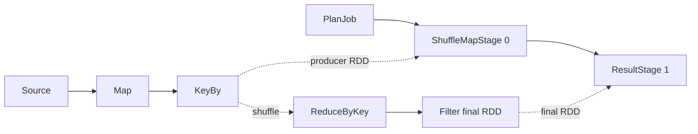
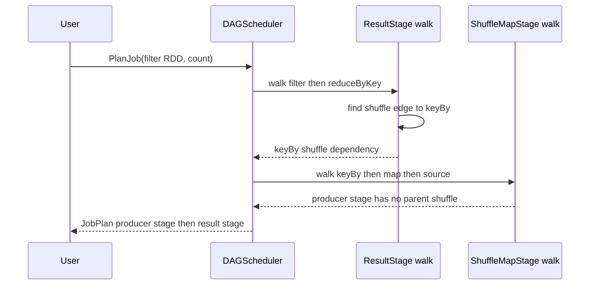
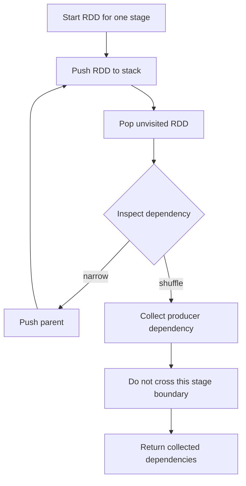
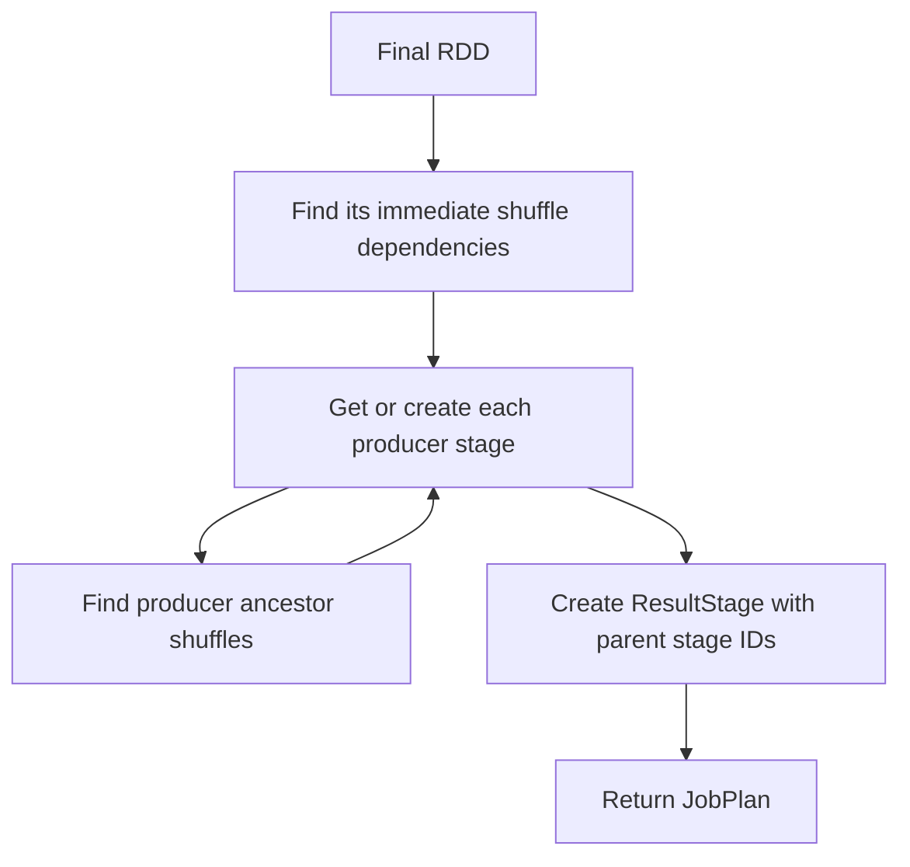

# Feature 02: RDD dependencies và DAGScheduler planning

## UC-02: Từ final RDD tới stage graph

### 1. Output trước tiên

Input của UC-02 là final RDD của một action. Output là `JobPlan`: metadata nói
rõ stages nào phải chạy và stage nào phụ thuộc stage nào.

```go
plan, err := scheduler.PlanJob(finalRDD, CountAction)
```

Ví dụ một lineage:

```text
source -> map -> keyBy -> reduceByKey -> filter -> count
```

Có một shuffle boundary tại `reduceByKey`. `JobPlan` có thể được hiểu như:

```text
Job 7

ShuffleMapStage 0
  runs the producer lineage: source -> map -> keyBy
  output: data partitioned for reduceByKey

ResultStage 1
  depends on: ShuffleMapStage 0
  runs the consumer lineage: reduceByKey -> filter -> count
```

Đây mới là plan. UC-02 không đọc source, không move data qua network/disk, và
không gọi `map`, `filter` hay reducer function.



### 2. Vì sao phải có stages?

`Map`, `Filter`, `FlatMap` và `KeyBy` có narrow dependency: output partition
chỉ cần parent partition tương ứng. Chúng có thể được pipeline trong cùng một
stage.

`ReduceByKey` khác: values cùng key có thể đang ở nhiều input partitions. Data
phải được repartition theo key trước khi reducer có thể chạy. Đây là shuffle,
nên consumer không thể chạy trước khi producer hoàn thành shuffle output.

```text
narrow edge:   child partition i reads parent partition i
shuffle edge:  one reduce partition may need records from many map partitions
```

DAGScheduler dùng shuffle edge để cắt RDD lineage thành stage graph.

### 3. Hai loại dependency

| Dependency kind | Planner làm gì? | Ví dụ |
| --- | --- | --- |
| `narrow` | đi tiếp tới parent trong cùng stage đang xét | `Map`, `Filter`, `FlatMap`, `KeyBy`, `Union` |
| `shuffle` | ghi nhận producer dependency và dừng nhánh hiện tại | parent của `ReduceByKey` |

Dependency metadata, không phải body của user function, quyết định traversal.
Closure map/filter/reducer vẫn private trong RDD và không được planner gọi.

### 4. Cách planner walk ví dụ trên

Planner bắt đầu ở `filter`, tức final RDD của action:

1. `filter -> reduceByKey` là narrow, nên đi tiếp tới `reduceByKey`.
2. `reduceByKey -> keyBy` là shuffle, nên ghi nhận `keyBy` là shuffle producer
   rồi **dừng**; result-stage traversal không đi tiếp qua `keyBy`.
3. Scheduler tạo hoặc lấy lại `ShuffleMapStage` cho producer `keyBy`.
4. Để tạo stage producer đó, scheduler walk từ `keyBy` ngược qua `map` tới
   `source`; tất cả edges này narrow nên chúng nằm trong cùng producer stage.
5. Scheduler link producer stage làm parent của result stage.



Điểm quan trọng: scheduler không cần một danh sách kiểu
`[source, map, keyBy, reduceByKey, filter]`. Danh sách đó không nói rõ chỗ nào
là stage boundary. Scheduler chỉ cần tìm shuffle dependencies ngay trước stage
đang xét.

### 5. Thuật toán tìm immediate shuffle dependencies

```text
findImmediateShuffleDependencies(startRDD):
    stack = [startRDD]
    visited = empty set of RDD IDs
    shuffleDependencies = empty set

    while stack is not empty:
        current = pop(stack)
        if current.ID was visited:
            continue
        mark current.ID visited

        for each dependency of current:
            if dependency is shuffle:
                add dependency to shuffleDependencies
                do not push its parent
            else:
                push dependency.parent

    return shuffleDependencies
```

`stack` thay cho recursive call để lineage sâu không làm đầy call stack.
`visited` tránh walk hai lần khi branches nhập lại, ví dụ qua `Union`.



Output của algorithm không phải global topological order. Nó chỉ là các shuffle
dependencies trực tiếp mà stage hiện tại cần chờ.

### 6. Từ shuffle dependencies thành stages

```text
create ResultStage(finalRDD):
    parentDeps = findImmediateShuffleDependencies(finalRDD)
    parents = getOrCreateShuffleMapStage(each parentDep)
    return ResultStage(finalRDD, parents)

getOrCreateShuffleMapStage(shuffleDep):
    return existing stage if this shuffle already has one
    parentDeps = findImmediateShuffleDependencies(shuffleDep.parentRDD)
    parents = getOrCreateShuffleMapStage(each parentDep)
    return ShuffleMapStage(shuffleDep.parentRDD, parents)
```

Một `ShuffleMapStage` được index theo shuffle identity. Nếu hai downstream
consumers cần cùng shuffle output trong scheduler lifecycle, chúng có thể dùng
cùng producer stage metadata thay vì tạo duplicate stage.



### 7. Union và shared ancestor

`Union` có hai narrow dependencies. DAGScheduler push cả hai parents vào work
stack, vì chúng vẫn thuộc current stage nếu không có shuffle trước đó.

```text
          mapA
         /    \
source --      union -> filter -> action
         \    /
          mapB
```

Nếu hai branches share một ancestor, `visited` bảo đảm ancestor đó chỉ được
process một lần trong traversal. Union không tự tạo shuffle và không đòi hai
parents có cùng partition count.

### 8. IDs trong plan

| ID | Được cấp khi nào? | Ý nghĩa |
| --- | --- | --- |
| RDD ID | tạo RDD ở Feature 01 | identity lineage trong `Context` |
| JobID | gọi `PlanJob` | một action submission |
| StageID | tạo ResultStage/ShuffleMapStage | identity stage trong scheduler |

IDs không phải content hash hay plan hash. Hai lần `PlanJob` trên cùng final
RDD có thể nhận JobID mới. Task ID, task attempt và stage retry thuộc feature
runtime sau, không thuộc UC-02.

### 9. Error contract

| Tình huống | Kết quả |
| --- | --- |
| `finalRDD` là `nil` | `PlanJob` trả error |
| dependency trỏ tới parent không tồn tại | reject corrupted graph |
| shuffle dependency thiếu partitioner hợp lệ | reject corrupted graph |
| shared ancestor | visit một lần, không error |
| closure có lỗi business data | không xảy ra trong planning vì closure chưa chạy |

### 10. Tests chính

- Chuỗi chỉ narrow tạo một `ResultStage`, không có parent shuffle stage.
- Một `ReduceByKey` tạo producer `ShuffleMapStage` và consumer `ResultStage`.
- Narrow transformations sau shuffle thuộc consumer stage.
- Nhiều shuffle boundaries tạo parent-stage graph theo dependency order.
- Union/shared ancestor không làm RDD bị visit hai lần.
- `PlanJob` không mở source, không gọi closure và không tạo task ID.
- JobID/StageID tăng theo scheduler lifecycle; tests compare topology sau khi
  normalize dynamic IDs.

### 11. Ngoài phạm vi

- task creation/submission, worker/executor launch, task/stage retry, locality;
- source I/O, shuffle file write/fetch và reducer execution;
- Catalyst logical/physical plan, AQE và cluster manager.
