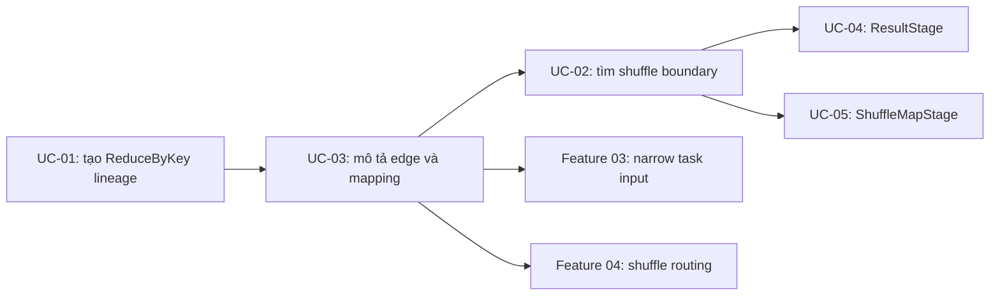

# Feature 02: RDD dependencies và DAGScheduler planning

## UC-03: Mỗi partition đọc dữ liệu từ đâu?

### 1. Mục đích và output của UC-03

UC-03 trả lời một câu hỏi rất cụ thể:

> Khi engine xử lý partition `i` của RDD con, nó cần lấy input từ partition nào
> của RDD cha?

Feature 01 đã cho biết một RDD có parent nào. Nhưng chỉ biết parent là chưa đủ.
Ví dụ, `Union(left, right)` có hai parents; partition 3 của Union phải đọc
partition nào? Còn `ReduceByKey` có phải chỉ đọc partition cùng số hay không?

UC-03 bổ sung metadata cho **mỗi dependency edge** để trả lời câu hỏi này.
Metadata đó cũng cho UC-02 biết edge nào vẫn ở cùng stage (`narrow`) và edge
nào là ranh giới shuffle (`shuffle`).

**Output:** mỗi child-to-parent edge có một `DependencySpec` immutable, gồm:

- `Kind`: `narrow` hoặc `shuffle`;
- `Mapping`: one-to-one, range hoặc all-to-all;
- `Partitioner`: chỉ có ở shuffle edge.

Nhờ output này, scheduler/runtime sau có thể trả lời chính xác “child partition
`i` cần parent partition nào?” mà không cần đọc rows hay chạy closure.

UC-03 **không chạy dữ liệu**. Nó không mở source, không gọi `Map`/`Filter`,
không hash record, không ghi shuffle file và không gọi reducer.

### 2. Ba trường hợp cần mô tả

| Transformation | Partition con đọc từ đâu? | Loại dependency |
| --- | --- | --- |
| `Map`, `Filter`, `FlatMap`, `KeyBy` | partition cùng số của parent | narrow, one-to-one |
| `Union(left, right)` | đúng một partition của left **hoặc** right, theo vị trí | narrow, range |
| `ReduceByKey` | có thể từ mọi partition của keyed parent | shuffle, all-to-all |

Điểm quan trọng: `narrow` không luôn có nghĩa là “partition `i` đọc parent
partition `i`”. `Union` là narrow nhưng cần offset để tìm đúng parent
partition. Đây là vấn đề chính UC-03 giải quyết.

### 3. Metadata được thêm vào dependency

Mỗi child-to-parent edge giữ một `DependencySpec`:

```go
type DependencyKind string

const (
    NarrowDependency  DependencyKind = "narrow"
    ShuffleDependency DependencyKind = "shuffle"
)

type PartitionMappingKind string

const (
    OneToOneMapping PartitionMappingKind = "one_to_one"
    RangeMapping    PartitionMappingKind = "range"
    AllToAllMapping PartitionMappingKind = "all_to_all"
)

type PartitionMapping struct {
    Kind        PartitionMappingKind
    ChildStart  int // dùng cho range mapping
    ParentStart int // dùng cho range mapping
    Length      int // dùng cho range mapping
}

type DependencySpec struct {
    ParentID    RDDID
    Kind        DependencyKind
    Mapping     PartitionMapping
    Partitioner *HashPartitioner // chỉ có với shuffle
}
```

Đây là contract metadata nội bộ. RDD có thể giữ reference tới parent để
traversal, nhưng description/public snapshot chỉ trả copy của metadata; caller
không thể sửa lineage bên trong qua snapshot đó.

`DependencySpec` không giữ source rows hay closure của user. Reducer của
`ReduceByKey` vẫn private như UC-01.

### 4. Cách đọc một partition mapping

Có thể hiểu mapping bằng helper khái niệm sau:

```text
parentPartitionsFor(childPartition):
  one_to_one -> [childPartition]
  range      -> [ParentStart + childPartition - ChildStart], nếu child nằm trong range
  all_to_all -> [0, 1, ..., parentPartitionCount - 1]
```

`range` trả về không có partition nào nếu `childPartition` nằm ngoài range của
dependency đó. Điều này cần cho `Union`: mỗi Union partition chỉ lấy input từ
một trong hai dependency, không phải từ cả hai.

Mapping nói về **partition input**, không nói về số rows. `Filter` vẫn
one-to-one dù output partition có thể rỗng; `FlatMap` vẫn one-to-one dù một row
có thể trở thành nhiều rows.

### 5. One-to-one: các transformation bình thường

`Map`, `Filter`, `FlatMap` và `KeyBy` giữ nguyên partition count. Vì vậy:

```text
child partition 0 -> parent partition 0
child partition 1 -> parent partition 1
...
child partition i -> parent partition i
```

Với `N` partitions, dependency là:

```text
Kind:        narrow
Mapping:     one_to_one
Partitioner: nil
```

Child và parent phải cùng có `N` partitions. Không có cross-partition input,
nên UC-02 có thể đi qua edge này và giữ transformation trong stage hiện tại.

### 6. Range mapping: `Union` phải dùng offset

`Union(left, right)` nối partition space của hai parents theo đúng thứ tự
arguments; nó không zip hay trộn partitions.

Giả sử `left` có 2 partitions và `right` có 3 partitions:

```text
left:         L0  L1
right:                R0  R1  R2
union output:  U0  U1  U2  U3  U4

U0 -> L0
U1 -> L1
U2 -> R0
U3 -> R1
U4 -> R2
```

Union giữ **hai** dependency specs, một spec cho mỗi parent:

```text
left dependency:
  Kind:    narrow
  Mapping: range(child [0, 2), parent [0, 2))

right dependency:
  Kind:    narrow
  Mapping: range(child [2, 5), parent [0, 3))
```

Với tổng quát `leftPartitions = L`, `rightPartitions = R`:

```text
union partition count = L + R

0 <= i < L       -> left partition i
L <= i < L + R   -> right partition i - L
```

Ở một range, công thức là:

```text
parentPartition = ParentStart + (childPartition - ChildStart)
```

Nên Union vẫn là narrow: mỗi output partition chỉ cần một parent partition.
Việc Union có hai parents không tự tạo shuffle. Nếu một parent có zero
partitions, range của parent đó có `Length = 0`; không có Union partition nào
map tới nó.

### 7. All-to-all: `ReduceByKey` là shuffle

`ReduceByKey` khác hẳn one-to-one. Một key có thể xuất hiện ở mọi producer
partition, nhưng tất cả records có key bằng nhau phải về cùng reduce partition.

Giả sử keyed parent có 3 partitions và `ReduceByKey(..., 2)` tạo 2 output
partitions:

```text
producer partitions:  P0  P1  P2
                         \ | /
reduce partition 0:       R0
reduce partition 1:       R1
```

Trước khi inspect records, `R0` và `R1` đều có thể nhận input từ `P0`, `P1`
và `P2`. Do đó dependency là:

```text
Kind:        shuffle
Mapping:     all_to_all
Partitioner: HashPartitioner(2)
```

`all_to_all` không có nghĩa mỗi record bị copy vào hai reduce partitions.
Runtime của Feature 04 sau này sẽ hash mỗi record vào **một** bucket. Metadata
chỉ nói rằng một reduce partition không thể chỉ định trước một producer
partition duy nhất.

Khi UC-02 thấy `Kind: shuffle`, nó dừng walk stage hiện tại tại edge này và
collect producer dependency. UC-04/UC-05 sau đó mới tạo `ResultStage` và
`ShuffleMapStage` từ thông tin này.

### 8. Invariant và validation

| Rule | Lý do |
| --- | --- |
| Mỗi spec trỏ tới một direct parent trong cùng `Context`. | Không cho lineage trỏ sang graph khác hoặc parent không tồn tại. |
| One-to-one child và parent có cùng partition count. | `child i -> parent i` phải luôn hợp lệ. |
| Range không âm, không vượt bounds và các Union range không overlap. | Mỗi Union output partition phải map chính xác một parent partition. |
| Hai Union range phủ đúng `[0, L + R)`. | Không bỏ sót hay tạo partition output không có parent. |
| Narrow edge không có partitioner và không dùng all-to-all. | Tránh mô tả mâu thuẫn. |
| Shuffle edge dùng all-to-all và có `HashPartitioner` hợp lệ. | Đây là thông tin UC-02 và shuffle runtime cần. |
| `HashPartitioner.Partitions` bằng partition count của child. | Số hash buckets là số output/reduce partitions. |

Nếu metadata bị invalid lúc tạo RDD, API trả error và không tạo child RDD nửa
vời. Planner cũng revalidate graph trước khi lập kế hoạch để phát hiện lỗi nội
bộ/future extension trước source I/O hoặc closure invocation.

### 9. UC-03 phối hợp với các use case khác



- UC-01 tạo `ReduceByKey` và ghi rằng edge là shuffle.
- UC-03 làm rõ partition relationship cho cả narrow lẫn shuffle edge.
- UC-02 chỉ cần `Kind` để biết có dừng tại stage boundary hay không.
- Runtime sau này dùng `Mapping` để biết task partition cần input nào.

### 10. Tests chính

- `Map`, `Filter`, `FlatMap` và `KeyBy` tạo một narrow one-to-one dependency;
  child `i` map tới parent `i`.
- One-to-one metadata bị reject nếu parent và child partition count khác nhau.
- `Union` của left 2 partitions và right 3 partitions map chính xác thành
  `L0, L1, R0, R1, R2`.
- Union ranges không overlap, phủ toàn bộ output partition space và giữ thứ tự
  left trước, right sau.
- Union có parent rỗng vẫn hợp lệ với range length zero.
- `ReduceByKey(..., N)` tạo shuffle all-to-all dependency với
  `HashPartitioner(N)`, không có lookup one-to-one.
- Snapshot bị caller mutate không thay đổi dependency metadata nội bộ.
- Metadata corrupted bị reject trước source I/O và trước khi gọi user closure.

### 11. Ngoài phạm vi

- tạo/submit task, task attempts, stage retries hay thực thi stages;
- đọc source, chạy narrow transformations hoặc gọi reducer;
- ghi/fetch shuffle output, combine, sort/spill và retry;
- `repartition`, `coalesce`, range/custom partitioner và partitioner
  propagation của Feature 09.
