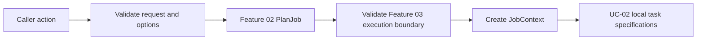
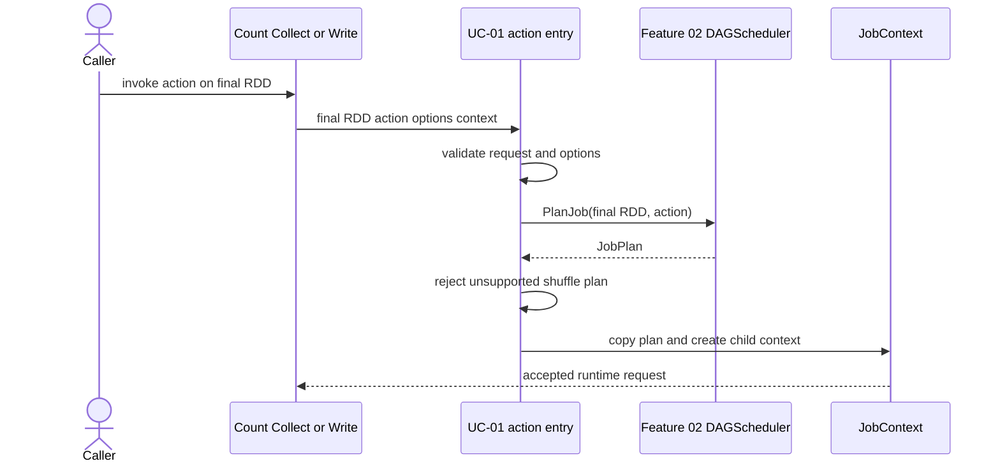

# Feature 03: Local worker runtime và actions

## UC-01: Action entry và job context

### 1. Output trước tiên

UC-01 nhận một action trên final RDD, lập `JobPlan`, validate runtime options
và tạo `JobContext` để các use case sau thực thi. Output **chưa phải** count,
rows của collect hay file output.

```text
Caller: orders.Filter(keepPaid).Count(ctx, options)

UC-01 output:
  JobContext
    - JobID:       từ JobPlan
    - Action:      count
    - FinalRDD:    paid RDD
    - JobPlan:     one ResultStage for this narrow-only lineage
    - Context:     cancellable child context
    - Options:     validated immutable snapshot
```

Sau UC-01, runtime biết **cần chạy gì**. UC-02 mới đổi stage partitions thành
local task specifications; UC-03/UC-04 mới tạo worker và xử lý rows.



UC-01 không làm các việc sau:

- không mở source file hoặc memory partition;
- không gọi `Map`, `Filter`, `FlatMap`, `KeyBy` closure;
- không tạo goroutine worker;
- không chạy reducer, shuffle hoặc ghi output file.

### 2. Public action surface

Action là điểm lazy RDD lineage trở thành runtime request:

```go
func (rdd *RDD) Count(ctx context.Context, options RunOptions) (int64, JobResult, error)
func (rdd *RDD) Collect(ctx context.Context, options RunOptions) ([]Row, JobResult, error)
func (rdd *RDD) WriteJSONLines(
    ctx context.Context,
    destination string,
    options RunOptions,
) (JobResult, error)
```

Các signatures trên thể hiện public direction. UC-01 dùng một internal entry
chung, tên minh hoạ:

```go
func StartAction(
    ctx context.Context,
    finalRDD *RDD,
    action ActionSpec,
    options RunOptions,
) (*JobContext, error)
```

`StartAction` không trả action result. Nó chỉ trả `JobContext` đã sẵn sàng để
coordinator giao cho UC-02. Public `Count`/`Collect`/`WriteJSONLines` chỉ trả
kết quả sau khi các use case runtime sau hoàn tất.

### 3. Input cần có gì?

| Input | Ví dụ | Vai trò |
| --- | --- | --- |
| `ctx` | `context.Background()` | caller cancel job bằng context này |
| `finalRDD` | `paid` | đầu cuối của lineage cần chạy |
| `ActionSpec` | `count`, `collect`, `write_json_lines` | xác định action sink sau này |
| `RunOptions` | `Workers: 4` | worker limit, output options và local runtime config |

`WriteJSONLines` còn có destination path. UC-01 chỉ validate request shape;
UC-06 mới tạo temporary output và publish directory atomically.

### 4. Thuật toán

```text
StartAction(ctx, finalRDD, action, options):
    reject nil finalRDD
    reject unsupported action or invalid action arguments
    reject invalid runtime options
    return ctx error if caller context is already canceled

    plan = dagScheduler.PlanJob(finalRDD, action)
    reject plan that needs shuffle execution

    jobCtx = JobContext{
        JobID: plan.JobID,
        Action: action,
        FinalRDD: finalRDD,
        Plan: deepCopy(plan),
        Context: child cancellable context of ctx,
        Options: normalized immutable copy(options),
        State: planned,
    }
    return jobCtx
```



### 5. Runtime options và admission

UC-01 cần validate configuration trước khi tạo task. Các exact option names là
implementation detail, nhưng contract tối thiểu gồm:

- worker limit là positive và không vượt local configured maximum;
- `WriteJSONLines` có destination hợp lệ;
- action kind được runtime hỗ trợ;
- caller context chưa canceled;
- final RDD thuộc context hợp lệ;
- plan chỉ chứa stages Feature 03 có thể chạy.

Feature 03 hỗ trợ narrow-only action. Nếu `JobPlan` có shuffle producer hoặc
shuffle consumer stage, UC-01 trả error rõ ràng kiểu:

```text
cannot execute job 7: shuffle execution requires Feature 04
```

Không worker, source I/O hay temporary output được tạo trước error này.

### 6. Vì sao plan trước, rồi mới tạo task?

Planner cần nhìn toàn bộ lineage để biết action có stage nào, bao nhiêu
partitions và có shuffle boundary không. Nếu tạo task trực tiếp từ final RDD,
runtime sẽ không biết:

- có cần chờ parent stage không;
- final RDD có bao nhiêu tasks;
- một shuffle dependency chưa được Feature 03 hỗ trợ;
- JobID/StageID nào phải gắn vào runtime metadata.

```text
RDD lineage
    -> PlanJob
    -> validated JobContext
    -> task specifications
    -> task execution
```

UC-01 là boundary giữa **logical description** và **runtime admission**, không
phải boundary giữa data partitions.

### 7. `JobContext` ownership

`JobContext` là private runtime state. Caller nhận `JobResult` sau action, chứ
không giữ pointer mutable vào coordinator state.

```text
Caller owns:          original context and RunOptions values
JobContext owns:      normalized options copy, child cancel function, plan copy
Coordinator owns:     task state and later action result
```

Copy plan/options ngăn caller mutation sau khi action bắt đầu làm thay đổi job
đã được admitted. Child context cho phép runtime cancel all future tasks khi
caller cancel hoặc job failure; UC-07 sẽ triển khai propagation thực tế.

### 8. Error contract

| Tình huống | Khi lỗi? | Có task/source I/O? |
| --- | --- | --- |
| `finalRDD` nil | trước planning | không |
| action không hỗ trợ | trước planning | không |
| `Workers <= 0` hoặc vượt max | trước planning | không |
| context đã canceled | trước planning | không |
| corrupted lineage/dependency | `PlanJob` | không |
| plan cần shuffle | sau planning, trước admission | không |
| lỗi row/function/source | UC-03 trở đi | có thể |

### 9. Tests chính

- `Count`, `Collect`, `WriteJSONLines` cùng dùng action entry chung.
- Valid narrow-only final RDD tạo `JobContext` có JobID/plan/action đúng.
- `StartAction` không gọi source reader hoặc user closure; test closure counter
  vẫn bằng zero.
- Invalid worker limit, destination/action input hoặc canceled context fail trước
  planning/task creation theo contract.
- Lineage có `ReduceByKey` tạo shuffle plan và bị reject trước source I/O.
- Caller mutation `RunOptions` sau admission không làm đổi options snapshot.
- Hai action submissions trên cùng final RDD có JobID khác theo scheduler
  lifecycle.

### 10. Ngoài phạm vi

- task specifications, worker goroutines, worker limit enforcement và stage
  readiness; chúng thuộc UC-02 đến UC-04;
- action result aggregation và output publishing; chúng thuộc UC-05/UC-06;
- cancellation propagation sau admission, retry và task attempts;
- shuffle execution, process workers hoặc closure serialization.
