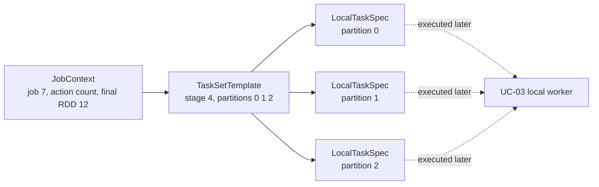

# Feature 03: Local worker runtime và actions

## UC-02: Một stage biến thành những local task nào?

### 1. Mục đích và output của UC-02

`JobPlan` cho biết stage nào tồn tại và stage có bao nhiêu partitions. Nhưng
worker không chạy “một stage” chung chung; worker cần một đơn vị công việc cụ
thể cho đúng một partition.

UC-02 trả lời:

> Với một stage đã sẵn sàng, runtime phải tạo những local task nào?

**Output:** một `LocalTaskSpec` immutable cho mỗi partition của stage:

```text
ResultStage 4, partitions [0, 1, 2]
    -> LocalTaskSpec(stage=4, partition=0)
    -> LocalTaskSpec(stage=4, partition=1)
    -> LocalTaskSpec(stage=4, partition=2)
```

Task spec là mô tả work; chưa có goroutine, TaskID, task attempt hay source
I/O. UC-03 mới thực thi một spec, UC-04 mới đưa specs vào worker pool.

### 2. Ví dụ xuyên suốt: từ output UC-01 tới ba task specs

Caller gọi:

```go
orders.Filter(keepPaid).Count(ctx, options)
```

Giả sử `orders` có 3 partitions. `Filter(keepPaid)` không đổi partition count,
nên final RDD `paidOrders` cũng có 3 partitions. UC-01 validate action và trả:

```text
JobContext
  JobID:       7
  Action:      count
  FinalRDD:    paidOrders (RDD 12)
  JobPlan:     ResultStage 4, narrow-only
  Context:     cancellable child context
  Options:     validated immutable snapshot, Workers=2
```

`JobPlan` của UC-01 có ResultStage 4 cho `paidOrders`; Feature 02 đã gắn
template partitions cho stage đó:

```text
TaskSetTemplate
  StageID:      4
  PartitionIDs: [0, 1, 2]
```

UC-02 lấy đúng các phần metadata cần cho task. Nó không cần biết partition 0
có bao nhiêu rows và cũng chưa mở source. Output là ba task specs:

```text
LocalTaskSpec(job=7, stage=4, partition=0, target=RDD 12, action=count)
LocalTaskSpec(job=7, stage=4, partition=1, target=RDD 12, action=count)
LocalTaskSpec(job=7, stage=4, partition=2, target=RDD 12, action=count)
```



Ba specs có thể hoàn thành theo thứ tự khác nhau, nhưng mỗi spec luôn gắn với
một partition ID duy nhất. UC-04 mới quyết định lúc nào và worker nào chạy chúng.

### 3. Task spec giữ những gì?

```go
type LocalTaskSpec struct {
    JobID       JobID
    StageID     StageID
    PartitionID int
    TargetRDDID RDDID
    Action      ActionSpec
}
```

| Field | Ý nghĩa |
| --- | --- |
| `JobID` | job mà task thuộc về |
| `StageID` | stage đang được thực thi |
| `PartitionID` | đúng một partition của stage |
| `TargetRDDID` | RDD output mà task cần tạo stream cho stage đó |
| `Action` | xác định task sink cho `count`, `collect` hoặc `write_json_lines` |

Trong ví dụ trên, task cho partition 1 được định nghĩa từng field như sau:

| Field trong spec | Lấy từ đâu? | Giá trị |
| --- | --- | --- |
| `JobID` | `JobContext.JobID` | `7` |
| `StageID` | `JobPlan.ResultStage.ID` | `4` |
| `PartitionID` | một entry của `TaskSetTemplate.PartitionIDs` | `1` |
| `TargetRDDID` | `JobContext.FinalRDD` | `12` (`paidOrders`) |
| `Action` | `JobContext.Action` | `count` |

`Context`, `RunOptions` và toàn bộ `JobPlan` không bị copy vào từng task spec.
`JobContext` vẫn sở hữu chúng; UC-04 truyền context chung khi dispatch và dùng
`Options.Workers` để giới hạn worker pool. Nhờ vậy ba task specs nhỏ, immutable
và không giữ state job mutable riêng.

`TargetRDDID` là `FinalRDDID` với `ResultStage`. Feature 03 chỉ admit
narrow-only plan, nên không tạo local task cho `ShuffleMapStage` hay shuffle
consumer.

### 4. Tạo specs từ template

Feature 02 đã có `TaskSetTemplate`:

```text
StageID:      4
PartitionIDs: [0, 1, 2]
```

UC-02 copy theo partition ID tăng dần:

```text
makeLocalTaskSpecs(jobCtx, template):
    validate template belongs to one stage in jobCtx.Plan
    validate stage is runnable and non-shuffle

    specs = []
    for partitionID in template.PartitionIDs in ascending order:
        append LocalTaskSpec(job, stage, partitionID, targetRDD, action)
    return immutable copy(specs)
```

Stage runnable khi mọi parent stages đã complete successfully. Trong Feature 03
admission, shuffle plan bị reject nên narrow-only job thường có một ResultStage
không có parent. Contract này vẫn được giữ để coordinator không vô tình chạy
stage có dependency chưa complete.

### 5. Partition mapping được dùng ở đâu?

Task spec chỉ chọn output partition của `TargetRDD`. Khi UC-03 walk ngược
lineage, nó dùng `DependencySpec.Mapping` của Feature 02 để tìm đúng parent
partition:

```text
task cho output partition 3 của Union
    -> range mapping chọn right parent partition 1
```

UC-02 không tự mở parent RDD hay expand lineage thành nhiều task. Một task vẫn
đại diện cho một stage output partition.

### 6. Empty stage

Stage có zero partitions tạo danh sách task specs rỗng:

```text
TaskSetTemplate(partitions=[]) -> LocalTaskSpecs=[]
```

Đây không phải error và không được tạo task giả cho partition 0. UC-04 đánh
dấu stage complete sau khi xác nhận không có task cần chạy; UC-05 quyết định
kết quả action rỗng như `Count = 0`.

### 7. Validation và error contract

| Tình huống | Kết quả |
| --- | --- |
| template StageID không có trong plan | return planning error |
| partition ID duplicate, gap hoặc ngoài range | return corrupted template error |
| target RDD không khớp stage | return corrupted stage error |
| stage có parent chưa complete | không tạo task; stage chưa runnable |
| stage đòi shuffle input/output | return unsupported-shuffle error trước task creation |
| caller sửa returned specs | không đổi JobContext hay template nội bộ |

Không validation nào mở source, gọi closure hay tạo worker.

### 8. Tests chính

- ResultStage có 3 partitions tạo đúng specs cho partition `[0, 1, 2]`.
- Specs giữ JobID, StageID, target RDD và action đúng JobContext.
- Empty template trả empty list, không có partition 0.
- Corrupted template/target stage fail trước source I/O.
- Stage chưa ready hoặc có shuffle bị chặn trước khi tạo spec.
- Caller mutation của returned list/spec không đổi state nội bộ.

### 9. Ngoài phạm vi

- chạy source reader hoặc narrow closure; UC-03;
- worker goroutine, bounded concurrency và stage state transitions; UC-04;
- TaskID, task attempt và retry; Feature 05;
- shuffle task specification/execution; Feature 04.
