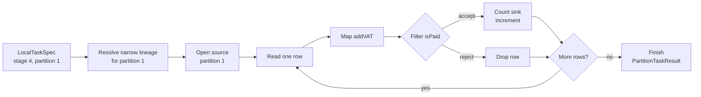
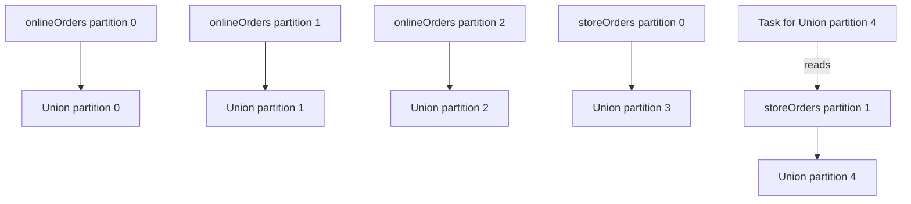

# Feature 03: Local worker runtime và actions

## UC-03: Một local task stream một partition như thế nào?

### 1. Mục đích và output của UC-03

`LocalTaskSpec` chỉ nói task phải làm partition nào. UC-03 thực sự xử lý đúng
một partition đó, từ source tới narrow lineage.

Nó trả lời:

> Làm sao task chạy `source -> Map/Filter/FlatMap/KeyBy` mà không giữ cả
> partition trong memory?

**Output:** một `PartitionTaskResult` cho mỗi task thành công, gồm task/stage/
partition identity và action-specific partial output:

```text
count:           số rows của partition
collect:         rows của riêng partition, theo stream order
write_json_lines: temporary file của riêng partition
```

Không task nào tự trả final `Count`, final `Collect` hay publish output
directory. UC-05/UC-06 làm các việc đó.

### 2. Ví dụ cụ thể: task cho một source partition

Giả sử source `orders` có hai partitions và caller tạo lineage:

```text
orders -> Map(addVAT) -> Filter(isPaid) -> Count
```

Source partition 1 có ba rows:

```text
{id: "A", paid: true,  amount: 10}
{id: "B", paid: false, amount: 20}
{id: "C", paid: true,  amount: 30}
```

UC-02 tạo task riêng cho partition 1:

```text
LocalTaskSpec
  StageID:     4
  PartitionID: 1
  TargetRDD:   Filter(isPaid)
  Action:      count
```

UC-03 chạy task đó theo từng row:

```text
row A -> Map thêm total=11 -> Filter(isPaid) accepts -> count = 1
row B -> Map thêm total=22 -> Filter(isPaid) rejects -> count = 1
row C -> Map thêm total=33 -> Filter(isPaid) accepts -> count = 2
```

Output của task chỉ là partial result:

```text
PartitionTaskResult(stage=4, partition=1, count=2)
```

Task cho partition 0 chạy độc lập và trả count riêng. UC-05 mới cộng hai count
để trả kết quả cuối cho caller.

### 3. Solution: stream từng row

Task resolve lineage từ `TargetRDD` về source cho đúng `PartitionID`, sau đó
stream rows theo chiều source tới target:

```text
source partition i
    -> Map closure
    -> Filter closure
    -> FlatMap closure
    -> KeyBy closure
    -> task sink
```



Diagram cho thấy task chỉ giữ một row đang đi qua pipeline. Nó không cần đợi
đọc hết partition mới bắt đầu `Map` hoặc `Filter`.

Pseudo-flow:

```text
executeNarrowTask(spec, sink):
    resolve source partition and narrow transforms for spec.PartitionID
    open source reader for that one source partition

    for each source row:
        check task context
        pass row through narrow transforms
        send each output row to sink

    close reader
    return sink.finish() as PartitionTaskResult
```

Task chỉ giữ row hiện tại và state cần thiết của sink. Nó không đọc toàn bộ
source partition vào `[]Row` trước khi transform.

### 4. Walk lineage đúng partition

Narrow edge không luôn là `child i -> parent i`. Task phải dùng
`DependencySpec.Mapping` của Feature 02:

| RDD node | Parent partition cần đọc |
| --- | --- |
| `Map`, `Filter`, `FlatMap`, `KeyBy` | cùng partition ID |
| `Union` | left hoặc right partition theo range offset |
| `ReduceByKey` / shuffle edge | không được Feature 03 execute |

Ví dụ gộp `onlineOrders` có 3 partitions với `storeOrders` có 2 partitions:

```text
Union partition 0, 1, 2 -> onlineOrders partition 0, 1, 2
Union partition 3, 4    -> storeOrders partition 0, 1
```

Vì vậy task cho Union partition 4 resolve thành `storeOrders` partition 1. Nó
chỉ đọc partition đó; không đọc các partitions của `onlineOrders` hay
`storeOrders` partition 0.



Nói cách khác, một Union task không chạy hai source branches. Range mapping của
Feature 02 chọn duy nhất branch và parent partition cần đọc.

Nếu walk gặp shuffle dependency, task fail trước source I/O với error rõ ràng:

```text
cannot execute stage 4 partition 1: shuffle execution requires Feature 04
```

### 5. Task sink

UC-03 không biết action final gom kết quả ra sao. Nó chỉ gửi output rows vào
sink phù hợp:

```go
type PartitionSink interface {
    Consume(Row) error
    Finish() (PartitionTaskResult, error)
    Abort() error
}
```

| Action | Sink output |
| --- | --- |
| `count` | row count của partition |
| `collect` | ordered rows của partition, với configured size limit |
| `write_json_lines` | temporary partition file |

Sink error được coi là task failure và có `JobID`, `StageID`, `PartitionID`
trong error context.

### 6. Closure và source errors

Map/filter/flat-map/key closures đã được giữ private trong RDD từ Feature 01.
In-process worker gọi trực tiếp chúng. Không serialize closure và không gửi nó
sang process khác.

Source read error, malformed source row, closure error, sink error và context
cancellation đều dừng task. Reader và sink phải được close/abort trước khi
return; UC-07 điều phối cancellation của toàn job.

### 7. Validation và error contract

| Tình huống | Kết quả |
| --- | --- |
| spec không thuộc JobContext/stage | return invalid task error |
| partition ngoài range | return error trước source I/O |
| mapping không resolve được đúng một narrow parent | return corrupted lineage error |
| gặp shuffle edge | return unsupported-shuffle error trước source I/O |
| caller context canceled | stop stream và return context error |
| source/closure/sink error | abort task, return contextual error |

Task không retry, không tự launch goroutine khác và không mark stage complete.

### 8. Tests chính

- Map/filter chain stream đúng rows và closure counter chỉ tăng khi task chạy.
- FlatMap tạo nhiều output rows mà không materialize input partition.
- Union partition dùng đúng branch/range mapping.
- Shuffle lineage bị reject trước source reader và reducer invocation.
- Source, closure, sink và cancellation error close/abort resources và có
  stage/partition context.
- Task result chỉ chứa partial action output, không tự aggregate final result.

### 9. Ngoài phạm vi

- tạo task specs; UC-02;
- worker pool, stage readiness và concurrency; UC-04;
- final Count/Collect aggregation; UC-05;
- JSONL temporary publish; UC-06;
- retry/task attempt, distributed/process execution hoặc shuffle; Feature 04/05.
