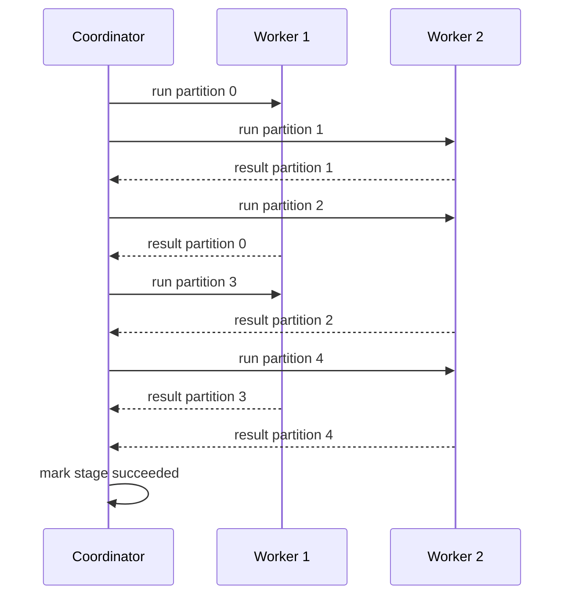
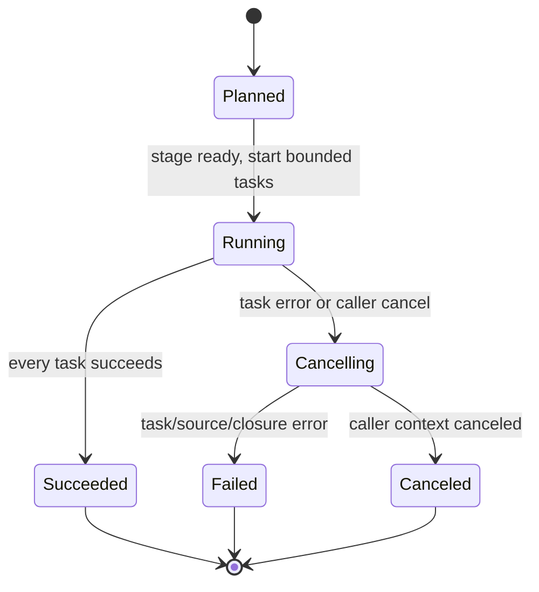

# Feature 03: Local worker runtime và actions

## UC-04: Chạy tasks song song nhưng không vượt worker limit

### 1. Mục đích và output của UC-04

Một stage có thể có nhiều partition tasks. Không được tạo vô hạn goroutine chỉ
vì input có nhiều partitions; cũng không được mở child stage trước khi parent
stage thành công.

UC-04 trả lời:

> Coordinator chọn stage nào chạy được và chạy bao nhiêu local tasks cùng lúc?

**Output:** `StageRunResult` cho mỗi stage đã hoàn tất, gồm stage ID và
`PartitionTaskResult` của toàn bộ partitions; hoặc một terminal job error/cancel
signal nếu stage không hoàn tất.

```text
Workers = 2, task partitions = [0, 1, 2]

run 0 and 1
when one finishes, run 2
active workers never exceed 2
```

UC-04 điều phối work, không transform row và không tự gom final action result.

### 2. Ví dụ: 5 partitions nhưng chỉ 2 workers

Giả sử ResultStage 4 có task partitions `[0, 1, 2, 3, 4]` và caller chọn:

```text
RunOptions.Workers = 2
```

Coordinator không tạo 5 goroutines cùng lúc. Nó giữ ba task trong queue và chỉ
cho tối đa hai task chạy:

```text
time       worker 1        worker 2        waiting queue
t0         partition 0     partition 1     [2, 3, 4]
t1         partition 0     partition 2     [3, 4]       (1 finished)
t2         partition 3     partition 2     [4]          (0 finished)
t3         partition 3     partition 4     []           (2 finished)
t4         idle            partition 4     []           (3 finished)
t5         idle            idle            []           (4 finished)
```

Completion order trong ví dụ là `1, 0, 2, 3, 4`, không phải partition order.
Coordinator vẫn lưu result vào slot đúng partition ID, nên UC-05 có thể trả
`Collect` theo thứ tự `0, 1, 2, 3, 4`.



Tại mọi thời điểm diagram chỉ có hai lệnh `run partition` chưa return, nên
`activeTasks <= Workers` luôn đúng.

### 3. Solution: coordinator là owner của state

Coordinator là nơi duy nhất thay đổi stage/task scheduling state:

```text
planned -> running -> succeeded
                  -> failed or canceled
```

Flow:

```text
runJob(jobCtx):
    find stages whose parent stages succeeded
    create LocalTaskSpecs through UC-02
    dispatch specs to bounded worker pool
    collect PartitionTaskResults

    if every task succeeds:
        mark stage succeeded
        open next ready stage
    else:
        ask UC-07 to cancel job and cleanup
```

Workers only execute a supplied `LocalTaskSpec` through UC-03 and send result
về coordinator. Worker không được tự mở stage khác hay publish final action
result.



State diagram chỉ mô tả lifecycle của stage/job tại coordinator. Worker không
tự chuyển state; worker chỉ gửi result hoặc error về coordinator.

### 4. Worker limit

`RunOptions.Workers` được UC-01 validate là positive. Coordinator tạo tối đa
`Workers` in-process worker goroutines hoặc dùng semaphore cùng capacity.

```text
activeTasks <= Workers
```

Task specs được dispatch theo `PartitionID` tăng dần. Completion có thể khác
thứ tự, nhưng coordinator lưu result theo partition ID để UC-05 giữ deterministic
result.

Nếu stage có zero tasks, coordinator mark stage succeeded ngay; không spawn
worker giả.

### 5. Stage readiness

Một stage chỉ được dispatch khi tất cả `ParentStageIDs` succeeded:

```text
parents=[]          -> ready
parents=[3, 4]      -> ready only after 3 and 4 succeeded
```

Feature 03 admit narrow-only plans, nên thực tế initial plan thường có đúng một
ResultStage không parent. Rule readiness vẫn là contract chung để coordinator
không chạy topology sai; shuffle parent stage vẫn bị UC-01 reject cho tới
Feature 04.

### 6. Failure và cancellation handoff

Khi worker return error hoặc caller cancel context:

1. coordinator ngừng dispatch task chưa chạy;
2. gọi job cancel function để task đang chạy quan sát cancellation;
3. đợi active workers return;
4. giao cleanup/terminal result cho UC-07.

Không có retry trong UC-04. Feature 05 mới quyết định retry policy và attempts.

### 7. Validation và error contract

| Tình huống | Kết quả |
| --- | --- |
| `Workers <= 0` | đã fail tại UC-01; coordinator vẫn defensively reject |
| spec/stage không thuộc plan | return corrupted plan error |
| parent stage failed/canceled | child không dispatch |
| shuffle stage xuất hiện sau admission | fail trước source I/O |
| một task fail | stop scheduling, cancel job qua UC-07 |
| duplicate task result | return coordinator invariant error |

Coordinator không đọc source, gọi closure hay ghi action output trực tiếp.

### 8. Tests chính

- active task counter không bao giờ vượt `Workers`.
- Tasks được submitted theo partition order nhưng completion out-of-order vẫn
  giữ result theo partition ID.
- Child stage không chạy trước mọi parent stages succeeded.
- Empty stage complete không spawn worker.
- Task failure/cancel dừng queue, signals active tasks và không mở stage sau.
- Coordinator không retry failed task và không execute shuffle plan.

### 9. Ngoài phạm vi

- partition-level source/closure execution; UC-03;
- Count/Collect aggregation, JSONL publish và cleanup details; UC-05 đến UC-07;
- retry, speculation, task attempts hay distributed worker scheduling; Feature 05;
- shuffle producer/reduce stage execution; Feature 04.
