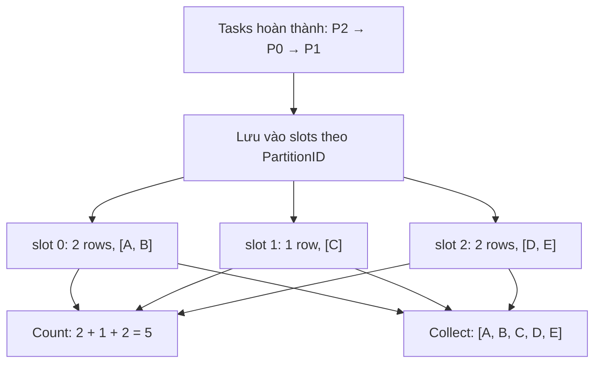

# Feature 03: Local worker runtime và actions

## UC-05: Gom `Count` và `Collect` không phụ thuộc concurrency

### 1. Mục đích và output của UC-05

Task completion không theo partition order: partition 2 có thể xong trước
partition 0. Nếu gom trực tiếp theo thứ tự worker trả về, `Collect` sẽ đổi thứ
tự mỗi lần chạy.

UC-05 trả lời:

> Làm sao biến partial output của các tasks thành kết quả `Count`/`Collect`
> đúng và deterministic?

**Output:** `JobResult` thành công cho hai action:

```text
Count:   tổng số output rows của mọi partitions
Collect: tất cả output rows, nối theo partition ID tăng dần
```

Không result nào được return nếu một required task fail hoặc job bị cancel.

### 2. Count solution

Mỗi successful count task trả một `int64` cho partition của nó. Coordinator
sum theo partition ID:

```text
partition counts: [3, 0, 5]
final Count: 8
```

Phép cộng theo thứ tự nào cũng cùng kết quả, nhưng implementation vẫn iterate
partition IDs tăng dần để diagnostics stable. Overflow `int64` là error; không
wrap về số âm.

### 3. Collect solution

Mỗi collect task giữ output rows của **riêng partition đó** theo stream order.
Coordinator chờ đủ successful partition results, rồi nối theo partition ID:

```text
task completion order: 2, 0, 1

partition 0: [A, B]
partition 1: [C]
partition 2: [D, E]

Collect result: [A, B, C, D, E]
```

Ví dụ trên cũng có thể chạy `Count` trên cùng input. Giả sử tasks hoàn thành
theo thứ tự 2, 0, 1:

| Lượt hoàn thành | Partition ID | Rows của partition | Partial Count |
| --- | --- | --- | --- |
| 1 | 2 | `[D, E]` | `2` |
| 2 | 0 | `[A, B]` | `2` |
| 3 | 1 | `[C]` | `1` |

Coordinator đặt mỗi partial result vào slot theo partition ID, bất kể task
nào về trước:



Với `Count`, đổi thứ tự task hoàn thành chỉ đổi thứ tự nhận partial counts;
tổng vẫn là `5` (nếu không overflow). Với `Collect`, nối ngay lúc nhận
sẽ cho `[D, E, A, B, C]`, sai partition order. Nối `slot 0`, rồi `slot 1`,
rồi `slot 2` mới cho `[A, B, C, D, E]`; thứ tự rows *trong mỗi slot* vẫn
giữ nguyên.

`Collect` chỉ phù hợp small result. `RunOptions` phải có configured row/byte
limit; sink dừng và trả error nếu limit bị vượt. Điều này tránh silent giữ toàn
bộ output lớn trong memory.

### 4. Ownership và snapshots

```text
Task owns:        partial partition result until it returns
Coordinator owns: result slots indexed by PartitionID
Caller receives:  copied Count value or copied []Row result
```

Caller mutate slice từ `Collect` không được làm đổi buffer coordinator giữ. Khi
JobResult đã terminal, coordinator không nhận late/duplicate partition result.

Ví dụ với `Collect` ở trên:

```text
1. Task P2 đang giữ local buffer [D, E].
2. P2 return thành công; coordinator nhận và đặt copy vào slot 2.
3. P2 đã return không còn quyền sửa slot 2.
4. Khi P0 và P1 cũng xong, coordinator tạo result mới [A, B, C, D, E].
5. Caller nhận một copy của result đó.
```

Lý do cần copy ở bước 4–5 là slice Go chỉ là một header trỏ tới backing array.
Nếu caller nhận thẳng slice nội bộ rồi làm:

```go
rows[0] = Row{"id": "changed-by-caller"}
```

thì caller có thể vô tình sửa buffer mà coordinator dùng để tạo `JobResult`,
log hoặc metric sau đó. Return một copy tách ownership của caller khỏi state
nội bộ của job.

Tương tự, sau khi job đã `succeeded`, một worker return result lần hai không
được phép thêm lại slot của mình. Nếu chấp nhận duplicate result, `Count` có
thể bị cộng hai lần và `Collect` có thể lặp rows. Terminal `JobResult` vì vậy
được xem là immutable snapshot: chỉ coordinator tạo nó một lần, rồi không nhận
thay đổi nữa.

### 5. Empty input và errors

| Tình huống | Count | Collect |
| --- | --- | --- |
| zero partitions | `0` | `[]` |
| partition có zero output rows | cộng `0` | đóng góp `[]` |
| task fail/cancel | return error | return error |
| collect limit vượt | không áp dụng | return error, không partial result |
| count overflow | return error | không áp dụng |

UC-05 không retry task và không trả partial result để caller “tự xử lý”.
Cancellation/failure cleanup thuộc UC-07.

### 6. Tests chính

- Count của nhiều partitions đúng dù tasks complete khác thứ tự.
- Count với zero partitions/empty partition trả 0 đúng.
- Collect nối rows theo partition order, không theo completion order.
- Collect giữ stream order bên trong từng partition.
- Collect row/byte limit và count overflow return error, không partial result.
- Failed/canceled task không return Count/Collect success result.
- Caller mutation Collect result không đổi coordinator state.

### 7. Ngoài phạm vi

- source/closure streaming; UC-03;
- task dispatch và worker limit; UC-04;
- JSONL action; UC-06;
- retry, task attempt hoặc action result persistence; Feature 05/06.
