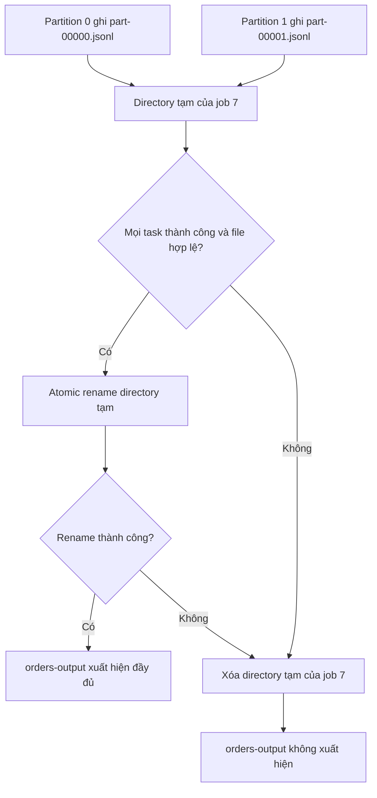

# Feature 03: Local worker runtime và actions

## UC-06: Làm sao `WriteJSONLines` không publish output dở dang?

### 1. Mục đích và output của UC-06

Nhiều partition tasks có thể ghi output song song. Nếu ghi trực tiếp vào
destination, một task fail giữa chừng có thể để lại directory half-written mà
caller tưởng là kết quả thành công.

UC-06 trả lời:

> Làm sao nhiều tasks ghi JSON Lines nhưng caller chỉ thấy toàn bộ output hoặc
> không thấy output nào?

**Output:** khi mọi task thành công, một output directory được publish atomically:

```text
destination/
  part-00000.jsonl
  part-00001.jsonl
  ...
```

Khi bất kỳ task fail/cancel, destination mới không được publish và temporary
output bị cleanup.

### 2. Solution: write temporary, then publish

Job tạo temporary directory là sibling của destination trên cùng filesystem:

```text
parent/
  .orders-output.job-7.tmp/
  orders-output/                 <- destination
```

Mỗi successful task chỉ ghi file riêng trong temporary directory:

```text
partition 0 -> .orders-output.job-7.tmp/part-00000.jsonl
partition 1 -> .orders-output.job-7.tmp/part-00001.jsonl
```

Sau khi coordinator xác nhận mọi required partition task thành công:

1. close và validate mọi temporary part file;
2. atomically rename temporary directory thành destination;
3. return successful `JobResult` với destination path.

Đặt temporary directory cùng filesystem là điều kiện để directory rename là
atomic. Không copy file từ temp sang destination ở bước publish.

### 3. Ví dụ: hai partition, một lần publish

Giả sử `orders` có partition 0 chứa `{ "id": 10 }`, partition 1 chứa
`{ "id": 11 }`; destination là `parent/orders-output/`. Job 7 tạo
`parent/.orders-output.job-7.tmp/`, rồi hai tasks ghi độc lập:

```text
.orders-output.job-7.tmp/
  part-00000.jsonl    # nội dung: {"id":10}
  part-00001.jsonl    # nội dung: {"id":11}
```

Nếu cả hai file đã close và validation thành công, coordinator rename nguyên
directory tạm thành `orders-output/` rồi mới trả success. Nếu partition 1 ghi
lỗi, coordinator dừng job và xóa directory tạm của job 7; `orders-output/`
không xuất hiện. File của partition 0 dù đã hoàn tất cũng không được publish.



### 4. Mỗi partition ghi gì?

`WriteJSONLines` sink nhận row stream từ UC-03 và ghi một JSON object hợp lệ
mỗi dòng. Filename được quyết định duy nhất từ partition ID:

```text
part-%05d.jsonl
```

Rows trong một part file giữ stream order của partition. Toàn bộ output có
partition order theo tên file tăng dần. Không có một global row ordering giữa
partitions ngoài thứ tự part file đó.

### 5. Destination safety

UC-01 validate destination shape. UC-06 áp dụng contract an toàn hơn:

- destination không được tồn tại lúc publish; nếu tồn tại, job fail trước task
  creation hoặc trước rename;
- runtime không overwrite hay xóa output directory có sẵn;
- temp path mang JobID/random suffix để không collision giữa concurrent jobs;
- caller chỉ nhận destination path sau atomic publish thành công.

Điều này tránh biến action write thành thao tác overwrite không rõ ý định.

### 6. Failure và cancellation

Khi task/sink/write error hoặc context bị cancel:

```text
stop remaining tasks
close/abort active writers
remove only this job's temporary directory
do not rename temp directory to destination
```

UC-07 sở hữu job cancellation và cleanup coordination. UC-06 định nghĩa output
contract: failed/canceled job không được để partial final destination.

Nếu atomic rename return error, action return error và temporary directory được
cleanup best-effort; destination cũ, nếu có, không được thay đổi.

### 7. Validation và error contract

| Tình huống | Kết quả |
| --- | --- |
| destination invalid hoặc đã tồn tại | fail trước publish, không overwrite |
| temporary directory không tạo được | fail trước worker/task output |
| JSON encode/write/close fail | task/job fail, final destination không publish |
| missing/duplicate partition file | fail validation trước rename |
| context cancel | cleanup temp, không publish |
| rename fail | return error, cleanup temp best-effort |

Source rows hoặc closure không được rerun chỉ để sửa output error; retry thuộc
Feature 05.

### 8. Tests chính

- Successful two-partition write tạo đúng deterministic part filenames và valid
  JSON Lines.
- Rows trong part file giữ partition stream order.
- Existing destination không bị overwrite hoặc xóa.
- One task/encoder/write failure không publish destination và cleanup temp.
- Cancellation giữa write không publish destination.
- Missing/duplicate part file hoặc rename error return error trước success result.
- Concurrent jobs dùng separate temp paths.

### 9. Ngoài phạm vi

- Count/Collect aggregation; UC-05;
- task execution/worker scheduling; UC-03/UC-04;
- retry, attempt-safe commit protocol, remote/object storage atomicity; Feature 05;
- distributed filesystem, multipart upload hoặc transactional external sinks.
