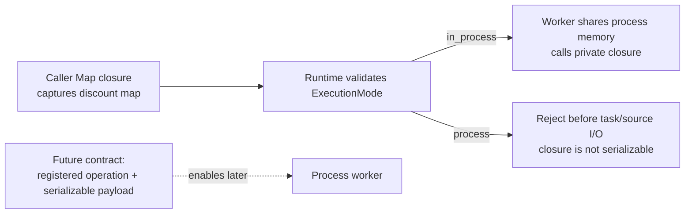

# Feature 03: Local worker runtime và actions

## UC-08: Vì sao chưa thể chạy Go closure trong child process?

### 1. Mục đích và output của UC-08

Feature 03 chạy in-process goroutine vì RDD giữ arbitrary Go closures như
`MapFunc` và `FilterFunc`. Go không có standard, an toàn để serialize arbitrary
closure cùng captured state sang child process.

UC-08 trả lời:

> Future process worker cần contract gì, và tại sao runtime hiện tại phải
> reject process execution thay vì giả vờ gửi được closure?

**Output:** một boundary contract rõ ràng:

- `in_process` là execution mode duy nhất được Feature 03 hỗ trợ;
- process worker chỉ có thể nhận `SerializableTaskPayload` không chứa Go closure;
- action dùng arbitrary closure phải bị reject nếu caller yêu cầu process mode;
- UC-08 không spawn process hay implement transport.

### 2. Ví dụ: closure của caller không thể gửi sang process

Caller có thể viết một closure dùng state chỉ tồn tại trong driver process:

```go
discount := map[string]int64{"gold": 10}
orders.Map(func(row Row) (Row, error) {
    row["discount"] = discount[row["tier"].(string)]
    return row, nil
})
```

In-process worker có thể gọi closure vì nó dùng chung memory với driver. Nhưng
child process chỉ nhận bytes qua IPC; nó không hiểu function value `MapFunc` hay
map `discount` mà closure đã capture. Vì vậy process mode phải reject request
trước khi tạo task thay vì âm thầm chạy sai hoặc fallback sang in-process.



Muốn process mode chạy được, caller hoặc future API phải dùng operation đã đăng
ký, ví dụ `ApplyDiscount(version=1)`, cùng arguments serializable. Đây là một
API contract mới, không phải phép chuyển đổi tự động từ arbitrary Go closure.

### 3. In-process mode hiện tại

```text
LocalTaskSpec
  -> goroutine trong cùng Go process
  -> đọc private RDD node và gọi private closure trực tiếp
```

Đây là lý do Feature 03 có thể execute `Map`, `Filter`, `FlatMap`, `KeyBy` mà
không cần function registry. Nó cũng không có process isolation: panic/bug,
memory và file descriptor vẫn thuộc cùng process của driver.

### 4. Contract future process worker

Process worker không nhận pointer RDD hoặc closure. Nó cần payload serializable,
ví dụ:

```go
type SerializableTaskPayload struct {
    JobID       JobID
    StageID     StageID
    PartitionID int
    SourceRef   SourceDescriptor
    Operations  []RegisteredOperation
    SinkSpec     SerializableSinkSpec
}
```

`RegisteredOperation` phải là ID/version/arguments của operation đã được
registry biết, không phải function value. Worker process phải validate version,
source permission và payload before execution.

Điều này yêu cầu thay đổi public API hoặc một restricted operation language.
Arbitrary caller viết:

```go
rdd.Map(func(row Row) (Row, error) { return personalize(row, secret), nil })
```

không thể tự động trở thành `RegisteredOperation` an toàn. Captured `secret`
cũng không được ngầm gửi qua IPC.

### 5. API behavior hiện tại

Nếu `RunOptions.ExecutionMode == process`, Feature 03 trả error trước planning
task/source I/O:

```text
process execution is not supported: arbitrary Go closures require a serializable operation contract
```

Không fallback im lặng sang in-process mode, vì caller có thể dựa vào isolation
hoặc security boundary mà process mode hứa hẹn.

### 6. Điều future feature phải giải quyết

| Cần có | Vì sao cần |
| --- | --- |
| operation registry/versioning | process hiểu chính xác operation nào chạy |
| serializable schema/row codec | transport data qua IPC |
| source/output capability contract | worker chỉ đọc/ghi tài nguyên được phép |
| cancellation and error protocol | driver dừng worker, nhận error có context |
| process lifecycle/resource limits | tránh process leak hoặc overload máy local |

Các requirements này là design work riêng. UC-08 không thêm named-operation
indirection vào RDD API hiện tại chỉ để giả lập process worker.

### 7. Tests chính

- Default/in-process mode vẫn dùng private closures và execute narrow task.
- Process mode reject trước source I/O, closure invocation hay process spawn.
- Error nói rõ arbitrary closure cần serializable operation contract.
- Không có RDD pointer, Go function value hoặc captured values trong future
  serializable payload shape.
- Caller không bị silently downgraded từ process sang in-process mode.

### 8. Ngoài phạm vi

- spawn, pool, IPC transport hoặc sandbox process worker thật;
- serialize arbitrary Go closure/captured state;
- distributed executor, RPC, remote scheduling hoặc cluster resource manager;
- retry/process recovery, authn/authz hoặc secret distribution.
